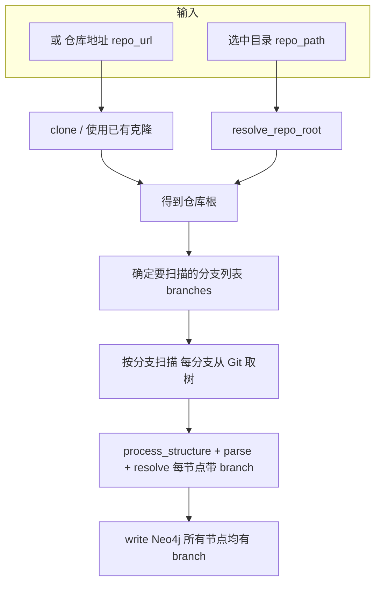
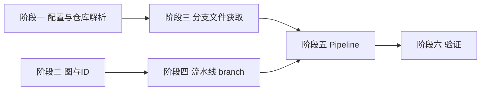

# Git 分支扫描与数据结构兼容方案

## 目标

- **所有节点都有一个或多个归属分支**：图中每个节点均带有 `branch` 属性，标识该节点来自哪个分支；扫描始终基于 Git 分支进行。
- **两种仓库输入方式**：  
  - **先选目录**：用户指定本地目录 → 解析该目录所属的 Git 仓库根 → 再选择要扫描的分支；  
  - **直接输入仓库地址**：用户提供 Git 仓库 URL → 克隆到本地（或使用已有克隆）→ 再选择要扫描的分支。
- 扫描不依赖工作区 checkout，通过 Git 读取指定分支的文件树（`git ls-tree` / `git show`）获取路径与内容。
- **直接覆盖旧行为**：不再支持“仅工作区、无 branch”的扫描；必须提供有效 Git 仓库（目录在仓库内或 `repo_url`），所有节点必有 `branch`，无降级路径。

## 仓库解析与分支选择

- **由目录解析仓库**  
  - 输入：`repo_path` 为本地路径（可为仓库内任意子目录）。  
  - 逻辑：从该路径向上查找 Git 根（`git rev-parse --show-toplevel`），得到仓库根；**若找不到则直接报错**，不做工作区降级。  
  - 接口：`resolve_repo_root(path: str) -> str | None`，返回仓库根绝对路径或 None（None 时 pipeline 报错）。

- **由 URL 解析/获取仓库**  
  - 输入：`repo_url`（如 `https://github.com/org/repo.git`）及克隆目标路径（如 `clone_dir`），均作为**方法参数**传入。  
  - 逻辑：在目标路径执行 `git clone`（若目录已存在则 `git fetch`）；得到本地仓库根后，与“由目录解析”走同一套分支扫描流程。

- **仓库与分支均通过方法参数传入，不使用 config**  
  - 入口方法（如 `run_pipeline`）签名中显式接收：`repo_path`（本地目录，可选）、`repo_url`（可选）、`clone_dir`（克隆目标，与 repo_url 配套）、`branches`（要扫描的分支列表，可选）。  
  - 若未传 `branches` 或为空，则在解析出的仓库根上执行 `git rev-parse --abbrev-ref HEAD` 得到当前分支作为唯一扫描分支。

## 架构要点

- **扫描始终基于分支**：对每个选中的分支，用 Git 取该分支下的文件列表与内容（不 checkout），生成节点时 **必填** `branch`，ID 含分支（如 `Label:branch:Name`）以保证多分支节点可并存。
- **所有节点都有归属分支**：structure / parser / resolvers 始终传入当前 `branch`，并写入 `properties.branch`；**无“无 branch”节点**，无降级。

## 1. 仓库作为方法参数传入（不使用 config）

- **不入 config**：仓库路径、仓库 URL、克隆目录、要扫描的分支列表**均不由 config 提供**，仅通过**方法参数**传入。config 仅保留与仓库无关的配置（如 Neo4j 的 uri/user/password、可选 database），供写入图时使用。
- **入口方法签名**（以 `run_pipeline` 为例）：
  - `repo_path: str | None = None`：本地路径（可为仓库内任意子目录）；与 `repo_url` 二选一或配合（repo_url 时可为克隆目标目录）。
  - `repo_url: str | None = None`：Git 仓库地址；若提供，则需同时提供 `clone_dir`（或约定使用 `repo_path` 作为克隆目标），克隆后再扫描。
  - `clone_dir: str | None = None`：克隆目标目录（与 `repo_url` 配套）；若未传则可用 `repo_path` 作为克隆目标。
  - `branches: list[str] | None = None`：要扫描的分支列表；若为 None 或空，则在解析出的仓库根上取当前分支（`git rev-parse --abbrev-ref HEAD`）。
  - `config: dict | None = None`：仅用于 Neo4j 等与仓库无关的选项；不包含 repo_path / repo_url / branches。
- **仓库解析**（新模块如 `ingestion/repo_resolve.py`）：
  - `resolve_repo_root(path: str) -> str | None`：从给定目录向上找 Git 根，返回绝对路径或 None。
  - `ensure_repo_from_url(repo_url: str, target_path: str) -> str`：在 `target_path` 执行 clone/fetch，返回仓库根；**target_path 由调用方通过参数传入**，不读 config。

## 2. ID 与类型（所有节点必有 branch，直接覆盖旧行为）

- **文件**：[`src/gitnexus_parser/graph/ids.py`](src/gitnexus_parser/graph/ids.py)
  - **新签名**：`generate_id(label: str, name: str, branch: str) -> str`，`branch` **必填**；统一采用 `Label:branch:Name`，不再保留“无 branch”的 `Label:Name` 格式（旧行为被覆盖）。
- **文件**：[`src/gitnexus_parser/graph/types.py`](src/gitnexus_parser/graph/types.py)
  - `NodeProperties` 增加 **必填** `branch: str`（或至少在所有扫描路径下必填）；关系类型增加 `branch` 便于按分支过滤。

## 3. 仓库解析与 Git 分支文件获取

- **仓库解析**（新文件如 `ingestion/repo_resolve.py` 或并入现有模块）：
  - `resolve_repo_root(path: str) -> str | None`：在 `path` 所在目录执行 `git rev-parse --show-toplevel`，返回仓库根绝对路径；非仓库返回 None。
  - `ensure_repo_from_url(repo_url: str, target_path: str) -> str`：若 `target_path` 不存在或非 git 则 `git clone repo_url target_path`，否则可选 `git fetch`；返回仓库根路径（即 `target_path` 或解析后的根）。
- **分支文件获取（不 checkout）**（如 `ingestion/git_walker.py` 或 `walker.py` 内）：
  - 在**已解析的仓库根**下执行：`git ls-tree -r <branch> --name-only` 得路径列表；对每条路径 `git show <branch>:<path>` 读取内容；用 `get_language_from_filename` 过滤扩展；读取失败则跳过。
  - 接口：`get_branch_paths_and_contents(repo_root: str, branch: str) -> tuple[list[str], list[tuple[str, str]]]`，返回 (paths, [(path, content), ...])，路径相对仓库根、正斜杠。
  - 实现优先 subprocess 调用 git，零额外依赖；可选 GitPython。

## 4. 流水线各环节传入 branch（必填，覆盖旧行为）

**所有环节 `branch: str` 必填**，不再支持 `branch=None`；`generate_id` 调用处一律传入当前分支。

- **structure**：`process_structure(graph, paths, branch)`，生成 id 与 properties 时必写 `branch`。
- **parser**：`parse_files(files_with_content, branch)`，所有 id 与 properties 带 `branch`。
- **import_resolver**：`process_imports(..., branch)`，File id 用 `generate_id("File", ..., branch=branch)`。
- **call_resolver / heritage_resolver**：fallback id 用 `generate_id(..., branch=branch)`。
- **symbol_table**：每个分支单独创建 `SymbolTable`，只填入当前分支的 symbols。

## 5. Pipeline 主流程

- **文件**：[`src/gitnexus_parser/ingestion/pipeline.py`](src/gitnexus_parser/ingestion/pipeline.py)
- **入口从参数取仓库与分支，不读 config**：`run_pipeline(repo_path=None, repo_url=None, clone_dir=None, branches=None, config=None, write_neo4j=True)`；config 仅用于 Neo4j 等，不包含 repo_path/repo_url/branches。
- **步骤一：确定仓库根（无则报错，不降级）**
  - 若调用方传了 `repo_url`：用 `ensure_repo_from_url(repo_url, clone_dir or repo_path)` 得到 `repo_root`（clone_dir/repo_path 由**参数**传入，必填其一作为克隆目标）。
  - 否则：`repo_root = resolve_repo_root(repo_path)`，**repo_path 为必填参数**；若为 None 则直接报错（如“未找到 Git 仓库，请传入有效 repo_path 或 repo_url”）。
- **步骤二：确定要扫描的分支**
  - 若参数 `branches` 非空：使用该列表。
  - 否则：在 `repo_root` 执行 `git rev-parse --abbrev-ref HEAD` 得到当前分支。
- **步骤三：按分支扫描（所有节点必带 branch）**
  - 对每个分支：`get_branch_paths_and_contents(repo_root, branch)` → `process_structure` / `parse_files` / 各 resolver 均传入该 `branch`，所有节点与关系带 `branch`。
- 若 `write_neo4j` 且配置了 Neo4j，最后 `write_graph(graph, ...)` 一次写入。

## 6. Neo4j 与前端兼容

- **Neo4j**：[`src/gitnexus_parser/neo4j_writer.py`](src/gitnexus_parser/neo4j_writer.py) 按 `id` MERGE 节点并 `SET n += $props`；`branch` 随 properties 写入，无需改写入逻辑。多分支下 id 含 branch，节点不互相覆盖。
- **兼容性**：所有节点均有 `branch` 属性（分支名）；前端或 Cypher 按 `n.branch = 'main'` 过滤；与 gitnexus `types.ts` 对齐时增加 `branch: string`（必填）。

## 7. 依赖与错误处理

- **仓库解析**：`resolve_repo_root` 在非 git 目录返回 None；`ensure_repo_from_url` 在 clone 失败时抛出明确异常。**Pipeline 从方法参数获取仓库与分支，不使用 config**；在无有效 `repo_root` 时直接报错，提示“请传入有效 repo_path 或 repo_url”（无降级）。
- **分支**：若用户指定的 `branches` 中某分支不存在，应在 `get_branch_paths_and_contents` 或 pipeline 层抛出或记录，避免静默跳过。
- **编码**：subprocess 调用 git 时统一 UTF-8 解码，错误替换策略与当前读文件一致；Windows 下注意路径与换行。

## 多步骤研发计划

### 阶段一：仓库解析（参数传入，不使用 config）

| 步骤 | 内容 | 产出/验收 |

|------|------|-----------|

| 1.1 | 约定 **config 不包含** `repo_path`、`repo_url`、`branches`；config 仅保留 Neo4j 等与仓库无关的配置；仓库与分支由调用方通过**方法参数**传入 | 文档/注释明确“仓库不入 config” |

| 1.2 | 新增 `ingestion/repo_resolve.py`（或同名模块）：实现 `resolve_repo_root(path)` 返回仓库根或 None，内部调用 `git rev-parse --show-toplevel`，非仓库返回 None | 给定仓库子目录返回根路径；非 git 目录返回 None |

| 1.3 | 同一模块实现 `ensure_repo_from_url(repo_url, target_path) -> str`：`target_path` 由**调用方参数**传入；目标不存在或非 git 则 `git clone`，否则可选 `git fetch`；返回仓库根路径 | 首次调用克隆成功；已有目录返回根路径 |

**依赖**：无。**完成后**：可单独测试“由目录解析仓库”和“由 URL 克隆”；仓库与分支均通过参数提供，不读 config。

---

### 阶段二：图与 ID 扩展

| 步骤 | 内容 | 产出/验收 |

|------|------|-----------|

| 2.1 | 修改 [`graph/ids.py`](src/gitnexus_parser/graph/ids.py)：`generate_id(label, name, branch)`，`branch` 必填；格式统一为 `Label:branch:Name` | 所有调用处将改为传 branch（本阶段可先保留旧签名并 deprecated，或直接改并准备改调用方） |

| 2.2 | 修改 [`graph/types.py`](src/gitnexus_parser/graph/types.py)：`NodeProperties` 增加 `branch: str`（必填）；关系类型增加可选 `branch` | 类型检查通过；文档/注释说明“所有节点必有 branch” |

**依赖**：无。**完成后**：后续所有生成节点/关系的代码都必须传入 `branch`。

---

### 阶段三：分支文件获取

| 步骤 | 内容 | 产出/验收 |

|------|------|-----------|

| 3.1 | 新增 `ingestion/git_walker.py`（或并入 walker）：实现 `get_branch_paths_and_contents(repo_root: str, branch: str) -> tuple[list[str], list[tuple[str, str]]]`；subprocess 调用 `git ls-tree -r <branch> --name-only` 与 `git show <branch>:<path>`；用 `get_language_from_filename` 过滤；路径统一正斜杠、相对仓库根 | 在测试仓库上指定分支，返回该分支下的源码路径与内容；二进制/不可读文件被跳过 |

| 3.2 | 分支不存在时抛出明确异常（如 `BranchNotFoundError` 或 ValueError），便于 pipeline 报错 | 传入不存在的分支名时抛出而非静默返回空 |

**依赖**：阶段一（需有 `repo_root` 概念）。**完成后**：可按分支从 Git 取文件列表与内容，不 checkout。

---

### 阶段四：流水线各环节传入 branch

| 步骤 | 内容 | 产出/验收 |

|------|------|-----------|

| 4.1 | [`ingestion/structure.py`](src/gitnexus_parser/ingestion/structure.py)：`process_structure(graph, paths, branch: str)`；所有 `generate_id(..., branch)`；节点 properties 写入 `branch` | 单测：传入 branch 后节点 id 含 branch、properties.branch 存在 |

| 4.2 | [`ingestion/parser.py`](src/gitnexus_parser/ingestion/parser.py)：`parse_files(files_with_content, branch: str)`；内部所有 `generate_id` 传 `branch`；节点 properties 写 `branch` | 单测：解析结果中节点 id 与 properties 含 branch |

| 4.3 | [`ingestion/import_resolver.py`](src/gitnexus_parser/ingestion/import_resolver.py)：`process_imports(..., branch: str)`；生成 File id 时 `generate_id("File", ..., branch)` | 与 parser 生成的 File 节点 id 一致 |

| 4.4 | [`ingestion/call_resolver.py`](src/gitnexus_parser/ingestion/call_resolver.py)、[`ingestion/heritage_resolver.py`](src/gitnexus_parser/ingestion/heritage_resolver.py)：接收 `branch`，fallback 构造 id 时 `generate_id(..., branch)` | 关系与节点同属一个 branch |

**依赖**：阶段二（`generate_id` 已要求 branch）。**完成后**：整条流水线在“给定 branch”下可跑通，所有节点与关系带 branch。

---

### 阶段五：Pipeline 主流程改造

| 步骤 | 内容 | 产出/验收 |

|------|------|-----------|

| 5.1 | 在 [`ingestion/pipeline.py`](src/gitnexus_parser/ingestion/pipeline.py) 中：**run_pipeline 签名**增加参数 `repo_path`、`repo_url`、`clone_dir`、`branches`；从**参数**得到 `repo_root`（若传 `repo_url` 则 `ensure_repo_from_url(repo_url, clone_dir or repo_path)`，否则 `resolve_repo_root(repo_path)`）；若为 None 则 **raise** 明确错误；**不从 config 读仓库或分支** | 调用时通过参数传 repo_path/repo_url/branches；非 git 目录或无效路径抛错，不降级 |

| 5.2 | 在仓库根上解析要扫描的分支列表：**参数** `branches` 非空则用，否则 `git rev-parse --abbrev-ref HEAD` 得当前分支作为单元素列表 | 不传 branches 时扫描当前分支 |

| 5.3 | 对每个分支：`get_branch_paths_and_contents(repo_root, branch)` → `process_structure(graph, paths, branch)` → `parse_files(..., branch)` → 新建 SymbolTable 仅填当前分支 symbols → `process_imports` / `process_calls` / `process_heritage` 均传 `branch`；**移除**原“工作区 walk + 无 branch”逻辑 | 单分支、多分支运行后图中节点均含 branch；Neo4j 写入正常 |

| 5.4 | 更新 README 或文档：示例**调用方式**（如 `run_pipeline(repo_path="...", branches=["main"])` 或 `run_pipeline(repo_url="...", clone_dir="...", branches=["main"])`）；[`config.example.json`](src/config.example.json) 仅保留 Neo4j 等与仓库无关的配置，不包含 repo_path/repo_url/branches | 新用户按参数调用跑通；config 示例无仓库相关项 |

**依赖**：阶段一、三、四。**完成后**：端到端通过**方法参数**传入“目录或 URL + 分支”完成扫描，无工作区降级，不使用 config 传仓库。

---

### 阶段六：验证与回归

| 步骤 | 内容 | 产出/验收 |

|------|------|-----------|

| 6.1 | **单分支**：**参数**传入 `repo_path` 指向仓库子目录、不传 `branches`，跑 pipeline；检查图中节点 id 含当前分支名、properties.branch 一致 | 通过 |

| 6.2 | **多分支**：**参数**传入 `branches=["main", "dev"]`（或仓库实际分支名），跑 pipeline；检查同一 path 在不同分支下对应不同节点（id 含 branch） | 通过 |

| 6.3 | **repo_url**：**参数**传入 `repo_url` 与 `clone_dir`（或 `repo_path` 作克隆目标），跑 pipeline；检查克隆成功且扫描结果含 branch | 通过 |

| 6.4 | **非 git 目录**：**参数**传入 `repo_path` 指向非仓库目录、不传 `repo_url`，跑 pipeline；检查**明确报错**、不静默、不降级 | 通过 |

| 6.5 | **Neo4j**（若启用）：写入后 Cypher 查询 `n.branch` 存在且与预期一致；多分支下同一 path 不同 branch 为不同节点 | 通过 |

**依赖**：阶段五完成。**完成后**：多步骤研发计划闭环，可发布或交付。

---

### 步骤依赖关系（简要）

- 阶段一、二可并行；阶段三依赖一；阶段四依赖二；阶段五依赖三、四；阶段六依赖五。