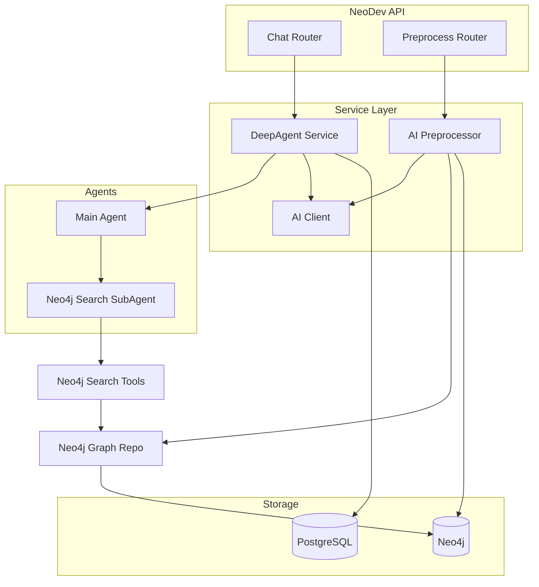

# NeoDev AI 客户端、预处理与对话能力实现计划

## 1. 目标与范围

- **AI 客户端**：单例，支持 Chat（OpenAI 兼容）+ Embedding（如 DashScope 1024 维），配置来自环境变量或配置文件。
- **预处理**：基于 Neo4j 中已有 Method/Function/Class 与 CALLS 关系，按拓扑层并发生成方法描述 → 聚合类/包/模块/项目描述 → 批量向量化并写回 Neo4j 节点（`description`、`embedding`）。
- **对话**：主智能体 + Neo4j 代码检索子智能体（DeepAgent 架构），工具链与 codeAnalysis 对齐；**对话与持久上下文存储全部使用 PostgreSQL**，不依赖 Weaviate。
- **存储**：对话消息、持久上下文、可选“临时上下文”的持久化均用 PG；Neo4j 仅负责代码图与描述/向量。

## 2. 架构总览

- **数据流**：  
  - 预处理：Neo4j 读（方法列表 + 调用图）→ LLM 描述 + Embedding → Neo4j 写（description/embedding）。  
  - 对话：用户消息 → 主智能体 → 必要时派发子智能体做 Neo4j 检索 → 结果经临时上下文交给主智能体 → 回复；对话与持久上下文写入 PG。

## 3. 依赖与配置

- **依赖**：在 [src/requirements.txt](NeoDev/src/requirements.txt) 中已有 `langchain`、`langgraph`、`neo4j`；需新增 `langchain-openai`（或兼容接口）用于 Chat/Embedding，以及 `openai`（调用 DashScope 等兼容 API）。若使用 deepagents 库，需确认 NeoDev 能引用（同 repo 或 pip 包）。
- **配置**：扩展 [src/config.example.json](NeoDev/src/config.example.json) 或通过环境变量提供：
  - `OPENAI_API_KEY` / `openai_api_key`
  - `OPENAI_BASE` / `openai_base`（如 DashScope 兼容端点）
  - `OPENAI_MODEL_CHAT` / `openai_model_chat`
  - `OPENAI_MODEL_EMB` / `openai_model_emb`
  - 可选：`CONFIG_PATH` 指向 JSON（与现有 sync 的 [sync_service.py](NeoDev/src/service/services/sync_service.py) 一致）。

## 4. PostgreSQL 存储设计（对话 + 持久上下文）

- **表结构**（新建迁移，如 `docker/migrations/005_ai_conversation_storage.sql`）：
  - **ai_conversations**：`id` (SERIAL), `thread_id` (VARCHAR UNIQUE), `project_id` (INT NULL, 关联 projects), `created_at`, `updated_at`。
  - **ai_messages**：`id` (SERIAL), `conversation_id` (FK ai_conversations), `role` (VARCHAR: user/assistant/system), `content` (TEXT), `context_type` (VARCHAR: normal/persistent, 默认 normal), `extra` (JSONB), `created_at`。
  - 约定：`context_type = 'persistent'` 表示该条为持久上下文；普通对话为 `normal`。检索“最近 N 轮对话”时按 `conversation_id + created_at` 过滤 `context_type = 'normal'`；按 `thread_id` 取 `context_type = 'persistent'` 即持久上下文。
- **职责**：
  - 实现 `ConversationStorageHandler` 的 PG 版本：`on_conversation_update(data)` 中根据 `data.thread_id` 创建/获取 `ai_conversations`，将 `data` 中的 messages 写入 `ai_messages`（若 `metadata.get("context_type") == "persistent"` 则写 `context_type='persistent'`），可选批量 + 定期或结束时 `flush()`。
  - 提供“按 thread_id 加载持久上下文”的接口（如 `get_persistent_context(thread_id) -> list[BaseMessage]`），供 DeepAgent 服务在恢复会话时写入 PersistentContextManager 的内存缓存，从而与 deepagents 的 PersistentContextManager 兼容（不修改 deepagents 源码）。
- **临时上下文**：仍使用 deepagents 的 `TemporaryContextManager`（内存 + 可选文件导出），不落 PG；若后续需要跨进程/持久化再考虑 PG 表。

## 5. AI 客户端（与 codeAnalysis 对齐）

- **位置**：`src/service/ai/client.py`（或 `src/service/services/ai_client.py`）。
- **实现要点**：
  - 单例，从环境变量或配置 JSON 读取 API Key、Base URL、Chat 模型名、Embedding 模型名。
  - Chat：使用 `langchain_openai.ChatOpenAI`（或兼容类）连接 OpenAI 兼容端点（如 DashScope）。
  - Embedding：与 codeAnalysis 一致，封装 1024 维向量接口（如 [codeAnalysis/services/ai/client.py](codeAnalysis/services/ai/client.py) 中的 `DashScopeEmbeddings`），批量 `embed_documents` 与单条 `embed_query`。
  - 提供 `initialize()`、`get_chat()`、`get_embedder()`、`is_available()`、`create_chat_model()`，供预处理与 DeepAgent 共用。

## 6. Neo4j 图仓储层（只读 + 描述/向量写入）

- **目的**：预处理与 Neo4j 检索工具需要按 `project_id` + `branch` 查询方法、调用图，并批量更新节点的 `description`、`embedding`。
- **位置**：例如 `src/service/repositories/neo4j_graph_repository.py`（或 `graph_repository.py`），依赖现有 [neo4j_writer](NeoDev/src/gitnexus_parser/neo4j_writer.py) 的 Neo4j 连接方式（从 sync 使用的 config 读取 uri/user/password/database）。
- **与 codeAnalysis 的差异**：NeoDev 图模型为 `(id, branch)` 唯一 + `project_id`，节点属性含 `name`、`filePath`、`content`、`startLine`、`endLine` 等（见 [graph/types.py](NeoDev/src/gitnexus_parser/graph/types.py)）。需实现的接口（Cypher 按 NeoDev 模型改写）：
  - **加载方法列表**：按 `project_id`、`branch` 查询 `Method`/`Function` 节点，返回 id、name、content、filePath、startLine、endLine 等；若存在 CONTAINS 父节点则带上 class_id 等。
  - **方法调用图**：返回 nodes + edges（CALLS），用于预处理拓扑分层。
  - **批量更新 description/embedding**：对指定 label（Method/Function/Class/File/Package/Module/Project）按 `(id, branch)` 更新 `description`、`embedding`（列表存 Neo4j）；可选 `source_code_hash` 用于增量跳过。
- **Neo4j 约束**：若尚未有 `description`、`embedding` 等属性，无需改约束，仅做 MERGE 或 SET 即可（与现有 [neo4j_writer.py](NeoDev/src/gitnexus_parser/neo4j_writer.py) 的写入方式兼容）。

## 7. 预处理（AIAnalysisPreprocessor）

- **位置**：`src/service/ai/preprocessor.py`（或 `src/service/services/ai_preprocessor.py`）。
- **逻辑**（与 [codeAnalysis/services/ai/preprocessor.py](codeAnalysis/services/ai/preprocessor.py) 一致，适配 NeoDev 图与仓储）：

  1. 从 Neo4j 图仓储按 `project_id` + `branch` 加载所有方法/函数及调用图；构建邻接表与入度，拓扑分层。
  2. 批量检查跳过：已有 `description`、`source_code_hash` 未变且已有 `embedding` 则跳过（可选）。
  3. 按层并发生成描述：叶子节点用“方法名+签名+源码”生成中文描述；父节点用“子方法描述+当前源码”生成；调用 AI 客户端单条或小批量请求，带重试与退避。
  4. 批量向量化：将本批描述用 Embedding 接口得到 1024 维向量，再批量写回 Neo4j（Method/Function）。
  5. 聚合类/包/模块/项目描述：基于下级节点描述用 LLM 生成上级描述，再向量化并写回对应节点。

- **参数**：`project_id`、`branch`、`force`（是否忽略已有 description/hash）。并发数、批量大小可配置（如从配置或环境变量读取）。

## 8. 对话：DeepAgent 服务 + PG 存储 + Neo4j 检索子智能体

- **DeepAgent 服务**：`src/service/ai/deepagent_service.py`（或 `src/service/services/deep_agent_service.py`）。
  - 使用 deepagents 的 `create_deep_agent`，配置主智能体 + 子智能体（neo4j-code-search-agent）。
  - **ConversationStorageHandler**：注入上述 PG 版实现（写入 `ai_conversations` + `ai_messages`，区分 normal/persistent）。
  - **PersistentContextManager**：仍用 deepagents 的 `PersistentContextManager`，其 `storage_handler` 指向同一 PG 处理器；在会话恢复时（如根据 thread_id 拉取历史），先调用 PG 的 `get_persistent_context(thread_id)`，将返回的 `list[BaseMessage]` 写入 PersistentContextManager 的内存（通过 load() 或扩展一次“从 DB 恢复”的入口），这样无需改 deepagents 源码。
  - **TemporaryContextManager**：直接使用 deepagents 的 `TemporaryContextManager`（内存 + 文件导出），用于 Neo4j 检索结果等临时块。
  - **Context retrieval**：不做 Weaviate 相似检索；`inject_retrieval_context=False`。若后续需要“相似历史对话”检索，可再在 PG 上做 pgvector 扩展。
- **子智能体**：neo4j-code-search-agent，工具为 Neo4j 检索（语义/关键词/混合/路径探索），与 [codeAnalysis/services/ai/tools/neo4j_search_tools.py](codeAnalysis/services/ai/tools/neo4j_search_tools.py) 行为一致，Cypher 改为 NeoDev 图模型（project_id、branch、name、filePath、content、description、embedding）。
- **中间件**：Neo4j 结果拦截、子智能体输出简化等，与 codeAnalysis 类似；临时上下文通过现有 TemporaryContextManager 注入。
- **工具**：主智能体具备 task（调用子智能体）、临时上下文（get_temp_context_registry、export_temp_context_block）、register_python_result、可选 skill 加载等；子智能体仅具备 Neo4j 检索工具。

## 9. API 与路由

- **Chat**：例如 `POST /api/projects/{project_id}/chat` 或 `POST /api/chat`，body 含 `thread_id`、`message`；可选 `stream: true`。返回流式或非流式回复；内部调用 DeepAgent 的 invoke/stream，并依赖 PG 存储 handler 落库。
- **持久上下文**：`POST /api/chat/context`（或 `/api/projects/{id}/chat/context`），body 含 `thread_id`、`content`，写入 PG 并同步到 PersistentContextManager 内存。
- **预处理**：`POST /api/projects/{project_id}/preprocess`，query 或 body 含 `branch`（默认 main）、`force`（默认 false）；调用 Preprocessor.run(project_id, branch, force)。

## 10. 实施顺序建议

1. **配置与 AI 客户端**：扩展 config、环境变量，实现 AI Client 单例并验证 Chat + Embedding。
2. **PG 迁移与存储**：新增 005 迁移，实现 PgConversationStorageHandler 及 `get_persistent_context`，不接 Agent 先做单元测试。
3. **Neo4j 图仓储**：实现 NeoDev 图模型的“方法列表 + 调用图 + 批量更新 description/embedding”。
4. **预处理**：实现 Preprocessor，依赖图仓储与 AI 客户端，跑通单项目单 branch。
5. **Neo4j 检索工具**：实现 neo4j_search_tools（语义/关键词/混合/路径），适配 NeoDev 图与 branch/project_id。
6. **DeepAgent 服务**：组装主/子智能体、PG 存储、临时上下文、中间件；实现“从 PG 恢复持久上下文”的入口。
7. **路由与集成**：Chat、持久上下文、预处理三个 API 挂到 [api.py](NeoDev/src/service/routers/api.py)，并做端到端验证。

## 11. 与 codeAnalysis 的差异小结

| 项目 | codeAnalysis | NeoDev（本方案） |

|------|--------------|------------------|

| 对话/上下文存储 | Weaviate | PostgreSQL（ai_conversations + ai_messages） |

| 图模型 | project_id，无 branch | project_id + branch，(id, branch) 唯一 |

| 方法/类来源 | ProjectScanner + Java 解析 | gitnexus_parser 解析（Method/Function/Class + CALLS） |

| 检索上下文 | WeaviateContextRetrievalHandler | 关闭注入，可选后续 pgvector |

按上述顺序实现即可在 NeoDev 中具备与 codeAnalysis 对等的 AI 客户端、预处理与完整对话能力，且存储统一使用 PG。