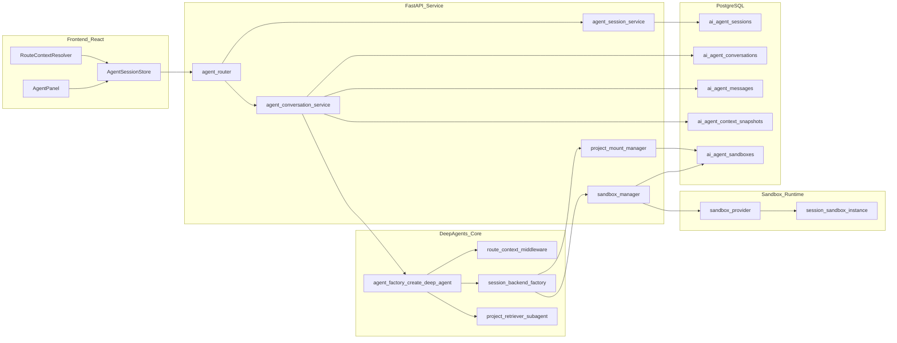
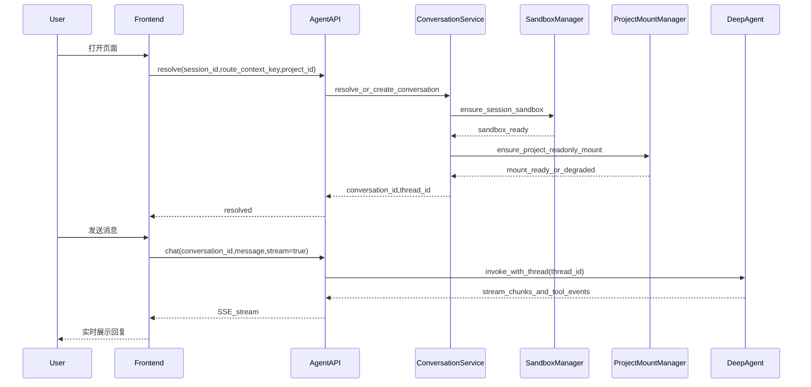
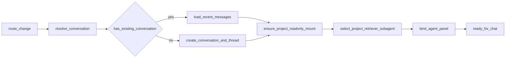

# NeoDev 智能体能力完整技术方案（DeepAgent + 会话级沙箱 + PG 会话）

## 目标与约束

- 在右侧对话框实现“随页面切换自动切换智能体上下文”，用户无感。
- 基于现有 `deepagents` 源码改造（[`D:/PycharmProjects/NeoDev/src/deepagents`](D:/PycharmProjects/NeoDev/src/deepagents)）。
- 沙箱必须做到**会话级隔离**（每个 chat session 独立 sandbox 生命周期）。
- 当路由切换到指定项目页时，需要把该项目目录挂载到会话沙箱并且**只读**。
- 对话历史与会话元数据使用 PG 存储（沿用现有 `psycopg2` 风格）。
- 与现有 FastAPI 路由聚合保持一致（[`D:/PycharmProjects/NeoDev/src/service/routers/api.py`](D:/PycharmProjects/NeoDev/src/service/routers/api.py)）。
- 本阶段聚焦可用、可维护、可扩展，不引入复杂多租户调度。
- 需要提供“项目检索子智能体”，并在项目切换时自动切换到对应项目的图查询与文件系统上下文。

## 现状结论（基于代码）

- 后端为 FastAPI：[`src/service/main.py`](D:/PycharmProjects/NeoDev/src/service/main.py)。
- 前端右侧 Agent 仅静态路由占位文案：[`web/src/components/AgentPanel.tsx`](D:/PycharmProjects/NeoDev/web/src/components/AgentPanel.tsx)。
- 前端路由上下文已清晰（`/onboard`、`/cockpit/requirements`、`/projects/:id/...`）：[`web/src/App.tsx`](D:/PycharmProjects/NeoDev/web/src/App.tsx)。
- 已有 PG 连接与 repository 模式可复用：[`src/service/dependencies.py`](D:/PycharmProjects/NeoDev/src/service/dependencies.py)。
- `deepagents` 已具备可插拔 backend / sandbox 协议：[`src/deepagents/backends/sandbox.py`](D:/PycharmProjects/NeoDev/src/deepagents/backends/sandbox.py)、[`src/deepagents/backends/protocol.py`](D:/PycharmProjects/NeoDev/src/deepagents/backends/protocol.py)。
- `deepagents` 已提供 `create_deep_agent`、`SubAgentMiddleware`、`FilesystemMiddleware`、`CompositeBackend` 等能力，可直接作为底座。

## 总体架构

## 核心设计

### 1) 页面切换无感策略（Agent + Context 自动切换）

- 定义 `route_context_key`（如 `onboard`、`graph_build`、`cockpit_requirements`、`project_repo`）。
- 定义 `agent_profile` 与 `route_context_key` 的映射（系统提示词、工具白名单、子智能体配置）。
- 前端每次路由变化调用 `resolve_or_create_conversation(session_id, route_context_key, project_id?)`。
- 已存在会话则恢复，不存在则创建新会话并注入页面上下文提示。
- 当 `route_context_key` 命中项目域页面（如 `project_repo`、`project_versions`），后端在 resolve 阶段触发项目目录只读挂载。
- 用户无需手动切换 agent，会话随页面自动切换。

### 2) 会话数据模型（Session / Conversation / Message）

- `session`：浏览器级长生命周期（登录态或匿名 UUID）。
- `conversation`：`session` 下按 `route_context_key + project_id + agent_profile` 唯一。
- `message`：conversation 下的 user/assistant/tool/system 消息明细。
- `context_snapshot`：用于快速恢复，降低历史重放成本。

### 3) 会话级沙箱隔离

- 一条 `session` 绑定一个独立 sandbox（可扩展到 session+project 粒度）。
- 首次需要执行能力时 `get_or_create(sandbox_id=None)`，后续复用同一 sandbox。
- 回收时机：显式关闭会话、空闲超时、后台定时任务清理。
- 约束：sandbox 生命周期与 PG 会话数据解耦，防止执行环境销毁导致历史丢失。

### 4) 项目目录只读挂载策略（新增）

- 挂载触发：当进入 `projects/:id/*` 相关页面并完成 `resolve` 时触发。
- 挂载来源：项目根目录以项目表中的 `repo_path` 为准。
- 挂载方式：在 sandbox 中将宿主机项目目录绑定到统一路径（建议 `/workspace/project`）并设置为只读。
- 挂载约束：
  - 只读挂载禁止写入、删除、重命名；
  - 所有写操作仅允许在沙箱临时工作目录（如 `/workspace/tmp`）；
  - 工具策略中对 `edit_file`、`write_file` 在只读挂载路径做硬拦截。
- 切换策略：
  - 同 session 切换到另一个项目时，先卸载旧项目挂载，再挂载新项目；
  - 若挂载失败，保留会话但降级为“仅图查询”模式并给出可观察错误。

### 5) 项目检索子智能体（新增）

- 角色：`project-retriever` 子智能体负责“项目内检索与证据收集”。
- 自动切换规则：
  - 主智能体检测到查询涉及项目代码定位、调用链、文件片段时，自动委托给 `project-retriever`；
  - `project_id` 与 `route_context_key` 作为子智能体硬上下文传入，禁止跨项目检索。
- 子智能体工具集（受限）：
  - 图查询工具：只查询当前项目图数据（按 `project_id` + 分支约束）；
  - 文件系统工具：只读访问当前挂载目录 `/workspace/project`；
  - 可选临时计算工具：仅在 `/workspace/tmp` 工作，不落宿主项目目录。
- 返回规范：子智能体返回“结论 + 图证据 + 文件证据（路径+片段）”，主智能体再做整合回答。

## PostgreSQL 模型设计

### 表结构建议

1. `ai_agent_sessions`

- `id` bigint pk
- `session_id` varchar unique
- `user_id` bigint null
- `status` varchar (`active|closed|expired`)
- `created_at` timestamptz
- `updated_at` timestamptz

2. `ai_agent_conversations`

- `id` bigint pk
- `session_id` varchar fk
- `route_context_key` varchar
- `project_id` bigint null
- `agent_profile` varchar
- `active_branch` varchar null
- `thread_id` varchar unique
- `title` varchar null
- `created_at` timestamptz
- `updated_at` timestamptz
- unique: `(session_id, route_context_key, coalesce(project_id,0), agent_profile)`

3. `ai_agent_messages`

- `id` bigint pk
- `conversation_id` bigint fk
- `role` varchar (`system|user|assistant|tool`)
- `content` text
- `tool_name` varchar null
- `tool_call_id` varchar null
- `token_in` int null
- `token_out` int null
- `latency_ms` int null
- `created_at` timestamptz
- index: `(conversation_id, created_at)`

4. `ai_agent_context_snapshots`

- `id` bigint pk
- `conversation_id` bigint fk
- `summary` text
- `state_json` jsonb
- `last_message_id` bigint
- `created_at` timestamptz
- index: `(conversation_id, created_at desc)`

5. `ai_agent_sandboxes`

- `id` bigint pk
- `session_id` varchar fk
- `sandbox_id` varchar unique
- `provider` varchar
- `status` varchar (`running|stopped|deleted|error`)
- `metadata_json` jsonb
- `mounted_project_id` bigint null
- `mounted_project_path` varchar null
- `mount_mode` varchar (`readonly|none`)
- `last_heartbeat_at` timestamptz
- `expires_at` timestamptz
- `created_at` timestamptz
- `updated_at` timestamptz

## DeepAgent 改造方案

### 1) Agent Factory（按 profile 组装）

- service 层新增 `agent_factory`：
  - 输入：`agent_profile`、`route_context_key`、`session_id`、`project_id`
  - 输出：`create_deep_agent(...)` 产出的运行实例
- middleware 注入建议：
  - `route_context_middleware`：注入页面上下文提示
  - `session_memory_middleware`：加载会话摘要与长期信息
  - `tool_policy_middleware`：按 profile 限制工具可用范围

### 2) Session Backend Factory（关键）

- 基于 backend 协议做路由工厂：
  - 执行相关（`execute`）强制路由到 session sandbox
  - 非执行（memory/snapshot/large results）走 state/store
- 可参考 Composite 模式：
  - `/workspace/project/**` -> sandbox backend（只读挂载区）
  - `/workspace/tmp/**` -> sandbox backend（可写临时区）
  - `/memory/**` -> state/store backend
  - `/large_tool_results/**` -> store backend
- 读写策略：
  - `read_file`/`ls` 允许访问 `/workspace/project/**`
  - `write_file`/`edit_file`/`execute` 对 `/workspace/project/**` 做写拦截
  - 写相关操作仅允许 `/workspace/tmp/**`

### 3) Sandbox Provider 实现要点

- 按 `SandboxProvider` 协议实现：`list`、`get_or_create`、`delete`。
- `sandbox_id` 建议规则：`neodev_{session_id_hash}`。
- 增加心跳与过期机制，支持后台回收与重试。
- 增加挂载管理接口（由 service 层封装）：
  - `mount_project_readonly(sandbox_id, project_path, mount_point)`
  - `unmount_project(sandbox_id, mount_point)`
  - `get_mount_status(sandbox_id)`

## API 设计

统一挂载在 `/api/agent`（由 `api.py` 聚合）。

1. `POST /api/agent/sessions/resolve`

- 入参：`session_id`, `route_context_key`, `project_id?`, `agent_profile?`
- 出参：`conversation_id`, `thread_id`, `agent_profile`, `sandbox_status`, `mount_status`

2. `GET /api/agent/conversations/{conversation_id}/messages`

- 分页获取历史消息

3. `POST /api/agent/chat`

- 入参：`conversation_id`, `message`, `stream?`
- 非流式：返回 `assistant_message`, `usage`
- 流式：SSE 返回 token chunk、tool event、final message

4. `POST /api/agent/context/snapshot`

- 手动触发上下文快照（也可内部自动触发）

5. `POST /api/agent/sandbox/recycle`

- 会话关闭触发回收（后台任务兜底）

6. `POST /api/agent/sandbox/mount-project`

- 入参：`session_id`, `project_id`, `project_path`, `mount_mode=readonly`
- 用途：手动触发或重试项目挂载（默认由 resolve 内部自动调用）

7. `GET /api/agent/sandbox/mount-status`

- 入参：`session_id`
- 出参：当前挂载项目、挂载点、只读状态、最近错误

## 前端方案（右侧对话框）

- 将 `AgentPanel` 从静态提示升级为可交互 ChatPanel。
- 新增 `AgentSessionStore`（React Context）管理：
  - `session_id`
  - `conversation_id`
  - 当前消息列表
  - streaming 状态
- 路由变化时自动 `resolve` 并无感切换 conversation。
- 交互细节：
  - 切换加载 skeleton，避免闪屏
  - 输入草稿按 conversation 维度缓存
  - 工具执行态（如沙箱执行）可视化
  - 在项目页展示“项目已只读挂载”状态标签，挂载失败展示降级提示

## 关键流程

### A. 首次进入并发起提问

### B. 页面切换无感恢复

## 安全与治理

- 工具按 `agent_profile` 白名单控制（非所有页面都开放 `execute`）。
- 对 `execute` 增加命令策略（高危命令拦截、超时、输出截断）。
- 项目挂载目录强制只读，增加路径级写拦截，避免误改仓库源码。
- 消息与工具调用留审计日志，支持追溯。
- 敏感信息脱敏（日志/异常/tool 返回）。

## 性能与稳定性

- 会话恢复优先 `context_snapshot`，减少全量历史回放。
- 消息列表分页加载，避免一次性全量查询。
- profile 级配置缓存，thread 级上下文隔离。
- sandbox 并发配额与空闲回收，控制资源成本。
- 项目切换时采用“卸载旧挂载 -> 挂载新项目”的顺序，防止跨项目脏上下文。
- 增加超时、重试、熔断：
  - LLM 调用超时
  - sandbox execute 超时
  - PG 短暂故障重试

## 分阶段落地计划（仅方案）

### Phase 1：基础链路

- 完成 PG 会话/消息模型
- 完成 `/sessions/resolve` + `/chat` 非流式
- 右侧面板可收发消息

### Phase 2：无感切换

- 完成路由上下文映射与 conversation 自动切换
- 完成 snapshot 恢复策略
- 完成项目页自动只读挂载策略

### Phase 3：会话级沙箱

- 接入 sandbox provider
- 完成 session->sandbox 生命周期管理
- 完成 backend 路由到 session sandbox
- 完成 `project-retriever` 子智能体自动切换

### Phase 4：流式与治理

- SSE 流式输出
- 工具状态可视化
- 风险命令拦截与审计完善

## 验收标准

- 页面切换后可在 1-2 秒内恢复对应会话历史，无需手动切换。
- 同一 session 下不同页面上下文互不污染。
- 会话级隔离可验证：A 会话执行产生的沙箱文件 B 会话不可见。
- 项目页切换后，沙箱挂载目录始终为对应项目且只读，无法写入宿主项目目录。
- 项目检索问答可自动命中对应项目图查询与只读文件检索，不出现跨项目结果。
- PG 中可追溯会话、消息、快照、sandbox 状态。
- 超时与异常场景下主链路可降级，不丢核心会话数据。

## 风险与对策

- 风险：sandbox 资源开销高  

对策：空闲回收、并发配额、按页面按需启用执行能力。

- 风险：上下文膨胀影响响应  

对策：snapshot 摘要、窗口裁剪、大结果外置存储。

- 风险：route/profile 映射变复杂  

对策：集中配置、模板化管理、变更回归清单。

- 风险：项目挂载失败导致检索不可用  

对策：降级到仅图查询模式，暴露挂载状态与重试接口，后台重试挂载。

- 风险：前后端切换状态抖动  

对策：resolve 幂等、前端本地缓存、防抖与取消旧请求。

## TL;DR

以 `session` 为主线，构建“路由驱动会话切换”的右侧智能体交互：DeepAgent 负责推理编排，PG 负责会话与历史事实存储，SandboxProvider 负责会话级隔离执行。新增项目页自动只读挂载与 `project-retriever` 子智能体自动切换机制，确保图查询与文件检索始终绑定当前项目，不串项目、不改源码。通过 `resolve -> mount -> chat -> snapshot -> recycle` 的闭环接口，实现页面切换无感、上下文隔离、可审计可恢复的智能体能力底座。