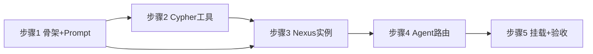
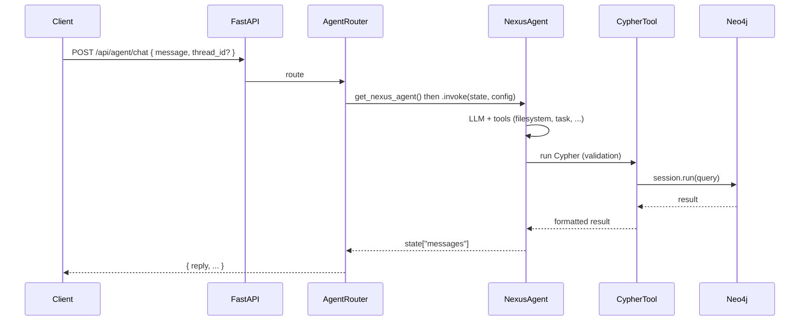

# 在 service 中基于 deepagent 创建 Nexus 智能体实例

## 现状与依据

- **DeepAgent 入口**：[`src/deepagents/graph.py`](src/deepagents/graph.py) 中的 `create_deep_agent()` 返回 `CompiledStateGraph`，支持 `system_prompt`、`tools`、`middleware`、`backend` 等；默认带 Todo、Filesystem、SubAgent、Summarization 等中间件。
- **Service 结构**：[`src/service/main.py`](src/service/main.py) 为 FastAPI 应用，通过 `service.routers` 挂载 `repos` 与 `parse`；解析管线已使用 Neo4j（[`src/service/routers/parse.py`](src/service/routers/parse.py) 传入 `neo4j_uri/user/password`）。
- **Neo4j 使用**：项目使用 `neo4j` 驱动写入图谱（[`src/gitnexus_parser/neo4j_writer.py`](src/gitnexus_parser/neo4j_writer.py)）；当前**没有**对外暴露 Cypher 查询接口，Nexus 的“用 Cypher 验证”需要由 agent 可调用的工具提供。

## 目标

- 在 **service** 中创建**一个 deepagent 实例**（即单个由 `create_deep_agent()` 返回的 `CompiledStateGraph`），命名为 Nexus；不是多个 agent 或独立子服务。
- Nexus 行为遵循你提供的指令：落地（引用）、验证（Cypher）、搜索-阅读-追踪-引用-验证流程、图谱模式与工具箱说明、输出风格（表格/Mermaid/TL;DR）等。
- **工具创建参考 [`src/gitnexus_parser`](src/gitnexus_parser)**：Neo4j/Cypher 等工具在 service 内实现，但配置与图谱语义与 parser 对齐（见下节）。
- 通过 HTTP API 暴露该 agent，使前端或其它服务可发送问题并获取 Nexus 的回复。

## 实现方案

### 1. Nexus 系统提示与配置

- 在 **service 内** 新增模块（建议 `service/agent/`），集中放置 Nexus 相关逻辑。
- **NEXUS_SYSTEM_PROMPT**：将你提供的完整指令（强制落地与验证、核心协议、工具箱、图谱模式、关键规则、输出风格）整理成一段 system prompt 字符串（或 `SystemMessage`），在创建 agent 时传入 `create_deep_agent(system_prompt=NEXUS_SYSTEM_PROMPT, ...)`。
- 不修改 `deepagents/graph.py`，仅在 service 侧“使用” deepagent 并注入 Nexus 专属 prompt。

### 2. 工具创建（参考 gitnexus_parser）

- **Cypher 工具**（供 Nexus 验证）  
  - **实现位置**：在 `service/agent/tools.py` 中实现 LangChain Tool，**参考 gitnexus_parser 的配置与连接方式**：
    - **配置来源**：使用 [`gitnexus_parser.config.load_config`](src/gitnexus_parser/config.py)（dict/文件/环境）获取 `neo4j_uri`、`neo4j_user`、`neo4j_password`；与 [`service/routers/parse.py`](src/service/routers/parse.py) 一致，请求体可传入覆盖。
    - **连接方式**：与 [`gitnexus_parser/ingestion/pipeline.py`](src/gitnexus_parser/ingestion/pipeline.py) 一致：`GraphDatabase.driver(uri, auth=(user, password))`，`session.run(cypher)` 执行**只读**查询（不写图）；结果序列化后返回给 agent。
    - **图谱语义**：查询的是 parser 写入的同一张图。节点/关系与 [`gitnexus_parser/graph/types.py`](src/gitnexus_parser/graph/types.py) 及 [`gitnexus_parser/neo4j_writer.py`](src/gitnexus_parser/neo4j_writer.py) 一致：节点标签见 `CONSTRAINT_LABELS`（File, Folder, Class, Function, …），关系类型为 CONTAINS、CALLS、IMPORTS、DEFINES、MEMBER_OF、STEP_IN_PROCESS 等；可在工具描述中注明，便于 Nexus 写出正确 Cypher。
  - 未配置 Neo4j 时工具返回明确提示，不抛未处理异常。
- **其它工具**：deepagent 自带 Filesystem（ls/read_file/grep 等）、Todo、SubAgent 等；文件级 search/grep 用内置能力即可。若后续需要“图谱上的 search/explore/impact”，可再在 `service/agent/tools.py` 中基于同一 Neo4j 与 schema 封装，继续参考 gitnexus_parser 的图结构。

### 3. 作为单一 deepagent 实例

- Nexus 即**一个**由 `create_deep_agent(...)` 得到的 **deepagent 实例**（单个 `CompiledStateGraph`），在 service 内以单例或惰性初始化方式持有。
- **推荐**：应用启动或首次请求时创建一次，例如 `create_deep_agent(system_prompt=NEXUS_PROMPT, tools=[cypher_tool], ...)`；Cypher 工具内部使用 `gitnexus_parser.config.load_config()` 获取 Neo4j 连接，与 parser 共用同一套配置/环境。
- 不传 `checkpointer` 时每次请求无状态；传 `checkpointer` 时用 `config={"configurable": {"thread_id": request.thread_id}}` 区分会话。
- 若将来需要“每请求不同 Neo4j”，可改为按请求构造 `cypher_tool`（或带 config 的 tool）并选择：单例 agent 下 tool 从 configurable 读连接，或按请求重新 `create_deep_agent`（成本较高）。

**并发与单例（多人同时使用）**

- **单例在并发下是安全的**：`CompiledStateGraph` 描述的是计算图，本身无请求级可变状态；每次 `invoke(state, config)` 传入独立的 `state` 与 `config`，各请求互不干扰。
- **实现约束**（避免出问题）：
  - **Cypher 工具**：Neo4j Driver 可多线程共用，但 **Session 不可**。工具内必须**每次调用**执行 `with driver.session(...) as session: session.run(query)`，即每次 tool 调用新建 session，用完即关；不要复用同一个 session 跨请求。
  - **thread_id**：使用 checkpointer 时，同一会话用同一 `thread_id`，不同用户/会话必须用不同 `thread_id`（例如用 UUID 或 user_id+session_id），否则会共享同一份对话状态。
- **非正确性风险**：高并发时会共享同一 LLM 与 Neo4j 连接，可能触及限流或连接池上限；属运维/容量问题，可通过限流、队列或水平扩容缓解，与是否单例无直接冲突。

### 4. API 设计

- **路由**：在 `service/routers/` 下新增 `agent.py`（或 `nexus.py`），挂载到 app（例如 `app.include_router(agent.router)`）。
- **端点示例**：`POST /api/agent/chat`（或 `/api/nexus/ask`）。
  - **Request body**：`message: str`（必填），`thread_id: str | None`（可选，用于多轮会话），可选 `neo4j_uri`, `neo4j_user`, `neo4j_password`（若采用请求级 Neo4j 则传；否则可省略）。
  - **行为**：构造 `state = {"messages": [HumanMessage(content=message)]}`；若有 `thread_id` 则 `config = {"configurable": {"thread_id": thread_id}}`，否则 `config = {}`；调用 `nexus_agent.invoke(state, config)`（或 `ainvoke` 做异步）。
  - **Response**：从最终 state 的 `messages` 中取最后一条 AI 消息内容返回（可带 `citations` 等若 state 中有）；若流式需求可后续加 SSE。
- **路径与安全**：对 `message` 做基本长度/内容校验；若请求体带 `repo_path` 等路径，复用 [`service/path_allowlist.py`](service/path_allowlist.py) 的 `ensure_path_allowed`（与 repos/parse 一致）。

### 5. 文件与依赖

- **新增/修改**：
  - `service/agent/__init__.py`：导出 `get_nexus_agent`、`NEXUS_SYSTEM_PROMPT` 等。
  - `service/agent/prompt.py`（或内联在 nexus.py）：存放 `NEXUS_SYSTEM_PROMPT` 常量。
  - `service/agent/nexus.py`：`get_nexus_agent(neo4j_config: dict | None = None)` 调用 `create_deep_agent(system_prompt=NEXUS_SYSTEM_PROMPT, tools=[...], ...)`，返回 `CompiledStateGraph`；若传入 `neo4j_config` 则用其构造 `cypher_tool`，否则从环境/配置读取或返回“无 Cypher”的 agent。
  - `service/agent/tools.py`：实现 `make_cypher_tool(uri, user, password)` 或从 env 读取的 `get_cypher_tool()`，返回供 `create_deep_agent` 使用的 Tool。
  - `service/routers/agent.py`：实现 `POST /api/agent/chat`，组合 state/config，调用 `get_nexus_agent(...).invoke(...)` 并返回结果。
  - [`service/main.py`](src/service/main.py)：`include_router(agent.router)`。
- **依赖**：现有 `src/requirements.txt` 已含 `fastapi`、`uvicorn`、`neo4j`、`langchain`、`langgraph`、`langchain-anthropic` 等，无需新增；若 deepagents 未在 requirements 中显式写为可编辑依赖，需确保 service 能 import `deepagents`（同 monorepo 下 `PYTHONPATH=src` 即可）。

### 6. 多步骤构建方案

按以下顺序分步实施，每步可单独验证后再进入下一步。

- **步骤 1 — 骨架与 Prompt**：搭建 `service/agent` 模块骨架与 Nexus 系统提示。产出：`service/agent/__init__.py`、`service/agent/prompt.py`（或内联）含 `NEXUS_SYSTEM_PROMPT`；可空占位 `nexus.py`、`tools.py`。依赖：无。
- **步骤 2 — Cypher 工具**：实现 Cypher 工具，参考 gitnexus_parser；每次 tool 调用内 `with driver.session() as session: session.run(...)`。产出：`service/agent/tools.py`（`get_cypher_tool`/`make_cypher_tool`）；未配置时返回友好提示。依赖：步骤 1。
- **步骤 3 — Nexus 实例**：创建 Nexus deepagent 实例并单例/惰性持有。产出：`service/agent/nexus.py` 中 `get_nexus_agent(neo4j_config=None)` 调用 `create_deep_agent(...)` 返回 `CompiledStateGraph`。依赖：步骤 1、2。
- **步骤 4 — Agent 路由**：添加 `POST /api/agent/chat`。产出：`service/routers/agent.py`（message、thread_id，invoke 后返回最后一条 AI 消息）。依赖：步骤 3。
- **步骤 5 — 挂载与验收**：在 main 挂载路由并验收。产出：`service/main.py` 中 `include_router(agent.router)`；调用接口确认返回；可选验证 Neo4j 未配置/已配置时 Cypher 行为。依赖：步骤 4。

依赖关系（Mermaid）：

### 7. 数据流概览

### 8. 验收要点

- Nexus 使用你提供的完整指令作为 system prompt，且通过 `create_deep_agent` 创建。
- Agent 在 service 内可被路由调用；`POST /api/agent/chat` 返回基于 message 的回复。
- 当 Neo4j 可用时，Nexus 具备 Cypher 工具并可执行只读查询以“验证”；未配置时接口仍可工作，Cypher 工具返回友好提示。
- 代码结构清晰：prompt 与 tools 可维护，便于后续扩展（如增加 search/explore/impact 等专用工具或子图）。

## 风险与取舍

- **Neo4j 配置作用域**：单例 agent + 全局 Neo4j 实现简单；若需每请求不同 Neo4j，需接受“每请求可能重建 agent”或引入“tool 从 configurable 读连接”的约定。
- **速率与成本**：每次对话会触发 LLM 与工具调用；可按需加限流、长度限制或缓存（非本方案必须）。
- **流式输出**：当前方案以同步 `invoke` 返回完整回复；若需流式，可后续改为 `stream()` 并暴露 SSE 端点。

## TL;DR

Nexus 是 **一个 deepagent 实例**（单次 `create_deep_agent` 的 `CompiledStateGraph`）。在 **service** 中新增 `service/agent` 模块：用 Nexus 指令作为 **system_prompt**，通过 **create_deep_agent** 创建该实例；**工具创建参考 gitnexus_parser**：Cypher 工具在 `service/agent/tools.py` 中实现，使用 `load_config()` 与 pipeline 相同的 Neo4j 连接方式，查询与 parser 写入的图一致（schema 见 types.py / neo4j_writer）。在 **service/routers/agent.py** 提供 **POST /api/agent/chat**，组装 state/config 并调用 agent.invoke，返回 Nexus 的回复。