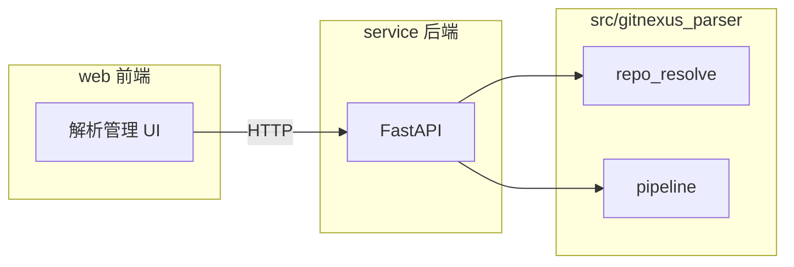

# Web 目录与项目解析管理前后端方案

## 目标

- **web/**：项目解析管理的前端（仓库解析、解析任务触发与结果展示）。
- **service/**：后端 HTTP 服务，封装对 `src/gitnexus_parser` 的调用。
- **src/gitnexus_parser**：保持现状，作为底层能力被 service 调用（[`repo_resolve.py`](src/gitnexus_parser/ingestion/repo_resolve.py)、[`pipeline.py`](src/gitnexus_parser/ingestion/pipeline.py)）。

## 架构概览

## 一、目录与职责

| 路径 | 职责 |

|------|------|

| **web/** | 前端 SPA：仓库解析（路径解析 / URL 克隆）、解析任务（选择仓库、触发 pipeline、展示节点/关系/文件数）。 |

| **service/** | FastAPI 应用：提供 REST 接口，调用 `resolve_repo_root`、`ensure_repo_from_url`、`run_pipeline`；通过 PYTHONPATH 或可安装方式引用 `src`。 |

| **src/gitnexus_parser** | 不新增业务逻辑，仅被 service 调用。 |

## 二、后端 service 设计

- **技术选型**：Python 3.x + FastAPI（与现有 Python 技术栈一致，易与 gitnexus_parser 集成）。
- **依赖**：在 `service/requirements.txt` 中声明 `fastapi`、`uvicorn`；Neo4j/parser 依赖通过复用 [`src/requirements.txt`](src/requirements.txt) 或从 `src` 安装得到。
- **运行方式**：启动时设置 `PYTHONPATH=src`（或项目根），使 `import gitnexus_parser` 可用；或通过 `pip install -e src` 安装 gitnexus_parser。

**建议 API（与阶段一能力对齐）**：

| 方法 | 路径 | 说明 |

|------|------|------|

| POST | `/api/repos/resolve` | Body: `{"path": "..."}`，返回 `{"repo_root": "..."}` 或 404/400。内部调用 `resolve_repo_root(path)`。 |

| POST | `/api/repos/ensure` | Body: `{"repo_url": "...", "target_path": "..."}`，克隆或确认已有仓库，返回 `{"repo_root": "..."}`。内部调用 `ensure_repo_from_url`。 |

| POST | `/api/parse` | Body: `{"repo_path": "...", "write_neo4j": true}`，可选传 `neo4j_uri/user/password` 或沿用环境变量/配置文件。调用 `run_pipeline(repo_path, config, write_neo4j=...)`，返回 `{ "node_count", "relationship_count", "file_count" }`。 |

- **安全与路径**：对 `path`、`target_path`、`repo_path` 做校验，限制在允许的根目录下（如配置项 `allowed_base_paths` 或当前工作目录下），避免任意路径访问。
- **CORS**：允许 `web` 开发服务器来源（如 `http://localhost:5173`），便于联调。

**建议 service 目录结构**：

- `service/main.py`：FastAPI 应用入口、CORS、挂载路由。
- `service/routers/repos.py`：`/api/repos/resolve`、`/api/repos/ensure`。
- `service/routers/parse.py`：`/api/parse`。
- `service/requirements.txt`：fastapi、uvicorn、以及从上层复用 neo4j/tree-sitter 等（或依赖 `../src`）。

## 三、前端 web 设计

- **技术选型**：Vite + React + TypeScript（或可替换为 Vue/Svelte，按团队习惯）。
- **功能范围**（项目解析管理）：

  1. **仓库解析**：输入本地路径 → 调用 `/api/repos/resolve` 显示仓库根；或输入 URL + 目标路径 → 调用 `/api/repos/ensure` 完成克隆并显示仓库根。
  2. **解析任务**：选择/输入已解析的仓库路径，触发 `/api/parse`，展示返回的 `node_count`、`relationship_count`、`file_count`（及可选错误信息）。

- **与后端联调**：开发时 Vite 代理 `/api` 到 service 地址（如 `http://localhost:8000`），或前端直接配置 API base URL。

**建议 web 目录结构**：

- `web/package.json`、`web/vite.config.ts`、`web/tsconfig.json`。
- `web/index.html`、`web/src/main.tsx`、`web/src/App.tsx`。
- `web/src/api/client.ts`：封装 `fetch` 调用上述三个 API。
- `web/src/pages/` 或 `web/src/components/`：仓库解析表单、解析任务表单与结果展示。

## 四、与阶段一方案的关系

- 阶段一方案（[阶段一测试驱动技术方案_2ff7fddb.plan.md](.cursor/plans/阶段一测试驱动技术方案_2ff7fddb.plan.md)）约定：config 不包含 repo/branches；仓库与分支由**方法参数**传入。本方案遵循该约定：service 从请求体接收 `path`、`repo_url`、`target_path`、`repo_path`，不依赖 config 中的 repo；Neo4j 等仍可由 config/环境变量或请求体可选覆盖。
- 底层仍使用已有的 `resolve_repo_root`、`ensure_repo_from_url` 和 `run_pipeline`，不修改其签名或实现。

## 五、实施顺序建议

1. **创建 service 目录与 FastAPI 骨架**：`main.py`、CORS、`routers/repos.py` 与 `routers/parse.py`，占位实现或直接调用 gitnexus_parser；`requirements.txt` 与启动方式（PYTHONPATH）。
2. **实现并验证 API**：用 curl/Postman 或简单脚本验证 `/api/repos/resolve`、`/api/repos/ensure`、`/api/parse`。
3. **创建 web 目录与前端脚手架**：Vite + React + TS，配置 API 代理或 base URL。
4. **实现解析管理 UI**：仓库解析（路径/URL）与解析任务触发、结果展示，对接上述 API。
5. **路径安全与错误处理**：在 service 中统一路径校验与错误响应格式；前端展示错误信息。

## 六、可选后续

- 解析任务列表/历史（需 service 持久化或内存存储）。
- 分支选择（待阶段三/五分支能力就绪后再在 API 与 UI 中体现）。