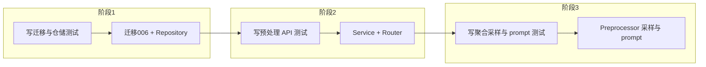

# 单分支与状态与上下文截断 — 测试驱动详细研发方案

本方案在 [单分支与状态与上下文截断_078e8f63.plan.md](.cursor/plans/单分支与状态与上下文截断_078e8f63.plan.md) 的 API、表结构、服务层与聚合规则基础上，**按测试驱动开发（TDD）** 组织：每个阶段先写测试（红）→ 实现（绿）→ 必要时重构。

---

## 1. 范围与目标（与原方案一致）

- **单分支**：每次预处理请求仅接受一个 `branch`，多分支通过多次请求 + 单项目单任务串行。
- **状态持久化**：PostgreSQL 表 `ai_preprocess_status`，用于并发控制（同一 project_id 仅允许一个 running）与前端查询。
- **聚合采样**：类/包/模块/项目聚合时，每种节点类型仅取前 3 个下级参与 LLM 输入，且提示词中必须注明「此为采样」。

---

## 2. TDD 阶段总览

- **阶段 1**：迁移 + 状态仓储（仅 DB 与 repository，无 HTTP）。
- **阶段 2**：预处理触发与状态查询 API（依赖阶段 1 的表与仓储）。
- **阶段 3**：Preprocessor 内聚合采样与 `_build_aggregate_prompt`（可 mock LLM/Neo4j）。

---

## 3. 阶段 1：迁移与状态仓储（TDD）

### 3.1 测试先行

**测试文件**：[tests/test_ai_preprocess_status_repository.py](tests/test_ai_preprocess_status_repository.py)（新建）

**依赖**：`conftest.py` 中已有 `pg_conn`、`db_connection`（会执行 `docker/migrations` 下所有 SQL），故需先加入迁移 `006_ai_preprocess_status.sql`，否则表不存在测试会失败；实施时可采用「先写迁移 → 再写仓储测试 → 再实现仓储」顺序。

**用例与断言要点**：

| 测试方法 | 步骤 | 断言要点 |

|----------|------|----------|

| `test_has_running_false_when_no_row` | 不插入任何记录 | `has_running(conn, project_id)` 为 False |

| `test_has_running_true_when_status_running` | 插入 (project_id, branch, status='running') | `has_running(conn, project_id)` 为 True |

| `test_has_running_false_when_status_completed` | 仅存在 status='completed' | `has_running(conn, project_id)` 为 False |

| `test_set_running_creates_row_returns_true` | 无 running 时 `set_running(conn, pid, "main")` | 返回 True；表中存在 (project_id, branch, status='running') |

| `test_set_running_when_already_running_returns_false` | 先 set_running 同一 project_id，再另一 branch 或同一 branch 再调 set_running（依实现：同一 project 任一 running 即占位） | 第二次 `set_running` 返回 False（不覆盖） |

| `test_set_completed_updates_row` | set_running 后 set_completed(conn, pid, "main", {"saved": 10}) | 该行 status='completed'，finished_at 非空，extra 含 saved |

| `test_set_failed_updates_row` | set_running 后 set_failed(conn, pid, "main", "error msg") | status='failed'，error_message 为 "error msg" |

| `test_get_status_by_project_and_branch_returns_one` | 插入一条 (project_id, branch, status) | get_status(conn, project_id, branch) 返回 list 且 len=1，元素含 project_id/branch/status/started_at 等 |

| `test_get_status_by_project_only_returns_all_branches` | 插入同一 project_id 两条不同 branch | get_status(conn, project_id, None) 返回 list 且 len=2（或按「最近一条」语义：若表为 upsert 单行 per (project_id,branch)，则两条） |

**表与并发语义**（与原方案一致）：唯一约束 `(project_id, branch)`；`has_running(project_id)` 只看是否存在该 project_id 且 status='running'；`set_running` 在 has_running 为 True 时返回 False 不写，否则 upsert 该 (project_id, branch) 为 running。

### 3.2 实现要点

- **迁移**：[docker/migrations/006_ai_preprocess_status.sql](docker/migrations/006_ai_preprocess_status.sql) — 建表 `ai_preprocess_status`（id, project_id, branch, status, started_at, finished_at, error_message, extra, created_at, updated_at），UNIQUE(project_id, branch)，索引 `WHERE status='running'`。
- **仓储**：[src/service/repositories/ai_preprocess_status_repository.py](src/service/repositories/ai_preprocess_status_repository.py) — 实现 `has_running`, `set_running`, `set_completed`, `set_failed`, `get_status`；使用 `conn.cursor(RealDictCursor)` 与现有 [project_repository](src/service/repositories/project_repository.py) 风格一致。

---

## 4. 阶段 2：预处理 API（TDD）

### 4.1 测试先行

**测试文件**：[tests/test_api_preprocess.py](tests/test_api_preprocess.py)（新建）

**依赖**：`client_with_db`（覆盖 `get_db` 为测试 PG），需先有 project 记录（可沿用 test_api_projects 的 create 方式）。

**用例与断言要点**：

| 测试方法 | 步骤 | 断言要点 |

|----------|------|----------|

| `test_post_preprocess_project_not_found_returns_404` | POST /api/projects/999999/preprocess | status_code == 404 |

| `test_post_preprocess_success_returns_200_and_status_running_or_message` | 创建 project 后 POST preprocess（branch 默认或传 "main"） | 200；body 含 status、project_id、branch；若异步则为 202 |

| `test_post_preprocess_when_running_returns_409` | 先 POST preprocess 使该项目进入 running（若当前实现为同步且很快完成，则需 mock Preprocessor.run 为长时间或先插入 running 状态再调 API） | 第二次 POST 同一 project_id 返回 409；body 含 detail 或 code 如 PROJECT_BUSY |

| `test_post_preprocess_with_branch_and_force` | POST body 或 query：branch=develop, force=true | 200；请求被接受（可断言 body.branch == "develop"） |

| `test_get_status_project_not_found_returns_404` | GET /api/projects/999999/preprocess/status | 404 |

| `test_get_status_no_record_returns_empty_or_single` | 新建 project，从未 preprocess | GET status 返回 200；body 为单条空或 items=[]（依设计） |

| `test_get_status_with_branch_returns_single_record` | 先 POST preprocess 并等待完成或 mock 为 completed，GET status?branch=main | 200；单条记录含 project_id, branch, status, started_at, finished_at 等 |

| `test_get_status_without_branch_returns_list` | 同一 project 多条 branch 状态（或仅一条） | GET status 无 branch 时 200；body 为 `{ "items": [ ... ] }` 或单条，与原方案 2.2 一致 |

**说明**：409 的可靠测试可依赖「在测试里直接通过 repository 插入 running 行，再发 POST preprocess」，避免依赖真实 Preprocessor 执行时间。

### 4.2 实现要点

- **路由**：新建 [src/service/routers/preprocess.py](src/service/routers/preprocess.py)（或并入 projects），挂载到 [src/service/routers/api.py](src/service/routers/api.py) 下 prefix `/projects`，确保路径为 `/{project_id}/preprocess` 与 `/{project_id}/preprocess/status`。
- **Service**：[src/service/services/ai_preprocessor_service.py](src/service/services/ai_preprocessor_service.py) — 入口函数接收 (conn, project_id, branch, force)；内部：`has_running` → 若 True 返回 (409, body)；`set_running` → 在 try 中调 Preprocessor.run(project_id, branch, force)，finally 里 set_completed 或 set_failed；返回 (200, body) 或 (202, body)。
- **与 Preprocessor 对接**：若 Preprocessor 尚未实现，可先 mock 或占位返回统计 dict，保证 200/409/404 行为正确。

---

## 5. 阶段 3：聚合采样与提示词（TDD）

### 5.1 测试先行

**测试文件**：[tests/test_aggregation_sampling.py](tests/test_aggregation_sampling.py) 或 [tests/test_ai_preprocessor.py](tests/test_ai_preprocessor.py)（新建）

**目标**：验证「按节点类型取前 N 个下级」与「prompt 中必须包含采样说明」两项。

| 测试方法 | 步骤 | 断言要点 |

|----------|------|----------|

| `test_sample_limits_to_config_size` | 构造 5 个下级，aggregation_sample_size=3 | 参与拼 prompt 的列表长度为 3 |

| `test_sample_sorted_by_name_or_id` | 下级 name 乱序，如 [C, A, B] | 采样结果为按 name 升序前 3，如 A,B,C（或按 id 升序） |

| `test_build_aggregate_prompt_contains_sampling_phrase` | 调用 _build_aggregate_prompt(scope, name, sampled, total=5) | 返回的 prompt 字符串包含「采样」或「仅展示前 n 个」及 total/n（如 total=5, n=3） |

| `test_aggregation_max_desc_chars_truncates_per_item` | 配置 aggregation_max_desc_chars=10，单条描述超长 | 每条描述最多 10 字符并带「…」（若实现该配置） |

**配置**：测试中通过环境变量或传入 config 覆盖 `aggregation_sample_size`、可选 `aggregation_max_desc_chars`。

### 5.2 实现要点

- **位置**：Preprocessor 所在模块（如 [src/service/services/ai_preprocessor.py](src/service/services/ai_preprocessor.py) 或 [src/service/ai/preprocessor.py](src/service/ai/preprocessor.py)）中，在「聚合类/包/模块/项目描述」的循环内。
- **步骤**：取当前父节点下级列表 → `total=len(children)` → 按 name（或 id）排序取前 `aggregation_sample_size` → 调用 `_build_aggregate_prompt(scope, name, sampled, total)`，其中 prompt 正文含固定句「以下为下级节点的**采样**（共 {total} 个，此处仅展示前 {n} 个作为代表），请基于该采样推断本节点的整体职责与作用。」→ 调用 LLM 并写回 Neo4j。
- **配置**：从环境或 config 读取 `aggregation_sample_size`（默认 3）、可选 `aggregation_max_desc_chars` / `aggregation_max_chars`，与 [原方案第 6 节](.cursor/plans/单分支与状态与上下文截断_078e8f63.plan.md) 一致。

---

## 6. API 与数据契约（不变）

- **POST /api/projects/{project_id}/preprocess**：body/query `branch`（必填或默认 main）、`force`（可选 false）；200/202 成功，409 项目正在处理，404 项目不存在。
- **GET /api/projects/{project_id}/preprocess/status**：query `branch` 可选；单 branch 返回单对象，无 branch 返回 `{ "items": [ ... ] }`；404 项目不存在。
- **表**：`ai_preprocess_status`，status 枚举 pending|running|completed|failed，唯一 (project_id, branch)。

---

## 7. 实施顺序（TDD 版）

1. **迁移**：编写并执行 `006_ai_preprocess_status.sql`（无测试文件，迁移本身可被 conftest 自动应用）。
2. **状态仓储**：写 [tests/test_ai_preprocess_status_repository.py](tests/test_ai_preprocess_status_repository.py) 中上述用例（红）→ 实现 [ai_preprocess_status_repository](src/service/repositories/ai_preprocess_status_repository.py)（绿）。
3. **预处理 API**：写 [tests/test_api_preprocess.py](tests/test_api_preprocess.py)（红）→ 实现 [ai_preprocessor_service](src/service/services/ai_preprocessor_service.py) + [preprocess router](src/service/routers/preprocess.py) 并挂载（绿）。
4. **聚合采样**：写 [tests/test_aggregation_sampling.py](tests/test_aggregation_sampling.py) 或 Preprocessor 内采样/prompt 测试（红）→ 在 Preprocessor 中实现排序、取前 N、`_build_aggregate_prompt` 及配置读取（绿）。

---

## 8. 与主计划衔接

- 主计划预处理参数仅单 `branch`；API 以本方案第 6 节及 [原方案 2](.cursor/plans/单分支与状态与上下文截断_078e8f63.plan.md) 为准；409 表示项目正在处理中；PG 增加 `ai_preprocess_status` 表与状态枚举；聚合按「每种节点前 3 个下级 + 提示词注明采样」实现。本 TDD 方案不改变上述契约，仅以测试驱动实现顺序与可测性。