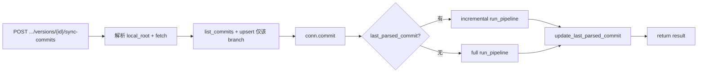

# 按分支独立同步并触发图分析（含自动增量）

## 现状

- **同步提交**：[`sync_service.sync_commits_for_project`](src/service/services/sync_service.py) 当前是**全局**：一次调用解析 local_root、fetch、然后对**所有** version 的 branch 执行 list_commits + upsert，最后一次 conn.commit()。入口为 `POST /api/projects/{project_id}/sync-commits`（无 version 维度）。
- **图分析**：[`gitnexus_parser.ingestion.pipeline.run_pipeline`](src/gitnexus_parser/ingestion/pipeline.py) 支持 **incremental**：当 `incremental=True` 且 `since_commit` 指定时，仅解析 `base_commit..HEAD` 的变更文件，在 Neo4j 中删除这些路径的节点再写入新子图，并持久化 scan_state，实现增量更新。若 `since_commit` 为空且无 scan_state，则全量建图。
- **versions 表**：每个 version 对应一个 branch，并有 `last_parsed_commit` 字段，表示该分支上次图分析到的 commit，用于判断“是否已有图”。

## 目标行为

1. **按分支独立同步**：不再“一次同步整个项目所有分支”，改为**单次只同步一个分支（一个 version）**。
   - 新 API：`POST /api/projects/{project_id}/versions/{version_id}/sync-commits`，仅同步该 version 对应 branch 的 commits 到 PG，并仅对该 branch 触发图分析。
   - 可选保留：`POST /api/projects/{project_id}/sync-commits` 保留为“同步所有版本”的便捷入口（内部循环调用单分支同步），或移除/废弃，由你决定。

2. **同步 + 图分析**：在一次“单分支同步”中，顺序为：解析 local_root（必要时 clone）→ fetch → 仅对该 version 的 branch 做 list_commits + upsert_commits → conn.commit() → **触发该分支的图分析**。

3. **已有图时自动增量更新**：触发图分析时：
   - 若该 version 的 **`last_parsed_commit` 存在**（说明该分支在 Neo4j 中已有图）：自动使用 **incremental**，即 `run_pipeline(..., incremental=True, since_commit=last_parsed_commit)`，只扫描并更新变更文件对应节点，实现增量、变量（图数据）更新。
   - 若 **`last_parsed_commit` 为空**：全量建图，即 `run_pipeline(..., incremental=False, since_commit=None)`。
   - pipeline 内部会按 `since_commit`/scan_state 计算变更路径、只解析变更文件并写 Neo4j，无需额外逻辑。

4. **失败隔离**：图分析异常时记录日志并写入返回的 `graph_errors`，不导致整次 sync 返回 502；commit 同步结果照常返回。

## 实现要点

### 1. 新增“单分支同步”能力

- 在 [sync_service](src/service/services/sync_service.py) 中：
  - 新增 **`sync_commits_for_version(conn, project_id: int, version_id: int) -> dict | None`**：
    - 校验 project 存在、version 存在且属于该 project、version 有 branch。
    - 解析 local_root（复用现有 `_resolve_local_repo`）、`fetch_repo`。
    - 仅对该 version 的 branch：`list_commits(local_root, branch)` → `upsert_commits(conn, project_id, version_id, commits)`。
    - `conn.commit()`。
    - 加载 Neo4j config（如 `load_config()`）；若需节省资源可仅当 `config.get("neo4j_uri")` 时才跑 pipeline。
    - **图分析**：`head = git_ops.get_head_commit(local_root, branch)`；`last = version.last_parsed_commit`；若 `last` 存在则 `incremental=True, since_commit=last`，否则 full；调用 `run_pipeline(local_root, config, branch=branch, write_neo4j=bool(config.get("neo4j_uri")), incremental=..., since_commit=...)`；成功则 `version_repo.update_last_parsed_commit(conn, version_id, head)` 并 `conn.commit()`；失败则记录到 `graph_errors`，不抛。
    - 返回 `{ project_id, version_id, branch, commits_synced, graph_action: "full"|"incremental", graph_errors?: [...] }`。
  - 原 **`sync_commits_for_project`** 可改为：遍历 `version_repo.list_by_project_id(conn, project_id)`，对每个有 branch 的 version 调用 `sync_commits_for_version(conn, project_id, ver["id"])`，汇总 commits_synced 与 graph 结果后返回（实现“按分支独立同步”的循环），或保留为仅同步 commits 不触发图（由你选）。

### 2. 路由与 API

- 在 [sync 路由](src/service/routers/sync.py) 中：
  - 新增 **`POST /{project_id}/versions/{version_id}/sync-commits`**：调用 `sync_service.sync_commits_for_version(db, project_id, version_id)`；若返回 None 则 404（project 或 version 不存在），否则返回 result。
  - 现有 **`POST /{project_id}/sync-commits`**：可保留并改为调用“循环每个 version 的 sync_commits_for_version”以保持“一键同步全项目”，或仅保留单分支接口，视产品需求定。

### 3. 自动增量的依据

- **“已有图”** = 该 version 在 DB 中 `last_parsed_commit` 非空。
- **增量更新**：`run_pipeline(..., incremental=True, since_commit=version["last_parsed_commit"])`。pipeline 内部会：
  - 用 `get_changed_paths(repo, since_commit, "HEAD")` 得到变更文件；
  - 只解析这些文件，在 Neo4j 中删除这些路径的节点后写入新子图；
  - 更新 scan_state（该 branch 对应 commit），便于下次再增量。
- 因此**会自动进行增量与图数据更新**，无需额外“变量”逻辑。

### 4. 前端修改（每个版本都有「同步提交」按钮）

- **API 客户端** [web/src/api/client.ts](web/src/api/client.ts)：
  - 新增 **`syncCommitsForVersion(projectId, versionId)`**：请求 `POST /api/projects/${projectId}/versions/${versionId}/sync-commits`，返回类型与后端一致（如 `commits_synced`、`graph_action`、`graph_errors` 等）。
  - 现有 **`syncCommits(projectId)`**：若保留「同步全部」接口则保留；否则可改为内部循环调用 `syncCommitsForVersion` 或移除。

- **版本管理页** [web/src/pages/project/ProjectVersionsPage.tsx](web/src/pages/project/ProjectVersionsPage.tsx)：
  - 在每个版本行（`versions.map` 的 `<li>`）中增加 **「同步提交」按钮**，点击时调用 `syncCommitsForVersion(projectId, v.id)`。
  - 使用 **按版本维度的 loading**（如 `syncingVersionId: number | null`）：某版本同步时该按钮显示「同步中...」并禁用，避免重复点击；可选同时禁用同行其他操作或仅禁用该按钮。
  - 同步成功后调用 `load()` 刷新列表（以便更新 `last_parsed_commit` 等）；失败时用现有 `setError` 展示错误。
  - 顶部的「同步提交」可保留为「同步全部」（调用 `syncCommits(projectId)`，若后端保留该接口），或改为仅保留每行按钮、移除顶部按钮，视产品需求定。

- **项目详情页** [web/src/pages/ProjectDetailPage.tsx](web/src/pages/ProjectDetailPage.tsx)：
  - 在版本列表每个 `<li>`（`data-testid="version-{v.id}"`）中增加 **「同步提交」按钮**，点击调用 `syncCommitsForVersion(projectId, v.id)`。
  - 同样用 `syncingVersionId`（或等价 state）控制该行的「同步中...」与禁用。
  - 同步成功后刷新版本列表（与现有 `load` 逻辑一致）；失败时用现有错误展示方式。
  - 顶部的「同步提交」可保留为同步全部或移除，与版本页策略一致。

- **Mock / 测试**：若 [web/src/test/mocks/handlers.ts](web/src/test/mocks/handlers.ts) 中有 `sync-commits` 的 mock，需新增对 `POST /api/projects/:project_id/versions/:version_id/sync-commits` 的 mock，以便版本页/详情页单版本同步的测试或开发。

### 5. 涉及文件（后端 + 前端）

- **[`src/service/services/sync_service.py`](src/service/services/sync_service.py)**：新增 `sync_commits_for_version`（单分支 sync + 图分析，按 last_parsed_commit 决定 full/incremental）；按需调整 `sync_commits_for_project`（是否改为循环调用 sync_commits_for_version）。
- **[`src/service/routers/sync.py`](src/service/routers/sync.py)**：新增 `POST /{project_id}/versions/{version_id}/sync-commits`；可选调整现有 `POST /{project_id}/sync-commits`。
- **[`src/service/routers/api.py`](src/service/routers/api.py)**：若把 versions 相关路由挂在同一 prefix 下，需保证 `projects/{project_id}/versions/{version_id}/sync-commits` 能正确匹配（通常 versions 路由已挂 `/projects`，需确认是否有 `versions/{version_id}/...` 子路径）。
- **[`web/src/api/client.ts`](web/src/api/client.ts)**：新增 `syncCommitsForVersion(projectId, versionId)`。
- **[`web/src/pages/project/ProjectVersionsPage.tsx`](web/src/pages/project/ProjectVersionsPage.tsx)**：每行版本增加「同步提交」按钮与 `syncingVersionId` 状态。
- **[`web/src/pages/ProjectDetailPage.tsx`](web/src/pages/ProjectDetailPage.tsx)**：版本列表每行增加「同步提交」按钮与按版本 loading 状态。
- **[`web/src/test/mocks/handlers.ts`](web/src/test/mocks/handlers.ts)**：新增单版本 sync-commits 的 mock（可选）。

### 6. 流程概览（单分支同步）

## 测试建议

- 单分支：调用 `POST /api/projects/{pid}/versions/{vid}/sync-commits`，mock DB 与 run_pipeline，断言只同步该 version 的 branch、且当 last_parsed_commit 存在时以 incremental 调用 run_pipeline。
- 增量语义：该 version 先有 last_parsed_commit，再 sync-commits，断言 run_pipeline 被调用时 `incremental=True`、`since_commit=last_parsed_commit`。
