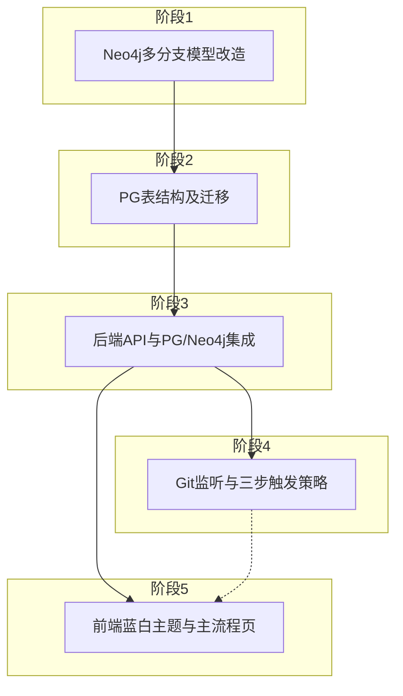

# 影响面分析多步骤技术实现方案

## 依赖关系总览

- **数据与存储**：先改 Neo4j 模型（阶段 1），再建 PG 表（阶段 2），避免后续返工。
- **后端**：阶段 3 在 PG 与现有 Neo4j 上实现 CRUD 与“触发分析”接口；阶段 4 的监听服务依赖阶段 3 的 API 与 pipeline。
- **前端**：阶段 5 依赖阶段 3 的 API 契约，可与阶段 4 并行开发（监听状态接口就绪后前端再对接）。

---

## DDD 预留与后续优化空间

后续可能进行 **领域驱动设计（DDD）** 优化，各阶段实现需预留扩展能力，与 [docs/数据结构设计-影响面分析.md](docs/数据结构设计-影响面分析.md) 第六节对齐。

**总则**：

- **限界上下文**：项目管理（PG）、影响面分析（PG + Neo4j）、代码图/解析（Neo4j）、Git 监听与扫描（PG + 本地）边界清晰；实现时避免跨上下文的直接耦合，便于后续拆成独立子域或模块。
- **聚合边界**：PG 表设计已按“主表 + 关联表 = 一聚合”预留（Project 聚合、Requirement 聚合、ImpactAnalysis 聚合）；实现时**以聚合为单元做读写与事务**，不在一处拼写多聚合的裸 SQL，便于日后替换为领域层 + 仓储接口。
- **扩展方式**：PG 新领域用新表+FK，不在单表堆砌；Neo4j 新概念用新 Label/RelationshipType；跨上下文引用仅存 node_id + project_id/branch，不在图内存 PG 主键。
- **分层预留**：阶段 3 的“仓储/服务”分层采用**接口友好**的命名与职责（如 Repository 只做持久化、Service 只做编排），便于后续抽出领域层、应用服务层与仓储实现替换。

各阶段与 DDD 相关的具体约束见下表，实现时遵守即可在后续 DDD 重构时最小化改动。

| 阶段 | DDD 预留要点 |

|------|----------------|

| 1 Neo4j | 节点 Label/RelationshipType 保持与 [graph/types.py](src/gitnexus_parser/graph/types.py) 一致，新增概念只通过扩展 Label/Type 完成；代码图限界上下文内不引入 PG 或业务概念。 |

| 2 PG | 表与文档 2.2 一一对应，不增加“大宽表”；每表对应可识别实体，主表+关联表边界与文档 6.2 聚合建议一致。 |

| 3 后端 | 仓储层仅做 CRUD，不写业务判断；业务编排集中在 Service；API 层只做参数校验与调用 Service，便于后续插入领域实体与领域服务。 |

| 4 监听 | 监听逻辑按“项目管理”与“代码图”的协作来写（读 PG 项目/版本，调 pipeline/Neo4j），避免在 parser 或 neo4j_writer 内写 PG；便于后续归入“Git 监听”限界上下文或应用服务。 |

| 5 前端 | 按“用例/页面”组织组件与请求，不按后端表结构硬编码领域概念；便于后续对接 CQRS 或不同 API 形状。 |

---

## 阶段 1：Neo4j 多分支模型改造

**目标**：节点从单值 `branch` 改为 `branches: list[str]`，按 `id`（及 Label）唯一；支持“变更数据”语义（新分支仅追加 branches，不复制子图）。

**涉及文件**：

- [src/gitnexus_parser/neo4j_writer.py](src/gitnexus_parser/neo4j_writer.py)：约束、写入、删除、新增 `add_branch_to_nodes`
- [src/gitnexus_parser/graph/types.py](src/gitnexus_parser/graph/types.py)：`NodeProperties` 中 `branch` → `branches`（list）
- [src/gitnexus_parser/ingestion/pipeline.py](src/gitnexus_parser/ingestion/pipeline.py)：写入时传 `branches` 而非 `branch`；增量删除按 `branches` 过滤

**关键改动**：

| 项目 | 当前 | 改造后 |

|------|------|--------|

| 唯一约束 | `(n.id, n.branch) IS NODE KEY` | 按 Label 的 `(n.id) IS NODE KEY`（或 UNIQUE） |

| 节点属性 | `branch: str` | `branches: list[str]`，写入时 `SET n.branches = coalesce(n.branches, []) + $newBranch` 或等价 |

| MERGE 键 | `(id, branch)` | `(id)`；SET 时维护 `branches` 数组（含当前分支） |

| 删除分支 | `WHERE n.branch = $branch DETACH DELETE n` | 从 `n.branches` 移除该分支；若 `size(n.branches)=0` 则 DETACH DELETE |

| 增量删除 | `WHERE n.branch = $branch AND n.filePath IN $paths` | `WHERE $branch IN n.branches AND n.filePath IN $paths`，删除前从 `branches` 移除或删节点 |

**新增函数**：

- `add_branch_to_nodes(driver, source_branch: str, new_branch: str, database=None)`：`MATCH (n) WHERE $source_branch IN n.branches SET n.branches = n.branches + $new_branch`（Neo4j 5+ 用 list concat；否则用 APOC 或逐节点更新）。

**数据迁移**（若库中已有 (id, branch) 数据）：

- 一次性脚本：将所有节点的 `branch` 转为 `branches = [branch]`，删除旧约束并创建新约束。可在阶段 1 末尾提供迁移脚本路径说明。

**DDD 预留**：保持“代码图”限界上下文内聚——仅扩展节点/关系模型与写入语义，不在此层引用 PG 或业务实体；NodeLabel/RelationshipType 继续集中在 [graph/types.py](src/gitnexus_parser/graph/types.py)，便于后续将图访问封装为领域仓储。

**验收**：现有 `run_pipeline(..., branch=X)` 写入的节点带 `branches`；`add_branch_to_nodes(A, B)` 后，原属 A 的节点 `branches` 含 B；按 `WHERE $branch IN n.branches` 可查询某分支子图。

---

## 阶段 2：PostgreSQL 表结构及迁移

**目标**：按 [docs/数据结构设计-影响面分析.md](docs/数据结构设计-影响面分析.md) 2.2 节建表，为项目/版本/需求/提交/影响面分析及监听状态提供持久化。

**表清单**（与 PRD 3.2 一致）：

- **projects**：id, name, repo_path 或 repo_url, created_at, 可选 watch_enabled, neo4j_database/neo4j_identifier
- **versions**：id, project_id (FK), branch（唯一 (project_id, branch)）, version_name/tag, created_at, 可选 last_parsed_commit
- **requirements**：id, project_id (FK), title, description, external_id, created_at
- **commits**：id, project_id (FK), version_id 或 branch, commit_sha, message, author, committed_at；唯一 (project_id, commit_sha) 或 (project_id, version_id, commit_sha)
- **requirement_commits**：requirement_id (FK), commit_id (FK)，主键 (requirement_id, commit_id)
- **impact_analyses**：id, project_id (FK), status, triggered_at, result_summary/result_store_path
- **impact_analysis_commits**：impact_analysis_id (FK), commit_id (FK)
- **监听**：采用方案 A（versions.last_parsed_commit + projects.watch_enabled）或方案 B 单独表 **branch_scan_state** (project_id, branch, last_parsed_commit)

**实施方式**：

- 在 [docker/init-pgvector.sql](docker/init-pgvector.sql) 后追加建表语句，或新建 `docker/migrations/001_impact_analysis_tables.sql`（或使用 Alembic 等），保证在空库上可一次性初始化。
- 为 project_id、version_id、commit_id 等建 FK 与索引，便于列表/筛选查询。

**DDD 预留**：表结构严格对应 [数据结构设计 6.1、6.2](docs/数据结构设计-影响面分析.md)——每张表对应可识别实体；projects+versions（+ 可选 branch_scan_state）视为 Project 聚合，requirements+requirement_commits 为 Requirement 聚合，impact_analyses+impact_analysis_commits 为 ImpactAnalysis 聚合。不在单表用 JSONB 或冗余列承载多聚合职责；新增领域时只新增表+FK，为后续“一聚合一仓储”预留清晰边界。

**验收**：执行迁移后，所有表存在且约束正确；可插入一条 project → version → commit 链与一条 impact_analysis + impact_analysis_commits 记录。

---

## 阶段 3：后端 API 与 PG/Neo4j 集成

**目标**：提供项目/版本/需求/提交/影响面分析的 CRUD 与“触发影响面分析”接口；后端连接 PG 并复用现有 Neo4j 与 pipeline。

**架构建议**：

- **配置**：从环境变量或现有 [config.example.json](src/config.example.json) 读取 PG 连接串（与 Neo4j 分离）。
- **分层（DDD 预留）**：采用 **Repository + Service + Router** 三层，便于后续插入领域层。
  - **Repository**：仅负责 PG/Neo4j 的 CRUD，方法粒度与“聚合/实体”对齐（如 `ProjectRepository.save/ find_by_id`），不包含业务规则；接口命名清晰，便于日后替换为 DDD 仓储实现。
  - **Service**：编排事务与跨聚合操作（如创建影响面分析 = 写 impact_analyses + impact_analysis_commits），调用 Repository 与 pipeline/Neo4j；不在此层堆积领域逻辑，为后续将“业务规则”下沉到领域实体/领域服务留出空间。
  - **Router**：只做请求解析、参数校验与调用 Service，不直接访问数据库。
- **路由**：在 [src/service/main.py](src/service/main.py) 挂载新 router：`projects`、`versions`、`requirements`、`commits`、`impact_analyses`（或合并为 `impact` 子路由）。

**接口清单**（与 PRD 3.5 对齐）：

- **项目**：GET/POST/PATCH/DELETE `/projects`（列表、创建、更新、删除）
- **版本**：GET/POST/DELETE `/projects/{id}/versions`（按项目列表、创建绑定 branch、删除）
- **需求**：GET/POST/PATCH/DELETE `/projects/{id}/requirements`；POST/DELETE 绑定/解绑提交（requirement_commits）
- **提交**：GET `/projects/{id}/commits` 或 `/projects/{id}/versions/{vid}/commits`（从 Git 同步到 PG 后返回；可选按需求过滤）
- **影响面分析**：POST 创建任务（入参 `commit_ids`），GET 列表与详情（状态、result_summary 等）；**分析执行逻辑为 TODO**，创建时可将 status 置为 `pending` 或由占位 job 置为 `completed` 并写假 result。
- **Git 同步**（为阶段 4 预留）：POST `/projects/{id}/sync-commits`（或 `/sync`）将当前仓库的 commits/branches 同步到 PG；可选 GET 监听状态、last_parsed_commit。

**Neo4j 与 PG 关联**：查询“某项目某分支子图”时，用 `(project_id, version.branch)` 确定 branch 参数；若多项目共用 Neo4j，可在图内用 project 节点或约定 branch 命名（如 `project_id_branch_name`）区分，与 [数据结构设计](docs/数据结构设计-影响面分析.md) 4.1 节一致。

**DDD 预留**：Repository 按聚合划分（如 `ProjectRepository`、`ImpactAnalysisRepository`），避免一个类写遍多张表；跨聚合写放在 Service 中且尽量按“一个用例一个事务”。引用 Neo4j 时仅通过 (project_id, branch) 定位子图，不在图节点上存储 PG 主键，与文档 6.3 跨上下文引用一致。

**验收**：Swagger 可调通上述 CRUD；创建影响面分析任务能写入 impact_analyses + impact_analysis_commits；提交列表可从 PG 返回（需先有同步或手工插入测试数据）。

---

## 阶段 4：Git 仓库监听与三步触发策略

**目标**：对已登记且启用监听的项目，感知提交与分支变动并写入 PG；按 PRD 2.4 三步顺序触发“变更数据 → 增量 → 全量”。

**输入与状态**：

- 监听范围：`projects` 中 `watch_enabled=true` 且 `repo_path` 有效的项目。
- 状态来源：优先 PG（versions.last_parsed_commit 或 branch_scan_state）；与现有 [incremental.py](src/gitnexus_parser/ingestion/incremental.py) 的 `scan_state.json` 二选一或双写（建议逐步迁到 PG，便于多实例与前端展示）。

**三步逻辑**（与 PRD 2.4、3.7 一致）：

1. **新分支 B**：若 B 不在 scan_state（或 PG）中，取 B 的 HEAD；若存在已扫描分支 A 且 A 的 last_scanned_commit = B 的 HEAD → **变更数据**：调用 `add_branch_to_nodes(driver, A, B)`，写 scan_state[B]=HEAD（并更新 PG versions.last_parsed_commit）。
2. **当前分支有 new commits**：HEAD > last_parsed_commit → **增量**：`run_pipeline(..., branch=该分支, incremental=True, since_commit=last_parsed_commit)`，写回 last_parsed_commit。
3. **否则**：**全量**：checkout 该分支后 `run_pipeline(..., branch=..., incremental=True)`（无 state 时内部走全量），写回 last_parsed_commit。

**实现形态**：

- 独立进程或定时任务：定期 `git fetch` + `git branch` / `git log` 检测新分支与新提交；或使用文件系统监听 / Git hooks 触发（PRD 3.7 允许实现时定）。
- 调用现有 [pipeline.run_pipeline](src/gitnexus_parser/ingestion/pipeline.py) 与 [neo4j_writer.add_branch_to_nodes](src/gitnexus_parser/neo4j_writer.py)（阶段 1 已实现）；scan_state 若迁 PG，需在 pipeline 或本模块中从 PG 读/写 last_parsed_commit。

**API 预留**：启停监听（按项目/全局）、手动触发同步（同步 commits/versions 到 PG）、查询监听状态与最近扫描 commit（供前端阶段 5 使用）。

**DDD 预留**：监听与触发逻辑作为“Git 监听与扫描”限界上下文实现，只依赖 PG 的 Project/Version 与 parser/Neo4j 的 pipeline、add_branch_to_nodes；不在 [pipeline](src/gitnexus_parser/ingestion/pipeline.py) 或 [neo4j_writer](src/gitnexus_parser/neo4j_writer.py) 内反向依赖 PG 或 service 层，便于后续将监听抽成独立应用服务或后台 worker。

**验收**：新分支与某已扫描分支 HEAD 相同时仅执行 add_branch_to_nodes；同一分支新提交后仅做增量解析；首次分支或无法匹配时做全量；PG 中 commits/versions 与 last_parsed_commit 正确更新。

---

## 阶段 5：前端蓝白主题与主流程页

**目标**：蓝白配色、顶部或左侧菜单、主工作流“选择项目 → 版本 → 需求 → 提交 → 触发影响面分析”，以及项目/版本管理、影响面结果入口。

**技术栈**：延续现有 [web/src/App.tsx](web/src/App.tsx)（React），路由可用 React Router；样式 [App.css](web/src/App.css) 从深色改为蓝白（主色如 #1e3a5f / #2563eb，背景 #f8fafc / #ffffff）。

**路由与菜单**（PRD 3.6）：

- `/`：主工作流（选择项目 → 版本 → 需求 → 提交 → 触发分析）
- `/projects`：项目管理（列表、新建、编辑、删除）
- `/versions` 或 `/branches`：分支/版本管理（按项目、创建/删除版本）
- `/impact`：影响面分析历史（列表、详情，可选）

**主流程页**：

- 级联选择器：项目 → 版本（分支）→ 需求（多选、可选）→ 提交（多选）；按钮“触发影响面分析”。
- 调用阶段 3 的 API：GET 项目/版本/需求/提交列表；POST 创建影响面分析（传 commit_ids）；GET 分析状态/结果（列表与详情页）。

**扩展**：菜单预留“项目管理”“分支管理”“影响面结果”等入口，便于后续加设置、Neo4j 状态等。

**DDD 预留**：前端按“用例/页面”组织（选项目、选版本、触发分析等），不按后端表名或实体名硬编码；API 调用封装在少量 client/hook 中，便于后续对接 CQRS 或不同 BFF/领域 API 形状。

**验收**：主流程可完成一次“选项目→选版本→选提交→触发分析”并看到任务状态（或占位结果）；项目/版本管理页可 CRUD；蓝白主题与菜单一致。

---

## 未包含（TODO）

- **影响面分析具体逻辑**：根据提交得到变更文件/符号，在 Neo4j 中按分支过滤做 CALLS/IMPORTS/CONTAINS 等影响面计算并写回 PG（result_summary/result_store_path）。PRD 与数据结构设计均将此列为后续实现，本方案仅在阶段 3 预留接口与占位状态。
- **DDD 深化**：本方案在各阶段已按限界上下文、聚合边界与分层预留扩展空间；后续可在此基础上引入显式领域层、聚合根/实体/值对象、领域服务与仓储抽象，无需推翻现有表结构与图模型，详见 [数据结构设计 第六节](docs/数据结构设计-影响面分析.md)。

---

## 实施顺序小结

| 顺序 | 阶段 | 产出 |

|------|------|------|

| 1 | Neo4j 多分支改造 | 节点 branches、add_branch_to_nodes、约束与写入/删除语义统一；可选迁移脚本 |

| 2 | PG 表结构 | 建表 SQL/migrations，projects/versions/requirements/commits/impact_analyses 等 |

| 3 | 后端 API | PG 连接与仓储、CRUD + 触发分析接口（分析逻辑 TODO） |

| 4 | Git 监听与触发 | 监听服务、三步策略、PG 同步与 scan_state 落地 |

| 5 | 前端 | 蓝白主题、菜单、主流程页、项目/版本/影响面结果页 |

| - | TODO | 影响面计算逻辑（Neo4j 遍历 + 写回 PG） |

阶段 1、2 可严格按序；阶段 3 依赖 1、2；阶段 4 依赖 1、3；阶段 5 依赖 3，与 4 可并行（仅监听状态接口依赖 4）。