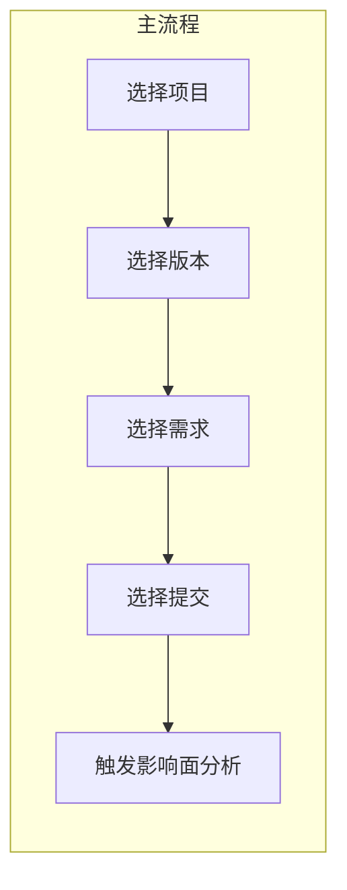

# 影响面分析页面与数据模型 PRD

## 一、现状简述

- **前端**：[`web/src/App.tsx`](web/src/App.tsx) 单页，含 RepoResolve、ParseTask；[`web/src/App.css`](web/src/App.css) 为深色主题（#16213e/#0f3460/#e94560），无菜单与路由。
- **后端**：[`src/service/main.py`](src/service/main.py) 挂载 `repos`、`parse`；解析管线将代码图写入 Neo4j（[`src/gitnexus_parser/neo4j_writer.py`](src/gitnexus_parser/neo4j_writer.py)）。图模型将改为节点带 **`branches` 数组**（一个节点可属于多个分支），见 2.4 与 3.3。
- **基础设施**：[`docker-compose.yml`](docker-compose.yml) 包含 **PostgreSQL + pgvector**；**Neo4j 已存在**（本机或外部），无需在 compose 中新增。

## 二、产品目标与页面逻辑

### 2.1 主流程（用户操作顺序）

- **选择项目**：从已登记项目列表中选（支持后续“项目管理”增删改）。
- **选择版本**：版本与分支 **1:1**（一个版本对应一个 Git 分支）。
- **选择需求**：需求与提交记录 **多对多**，也可不绑定提交（仅选需求用于归类或筛选）。
- **选择提交**：可勾选 **一次或多次** 提交，用于触发影响面分析。
- **触发影响面分析**：一次分析可对应 **多笔提交**；提交与影响面分析为 **多对一**（多提交 → 一次分析任务/结果）。

### 2.2 实体关系（ER 概念）

| 实体 | 说明 | 存储 |

|------|------|------|

| 项目 (Project) | 仓库/项目元数据 | PG |

| 版本 (Version) | 与分支 1:1 | PG |

| 需求 (Requirement) | 需求条目，与提交多对多 | PG |

| 提交 (Commit) | Git commit 记录 | PG |

| 影响面分析 (ImpactAnalysis) | 一次分析任务/结果，多提交→一次分析 | PG |

| 项目图 | 代码结构/调用关系（已有） | Neo4j |

关系小结：

- **项目 → 版本/分支**：1:N（一个项目下多版本/多分支）。
- **版本 ↔ 分支**：1:1。
- **需求 ↔ 提交**：N:M（多对多，可选）。
- **提交 → 影响面分析**：N:1（多笔提交可归属同一次分析）。
- **PG 项目/分支** 与 **Neo4j 图**：通过 `project_id` + `branch` 关联。Neo4j 节点为 **`branches` 多值**（数组），查询“某项目某分支”子图用 `WHERE $branch IN n.branches`；需在 PG 或配置中记录 project 与 Neo4j 的对应关系。

### 2.3 Git 仓库实时监听与增量扫描

- **监听范围**：对已登记项目的 Git 仓库进行 **实时监听**，感知 **提交（commits）** 与 **分支（branches）** 变动。
- **记录**：将新增提交、分支增删同步到 PG（写入/更新 `commits`、`versions` 等），保证前端“选择版本/提交”的数据与仓库一致。
- **触发扫描**：监听到变更后，根据**新提交**或**新分支**选择增量或全量（见 2.4）。

### 2.4 触发策略：先判新分支 HEAD 与已扫描分支最后提交相同 → 变更数据；再判新提交 → 增量；否则全量

正确行为按以下**三步顺序**判断（结合 [pipeline](src/gitnexus_parser/ingestion/pipeline.py)、[incremental](src/gitnexus_parser/ingestion/incremental.py)、[neo4j_writer](src/gitnexus_parser/neo4j_writer.py) 及多分支模型改造）。

**1）先判：新分支的最近一次提交是否与某已扫描分支的最近一次扫描提交相同**

- 若目标分支 B 是“新分支”（scan_state 中无 B），取 B 的 **最近一次提交（HEAD）**；遍历所有**已扫描分支** A，取 A 的 **最近一次扫描提交** `last_scanned_commit`（scan_state[A]）。若 **B 的 HEAD 与某条 A 的 last_scanned_commit 相同**，则做变更数据。
- **是** → **变更数据**：不跑解析，调用 `add_branch_to_nodes(driver, source_branch=A, new_branch=B)`，在已有节点的 `branches` 数组中追加 B；写 scan_state[B] = B 的 HEAD。结束。
- **否** → 继续第 2 步。

**2）再判：当前分支是否有新提交**

- 若该分支在 scan_state（或 PG 的 last_parsed_commit）中已有记录，且 **HEAD 新于 last_scanned_commit**，则“有新的提交”。
- **是** → **增量更新**：`run_pipeline(..., branch=该分支, incremental=True, since_commit=last_scanned_commit)`；仅解析变更路径并更新 Neo4j，再写回 scan_state。
- **否** → 继续第 3 步。

**3）都为否 → 全量扫描**

- 对该分支执行首次全量：先 `git checkout` 到该分支，再 `run_pipeline(..., branch=该分支, incremental=True)`（无 state 时管线内部走 `paths_to_scan = all_paths`），在 Neo4j 建立该分支子图并写入 scan_state。

**Neo4j 多分支模型说明**：节点使用 **`branches: list[str]`**（一个节点可属于多个分支）。「变更数据」不再复制子图，仅对含 source_branch 的节点执行 `SET n.branches = n.branches + new_branch`。查询某分支子图用 `WHERE $branch IN n.branches`。详见 [Neo4j 多分支模型改造](.cursor/plans/neo4j_多分支模型改造_fc98d2aa.plan.md)。

**小结**

| 条件 | 动作 |

|------|------|

| 新分支 B 的**最近一次提交（HEAD）**与某已扫描分支 A 的**最近一次扫描提交**相同 | **变更数据**：`add_branch_to_nodes(A, B)`，写 scan_state[B] |

| 当前分支有 new commits（HEAD > last_scanned） | **增量更新**：`run_pipeline(..., incremental=True, since_commit=...)` |

| 以上都不满足 | **全量扫描**：checkout 后 `run_pipeline(..., branch=..., incremental=True)`（无 state → 全量） |

## 三、PRD 文档范围（你要交付的“PRD”）

以下为 PRD 文档应包含的章节与要点，**不在此模式下手动改代码**，仅作规划与文档结构。

### 3.1 界面与交互

- **整体布局**：蓝白配色（主色建议如 `#1e3a5f` / `#2563eb`，背景 `#f8fafc` / `#ffffff`），顶部或左侧 **菜单栏**（或 Tab/导航），便于后续扩展“项目管理”“分支管理”“影响面结果”等独立页面。
- **主工作流页面**：  

选择项目 → 选择版本(分支) → 选择需求(可选、可多选) → 选择提交(多选) → 操作按钮“触发影响面分析”。

- **扩展入口**：菜单中预留 **项目管理**、**分支/版本管理**，与主流程解耦，便于后续迭代。

### 3.2 数据结构（PostgreSQL）

- **projects**：id, name, repo_path 或 repo_url, created_at 等。
- **versions**：id, project_id, branch（唯一约束 (project_id, branch)），version_name 或 tag，created_at。
- **requirements**：id, project_id, title, description, external_id（可选），created_at。
- **commits**：id, project_id, version_id 或 branch, commit_sha, message, author, committed_at。
- **requirement_commits**：requirement_id, commit_id（多对多关联表）。
- **impact_analyses**：id, project_id, status, triggered_at, result_summary 或 result_store_path（可选）。
- **impact_analysis_commits**：impact_analysis_id, commit_id（多对一：多 commit 指向一次 analysis）。
- **监听/扫描状态**（可选）：在 **projects** 或 **versions** 上增加字段，如 `watch_enabled`、`last_parsed_commit`（或单独表 `branch_scan_state`），用于记录“是否启用监听”以及“该分支上次增量扫描的 commit”，便于监听服务判断是否需要触发增量扫描及传入 `since_commit`。

项目/分支与 Neo4j 的关联方式建议在 PRD 中写明：例如在 **projects** 或配置中记录 `neo4j_database`/标识，查询图时用 `(project_id, branch)` 对应 Neo4j 的 `branch` 与图数据；若多项目共用一 Neo4j，则用 `(project_id, branch)` 唯一定位子图。

### 3.3 Neo4j 与 PG 的关联

- **Neo4j 图模型（多分支）**：节点为 **`branches: list[str]`**（一个节点可属于多个分支），按 **id** 唯一（每 Label）；关系端点按 id 匹配。查询“某分支子图”用 `WHERE $branch IN n.branches`。写入时向节点的 `branches` 追加当前分支；删除某分支时从 `branches` 中移除该分支，若数组为空再删节点。详见 [neo4j_writer](src/gitnexus_parser/neo4j_writer.py) 及 [Neo4j 多分支模型改造](.cursor/plans/neo4j_多分支模型改造_fc98d2aa.plan.md)。
- **关联设计**：PG 中 **project** 对应一个仓库/代码库；**version.branch** 对应 Neo4j 中“该分支”的子图（过滤条件 `branch IN n.branches`）。**影响面分析具体逻辑**（根据所选提交得到变更文件/符号，在 Neo4j 中基于分支过滤查询 CALLS/IMPORTS/CONTAINS 等做影响面计算并写回 PG）**不在此阶段实现，作为 TODO**；PRD 仅定义数据表与接口契约，实现时再落地该逻辑。

### 3.4 基础设施（docker-compose）

- **Neo4j 已存在**，无需在 [`docker-compose.yml`](docker-compose.yml) 中新增服务；PRD 以现有 compose（仅 PG）为基线，Neo4j 连接沿用现有配置（如 [config.example.json](src/config.example.json) / 环境变量）。

### 3.5 API 与后端（PRD 中仅列接口规划，不实现）

- 项目：列表、创建、更新、删除。
- 版本/分支：按项目列表、创建(绑定 branch)、删除。
- 需求：按项目列表、创建、更新、删除；绑定/解绑提交（requirement_commits）。
- 提交：按项目/分支拉取或同步 Git 提交列表；可选按需求过滤。
- 影响面分析：创建任务（入参：选中的 commit_ids）、查询状态与结果（列表、详情）。**具体分析逻辑**（调 Neo4j 计算影响面并写回 PG）**不实现，列为 TODO**。
- **Git 监听与增量扫描**：启停监听（按项目或按分支）、同步提交/分支到 PG、在监听到变更时触发增量变量扫描（调用现有 parse 管线 `incremental=True, since_commit=...`）；可选接口：查询监听状态、最近一次扫描 commit。

### 3.6 前端路由与菜单（PRD 建议）

- 路由示例：`/` 主工作流，`/projects` 项目管理，`/branches` 或 `/versions` 分支/版本管理，`/impact` 影响面分析历史（可选）。
- 菜单项与上述对应，便于后续加“设置”“Neo4j 状态”等。

### 3.7 Git 仓库实时监听与增量扫描（PRD 要点）

- **监听方式**：对已登记且启用监听的项目，通过轮询（如定时 `git fetch` + `git log` / `git branch`）或 Git hooks / 文件系统监听等方式，感知新提交与分支增删。
- **记录**：新提交写入 **commits**，新分支对应新建/更新 **versions**；保证与仓库一致。
- **触发策略**（与 2.4 一致，三步顺序）：
  - **先判**：新分支 B 的**最近一次提交（HEAD）**是否与某已扫描分支 A 的**最近一次扫描提交**相同。若是，则 **变更数据**：`add_branch_to_nodes(driver, A, B)`，写 scan_state[B]。
  - **再判**：当前分支是否有新提交。若有，则 **增量更新**：`run_pipeline(..., branch=该分支, incremental=True)`，`since_commit` 由 scan_state 或 PG 提供。
  - **都为否**：**全量扫描**：checkout 后 `run_pipeline(..., branch=..., incremental=True)`（无 state 时走全量）。
- **实现形态**：可为独立后台服务/进程、或由 API 层定时任务触发；PRD 中仅规定“需实时监听、记录、按 2.4 三步触发变更数据/增量/全量”，具体实现（轮询间隔、队列防重等）在开发阶段定。

## 四、PRD 产出物与位置

- **产出物**：一份 **PRD 文档**（Markdown），包含上述 3.1～3.7 的完整描述、表结构草案、接口列表；Neo4j 已存在，仅说明与现有 compose/配置的对应关系。
- **建议路径**：`docs/PRD-影响面分析页面与数据模型.md`（或你指定的 `docs/xxx.md`），文档开头引用当前 [`docker-compose.yml`](docker-compose.yml) 作为环境基线。

## 五、实施顺序建议（供实现阶段参考）

1. **Neo4j 多分支模型改造**：节点改为 `branches` 数组、约束与写入/删除语义、新增 `add_branch_to_nodes`；详见 [Neo4j 多分支模型改造](.cursor/plans/neo4j_多分支模型改造_fc98d2aa.plan.md)。若库中已有 (id, branch) 数据，需执行一次迁移脚本。
2. **PG 表结构**：按 3.2 建表（含监听/扫描状态字段或表）。
3. **后端 API**：项目/版本/需求/提交/影响面分析的 CRUD 与“触发分析”接口；**Git 监听**相关：启停监听、同步提交与分支、按 2.4 三步触发变更数据/增量/全量。
4. **Git 仓库实时监听与增量扫描**：实现监听（提交与分支变动）→ 记录到 PG → 按 2.4 先判新分支 HEAD 与某已扫描分支最后提交相同（变更数据）、再判新提交（增量）、否则全量；更新 scan_state / last_parsed_commit。
5. **前端**：蓝白主题 + 菜单布局 + 主流程页（选择项目→版本→需求→提交→触发分析）；再扩展项目/分支管理页与影响面结果列表。
6. **TODO**：影响面分析具体逻辑（根据提交查 Neo4j 做影响面计算并写回 PG）后续单独实现。

---

本计划仅定义 PRD 文档的内容与结构；实际文档撰写与后续开发可在你确认后分步执行。