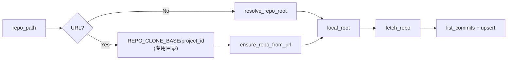

# 远程仓库先拉取/更新再同步提交

## 目录约定（必须）

**专门使用一个目录来存储目标项目的代码**，不与其他用途混用：

- 配置一个**专用根目录**（如环境变量 `REPO_CLONE_BASE`），仅用于存放按项目克隆的仓库。
- 每个项目对应该根目录下的**一个子目录**，例如 `<REPO_CLONE_BASE>/<project_id>`，避免多项目冲突、便于按项目清理或迁移。
- 当 `repo_path` 为远程 URL 时，必须已配置 `REPO_CLONE_BASE`，否则接口返回明确错误；克隆与后续 fetch 均只操作该目录下的路径。
- 若部署使用了 [path_allowlist](src/service/path_allowlist.py) 的 `ALLOWED_BASE_PATHS`，则 `REPO_CLONE_BASE` 必须落在允许范围内，并在克隆前调用 `ensure_path_allowed`。

## 现状

- [sync_service.py](src/service/services/sync_service.py) 直接用 `project.repo_path` 调用 `git_ops.list_commits(repo_path, branch=...)`。
- [git_ops.list_commits](src/service/git_ops.py) 要求 `repo_path` 为本地目录，否则返回 `[]`，commit 表无变化。
- 项目已支持 `repo_username` / `repo_password`（[project_repository](src/service/repositories/project_repository.py)、迁移 004）。
- [repo_resolve.ensure_repo_from_url](src/gitnexus_parser/ingestion/repo_resolve.py) 可克隆到指定 target_path；若已存在且为 Git 仓库则返回 root，不执行 fetch。

## 目标行为

- **远程仓库**（`repo_path` 为 URL）：先克隆到**专用目录** `<REPO_CLONE_BASE>/<project_id>`（若尚未克隆），再在该目录执行 `git fetch`，然后用得到的本地路径做同步。
- **本地仓库**：在现有路径上执行 `git fetch` 更新，再走原有同步逻辑。
- 同步逻辑（按版本分支 `list_commits` + `upsert_commits`）不变。

## 实现要点

### 1. 判断“远程”vs“本地”

- `repo_path` 为 URL（如 `http://`、`https://`、`git@`）则视为远程；否则视为本地路径。

### 2. 远程 URL 时的本地目录（专用目录）

- 使用环境变量 `REPO_CLONE_BASE` 作为**专门存储项目代码的根目录**。
- 每个项目的克隆路径：`os.path.join(REPO_CLONE_BASE, str(project_id))`。
- 克隆前对 `REPO_CLONE_BASE`（及最终 target_path）调用 `ensure_path_allowed`；未配置 `REPO_CLONE_BASE` 且为远程 URL 时返回 400/502 并提示配置。

### 3. 解析出“本地工作目录”

- **远程**：`local_root = ensure_repo_from_url(repo_path, target_path=<REPO_CLONE_BASE>/<project_id>, username=..., password=...)`。
- **本地**：`local_root = resolve_repo_root(repo_path)`，若为 None 则按无效路径处理。

### 4. 统一“更新”本地仓库（fetch）

- 在 [git_ops](src/service/git_ops.py) 新增 `fetch_repo(repo_path: str)`，在仓库根目录执行 `git fetch`；失败可抛异常，由 sync 路由转为 502。
- 得到有效 local_path 后（无论来自远程克隆还是本地解析），先 `fetch_repo(local_path)`，再执行现有 `list_commits` + `upsert_commits`。

### 5. 修改 sync_service 流程（伪代码）

1. project = project_repo.find_by_id(conn, project_id)；无则 return None。
2. repo_path = project.repo_path.strip()。
3. 若 repo_path 视为远程 URL：
   - 若未配置 REPO_CLONE_BASE：raise 明确错误（400/502）。
   - target_path = os.path.join(REPO_CLONE_BASE, str(project_id))。
   - ensure_path_allowed(REPO_CLONE_BASE) 或 ensure_path_allowed(target_path)。
   - local_root = ensure_repo_from_url(repo_path, target_path, branch=None, username=project.repo_username, password=project.repo_password)。
4. 否则（本地路径）：
   - local_root = resolve_repo_root(repo_path)；若为 None 可返回错误或沿用原路径。
5. fetch_repo(local_root)。
6. 现有循环：for ver in versions（带 branch）：list_commits(local_root, branch) -> upsert_commits；total_commits += n。
7. conn.commit()；return { project_id, versions_synced, commits_synced }。

### 6. 依赖与异常

- sync_service 依赖 `repo_resolve.resolve_repo_root`、`ensure_repo_from_url` 及 `path_allowlist.ensure_path_allowed`。
- ensure_repo_from_url / fetch_repo 的 ValueError、RuntimeError 在 [sync router](src/service/routers/sync.py) 中转为 HTTPException(502, detail=...)。

### 7. 配置与文档

- **REPO_CLONE_BASE**：专门用于存储目标项目代码的根目录，建议绝对路径；远程 URL 时必须配置。
- 若使用 ALLOWED_BASE_PATHS，REPO_CLONE_BASE 须在允许范围内。

### 8. 流程概览

