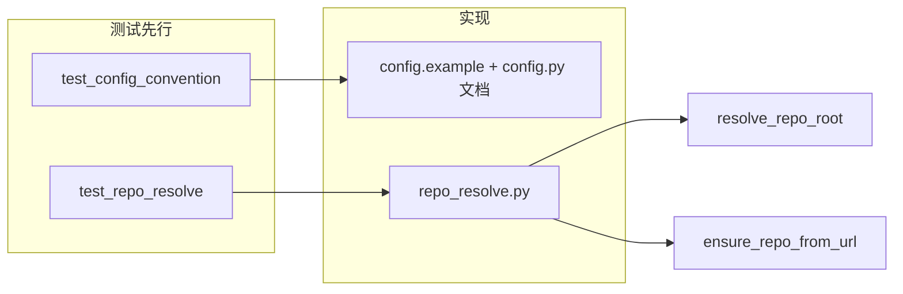

# 阶段一（仓库解析）测试驱动技术研发方案

## 目标与范围

- **阶段一内容**：约定 config 不包含 repo_path/repo_url/branches；新增 `ingestion/repo_resolve.py`，实现 `resolve_repo_root(path)` 与 `ensure_repo_from_url(repo_url, target_path)`；仓库与分支均由**方法参数**传入，不读 config。
- **测试驱动**：每个子步骤均**先写测试（红）→ 再实现（绿）→ 必要时重构**；测试可单独运行，不依赖 Pipeline 主流程。

## 测试基础设施

- **运行器**：项目已包含 [`src/requirements.txt`](src/requirements.txt) 中的 `pytest>=7.0.0`，直接使用 pytest。
- **测试目录**：在仓库根下新增 `tests/`（与 `src/` 平级），便于与 `src/gitnexus_parser` 解耦；或使用 `src/gitnexus_parser/tests/` 若希望测试与包同树。建议 **`tests/`**，并在此目录下放 `tests/test_repo_resolve.py`、`tests/test_config_convention.py`（或合并到一条测试模块）。
- **临时 Git 仓库**：测试 `resolve_repo_root` / `ensure_repo_from_url` 时，使用 `tempfile.TemporaryDirectory()` 创建临时目录，在目录内执行 `git init`（及可选 `git commit`）以得到“仓库根”；非 git 用例用普通临时目录或未 `git init` 的目录。通过 `subprocess.run(..., cwd=..., capture_output=True, text=True)` 调用 git，避免引入 GitPython 以保持与方案一致（零额外依赖）。
- **pytest 发现**：在项目根执行 `pytest tests/` 即可；若需在 `src` 内运行，可加 `pyproject.toml` 或 `pytest.ini` 的 `pythonpath = src`（可选）。

---

## 步骤 1.1：约定 config 不包含 repo/branches（文档 + 契约测试）

| 项目 | 说明 |

|------|------|

| **TDD 顺序** | 先写“契约测试”或文档断言，再改 config 与文档，使测试通过。 |

| **测试内容** | 1）断言 `config.example.json` 中**不包含**键 `repo_path`、`repo_url`、`branches`（若存在则测试失败，强制从示例中移除）。2）可选：对 `load_config` 的文档或行为做测试，例如“从仅含 neo4j_* 的 dict 加载不报错且不包含 repo_path”（若当前 load_config 会注入 repo_path 来自 env，本阶段可仅约定“config 文件与文档不提供 repo”，env 覆盖的移除可放在阶段五）。 |

| **实现与文档** | 从 [`src/config.example.json`](src/config.example.json) 中**删除** `repo_path` 键；在 [`src/gitnexus_parser/config.py`](src/gitnexus_parser/config.py) 的 `load_config` 文档字符串中明确写清：“config 仅保留与仓库无关的配置（如 neo4j_uri、neo4j_user、neo4j_password、neo4j_database）；仓库路径、仓库 URL、克隆目录、分支列表均由**方法参数**传入，不由 config 提供。” 若在阶段一保留 `ENV_REPO_PATH` 的 env 覆盖，需在注释中注明“仅为兼容旧用法，pipeline 入口将不再从 config 读取 repo_path”。 |

| **验收** | 契约测试通过；`config.example.json` 仅含 Neo4j 等与仓库无关项；文档/注释明确“仓库不入 config”。 |

---

## 步骤 1.2：resolve_repo_root(path) — TDD

| 项目 | 说明 |

|------|------|

| **接口** | `resolve_repo_root(path: str) -> str | None`。从给定路径向上查找 Git 仓库根（`git rev-parse --show-toplevel`），返回绝对路径；非仓库或错误则返回 `None`。 |

| **实现位置** | 新增 [`src/gitnexus_parser/ingestion/repo_resolve.py`](src/gitnexus_parser/ingestion/repo_resolve.py)。 |

| **TDD 顺序** | 先写 `tests/test_repo_resolve.py` 中的用例，再实现 `resolve_repo_root`。 |

**测试用例（先写）：**

1. **仓库根目录**：临时目录 `git init` 后，传入该目录，应返回该目录的绝对路径。
2. **仓库子目录**：在临时仓库内建子目录（如 `a/b`），传入该子目录，应返回仓库根的绝对路径（与用例 1 相同根）。
3. **非 Git 目录**：临时目录未执行 `git init`，传入该目录，应返回 `None`。
4. **不存在的路径**：传入不存在的路径，应返回 `None`（或 subprocess 失败后统一返回 `None`）。
5. **路径为文件**：传入一个文件路径（如临时文件），应返回 `None`。
6. **Windows 兼容**：在 Windows 上返回的路径使用正斜杠或与 `Path.resolve()` 一致；subprocess 使用 `cwd=path` 时若 path 为文件则需先取父目录或直接返回 `None`（可由用例 5 覆盖）。

**实现要点：**

- 使用 `subprocess.run(["git", "rev-parse", "--show-toplevel"], cwd=path, capture_output=True, text=True, timeout=5)`；若 `path` 不是目录，先检查 `os.path.isdir(path)`，否则直接返回 `None`。
- 仅当 `returncode == 0` 且 stdout 非空时，将 stdout 剥掉空白并作为绝对路径返回（可用 `Path(stdout.strip()).resolve()` 统一为绝对路径）；否则返回 `None`。
- 编码：不依赖 locale，若需可设 `env={**os.environ, "LANG": "C"}`；Windows 下注意路径字符串与换行。

**验收**：上述测试全部通过；给定仓库子目录返回根路径，非 git 目录返回 `None`。

---

## 步骤 1.3：ensure_repo_from_url(repo_url, target_path) — TDD

| 项目 | 说明 |

|------|------|

| **接口** | `ensure_repo_from_url(repo_url: str, target_path: str) -> str`。在 `target_path` 确保存在可用的 Git 仓库：若目录不存在或存在但非 Git 仓库则执行 `git clone repo_url target_path`；若已为 Git 仓库则可选 `git fetch`。返回仓库根路径（即 `target_path` 的绝对路径，或 clone 后 `resolve_repo_root(target_path)` 的结果以保证与 1.2 一致）。 |

| **实现位置** | 同上，[`src/gitnexus_parser/ingestion/repo_resolve.py`](src/gitnexus_parser/ingestion/repo_resolve.py)。 |

| **TDD 顺序** | 先写测试，再实现。 |

**测试用例（先写）：**

1. **空目录 / 不存在**：`target_path` 为不存在或空目录，调用后应成功 `git clone repo_url target_path`，返回值为该目录的绝对路径，且 `resolve_repo_root(target_path)` 非 `None`。可使用小型公共仓库（如 GitHub 上的一个小 repo）或本地 `file://` 临时仓库（在临时目录 `git init --bare` 再 clone，避免网络）。
2. **已是 Git 仓库**：`target_path` 已是某次 clone 的结果，再次调用 `ensure_repo_from_url` 应不报错，并返回同一仓库根（可选：内部执行 `git fetch`，不强制）。
3. **target_path 存在但非 Git**：若策略为“覆盖或报错”，建议**报错**：即当 `target_path` 存在且非 Git 仓库时，抛出明确异常（如 `ValueError` 或自定义 `NotARepoError`），提示需要空目录或已有仓库；测试中断言 raise。
4. **clone 失败**：当 `repo_url` 无效或不可达时，应抛出明确异常（如 `subprocess.CalledProcessError` 或封装为 `CloneError`），测试中 mock 或使用无效 URL 断言 raise。
5. **返回值为仓库根**：返回值必须与 `resolve_repo_root(target_path)` 一致，便于 pipeline 统一使用“仓库根”。

**实现要点：**

- 若 `target_path` 不存在：创建父目录（若需要），执行 `git clone <repo_url> <target_path>`。
- 若 `target_path` 存在：用 `resolve_repo_root(target_path)` 判断是否为 Git 仓库；为 `None` 则抛出明确异常；非 `None` 则可选 `git fetch` 后返回该根。
- 使用 subprocess 调用 git，UTF-8 解码；clone 失败时抛出带信息的异常。
- **依赖**：无；不读 config，`target_path` 完全由参数传入。

**验收**：首次调用克隆成功并返回仓库根；已有目录且为 Git 时返回根路径；非 Git 目录或 clone 失败时抛出明确异常。

---

## 文件与依赖关系

- **新增文件**：[`src/gitnexus_parser/ingestion/repo_resolve.py`](src/gitnexus_parser/ingestion/repo_resolve.py)（含 `resolve_repo_root`、`ensure_repo_from_url`）；`tests/test_repo_resolve.py`；可选 `tests/test_config_convention.py` 或合并到一条。
- **修改文件**：[`src/config.example.json`](src/config.example.json)（删除 `repo_path`）；[`src/gitnexus_parser/config.py`](src/gitnexus_parser/config.py)（文档字符串与可选注释）。
- **依赖**：无；阶段一不修改 `run_pipeline` 签名（留待阶段五），仅提供仓库解析能力与 config 约定。

---

## 执行顺序小结（TDD）

1. **1.1**：写 config 契约测试 → 改 `config.example.json` 与 `config.py` 文档 → 测试通过。
2. **1.2**：写 `resolve_repo_root` 的 5～6 条测试 → 实现 `resolve_repo_root` → 测试通过。
3. **1.3**：写 `ensure_repo_from_url` 的 4～5 条测试 → 实现 `ensure_repo_from_url` → 测试通过。

完成后可单独验证“由目录解析仓库”和“由 URL 克隆”，且 config 明确不包含 repo/branches，为阶段五 pipeline 入参改造与阶段三分支文件获取提供基础。