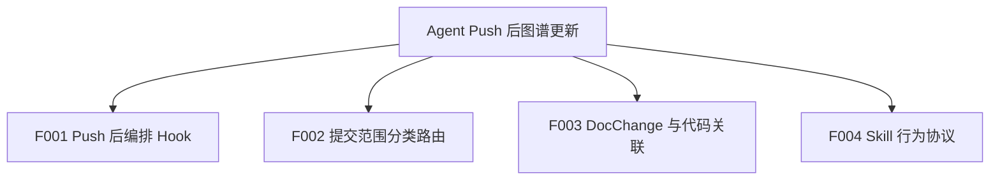
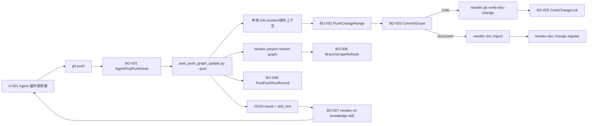
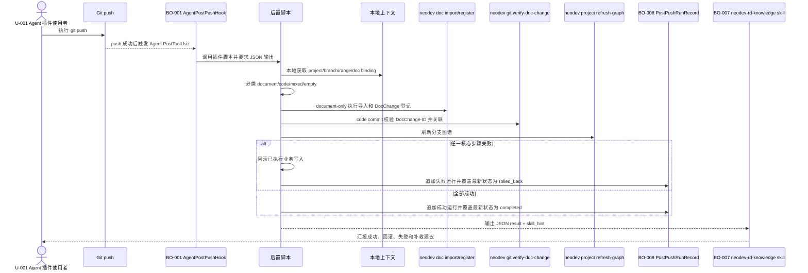

# Agent Push 后图谱更新总 PRD

## 1. 文档信息

| 项 | 内容 |
| --- | --- |
| 文档编号 | R-004 |
| 版本 | v1.0 |
| 状态 | 已定稿，待确认问题已由用户关闭 |
| 最后更新 | 2026-05-13 |
| 事实源 | 见 `00-source-index.md` |
| 输出路径 | `docs/requirements/agent-post-push-graph-update/` |

## 2. 背景与目标

NeoDev 当前已具备 `git verify-doc-change`、`project refresh-graph`、`doc import`、`doc change register`、`CodeChangeLink` 和分支图谱刷新能力，但 Agent 插件层 `Bash(git push *)` 的 `PostToolUse` 目前只输出手动刷新提醒，不会自动更新图谱或关联数据。（SRC-C-001, SRC-C-006, SRC-C-007, SRC-C-008, SRC-C-013）

用户确认本期只覆盖 Agent 插件层面的 `git push` 成功后操作，不覆盖普通终端、IDE 或 Git 服务端 webhook；固定流程由脚本调用 CLI，现有 `neodev-rd-knowledge` skill 负责 Agent 的结果解读、汇报和补救协议。（SRC-U-004, SRC-U-005, SRC-U-006, SRC-U-007）

| 需求编号 | 目标 | 来源编号 |
| --- | --- | --- |
| R-001 | Agent 插件层在 `git push` 成功后自动触发图谱和相关数据更新，不再只提示手动刷新。 | SRC-U-001, SRC-U-004, SRC-C-001 |
| R-002 | 后置流程必须区分文档提交、代码提交、混合提交和空提交，并按范围选择后续动作。 | SRC-U-002, SRC-C-003, SRC-C-004 |
| R-003 | 代码提交带合法 `DocChange-ID` 时，后置流程必须自动关联文档变更和代码提交。 | SRC-U-003, SRC-C-005, SRC-C-006, SRC-A-003 |
| R-004 | 本期能力只在 Agent 插件层实现，不覆盖普通终端、IDE 或 Git 服务端 webhook。 | SRC-U-005 |
| R-005 | 图谱刷新应复用当前 `project refresh-graph` 能力，不恢复已删除的 `git post-push-refresh` 命令。 | SRC-D-005, SRC-C-008, SRC-T-005 |
| R-006 | 固定流程必须脚本化并通过 NeoDev CLI 执行；Skill 只承担 Agent 行为协议、结果解读、汇报和补救引导。 | SRC-U-006, SRC-D-006 |
| R-007 | document-only push 必须自动执行文档导入，并在导入后登记 DocChange。 | SRC-U-007, SRC-C-010, SRC-C-011, SRC-C-013 |
| R-008 | 后置运行结果必须持久化；运行历史追加记录，同一业务键的最新有效状态采用覆盖更新。 | SRC-U-007, SRC-A-004, SRC-A-005 |
| R-009 | 后置流程失败时必须全部回滚，保持文档导入、DocChange 登记、代码关联、图谱刷新和最新运行状态的原子性。 | SRC-U-007 |

## 3. 范围

### 3.1 纳入范围

- 改造 Agent 插件 `PostToolUse` 的 `Bash(git push *)` 后置入口，使其调用插件脚本执行自动后置流程。（SRC-C-001）
- 后置脚本由 Agent/脚本自身从本地仓库、插件上下文、`.neodev` 配置或本地 Git 命令中获取 project、branch、push range、doc binding 等上下文；Hook 不传入远端服务查询后才能获得的业务参数。（SRC-U-007）
- 后置脚本按 commit paths 区分 document/code/mixed/empty，并形成可审计 JSON 输出。（SRC-U-002, SRC-C-003, SRC-C-004）
- 对代码提交复用 `neodev git verify-doc-change`，在存在合法 `DocChange-ID` 时写入 `CodeChangeLink` 并推进 DocChange 状态。（SRC-U-003, SRC-C-006, SRC-A-003）
- 对 document-only 提交复用 `neodev doc import` 后执行 `neodev doc change register`，登记以文档 commit hash 为 `DocChange-ID` 的文档变更。（SRC-U-007, SRC-C-013）
- push 后触发 `neodev project refresh-graph` 刷新分支图谱。（SRC-U-001, SRC-C-007, SRC-C-008）
- 持久化 post-push 运行结果，保留追加历史，并覆盖同一业务键的最新有效状态。（SRC-U-007）
- 扩展现有 `neodev-rd-knowledge` skill，用于指导 Agent 解读后置脚本 JSON 结果、汇报状态和执行安全补救。（SRC-U-006, SRC-U-007, SRC-D-006）
- 任一核心步骤失败时，后置流程必须回滚已执行的业务写入；如现有底层能力无法提供跨 PostgreSQL/Neo4j 原子性，实现阶段必须补充事务或补偿设计。（SRC-U-007）

### 3.2 不纳入范围

- 不新增或恢复 Git 原生 `post-push` hook。（SRC-U-005, SRC-D-005, SRC-T-005）
- 不覆盖普通终端、IDE 或脚本直接执行的原生 `git push`。（SRC-U-005）
- 不新增额外权限或数据可见性模型，默认继承 Agent 进程、NeoDev CLI 和远端服务已有权限。（SRC-U-007）
- 不直接写 PostgreSQL 或 Neo4j；事实写入通过现有 NeoDev CLI/服务边界完成。（SRC-A-002, SRC-A-003, SRC-C-006, SRC-C-007）
- 不让 skill 替代脚本执行核心写入、校验或图谱刷新；skill 只约束 Agent 如何调用、解释和补救。（SRC-U-006, SRC-D-006）
- 不在本期实现 commit 级增量图谱刷新；当前图谱刷新沿用分支级 `project refresh-graph`。（SRC-D-005, SRC-C-007, SRC-T-005）

## 4. 业务对象、属性、术语统一

| 对象编号 | 标准名称 | 定义 | 主标识 | 生命周期 | 关联对象 | 来源编号 |
| --- | --- | --- | --- | --- | --- | --- |
| BO-001 | AgentPostPushHook | Agent 插件层匹配 `Bash(git push *)` 的后置入口 | matcher + script path | 已配置 -> push 后触发 -> 输出后置结果 | BO-002, BO-006, BO-007, BO-008 | SRC-C-001 |
| BO-002 | PushChangeRange | push 成功后需要处理的一组 commit | local/remote ref 或 commit sha 列表 | 待本地获取 -> 已分类 -> 已处理/失败回滚 | BO-003, BO-008 | SRC-C-004, SRC-U-007 |
| BO-003 | CommitScope | 对单个 commit 或路径集合的 document/code/mixed/empty 分类 | scope + paths | 待分类 -> document/code/mixed/empty | BO-002, BO-004 | SRC-U-002, SRC-C-003 |
| BO-004 | DocChange | 文档 Git commit hash 对应的受控文档变更记录 | doc_change_id | pending_implementation -> in_implementation -> implemented | BO-005 | SRC-C-011 |
| BO-005 | CodeChangeLink | DocChange 与代码提交之间的关联记录 | doc_change_id + commit_sha | 未创建 -> 已创建；失败时回滚 | BO-004, BO-002 | SRC-C-006, SRC-A-004 |
| BO-006 | BranchGraphRefresh | 对项目分支代码图谱的刷新运行和结果 | project + branch + run_id | 待触发 -> running -> completed/failed/rolled_back | BO-001, BO-002, BO-008 | SRC-C-007, SRC-A-005 |
| BO-007 | AgentPostPushSkill | 现有 `neodev-rd-knowledge` skill 中扩展的后置处理协议 | skill name + trigger description | 未加载 -> 已加载 -> 已解释结果/已提示补救 | BO-001, BO-008 | SRC-U-006, SRC-U-007, SRC-D-006 |
| BO-008 | PostPushRunRecord | post-push 后置流程的持久化运行记录 | run_id + project + branch + push key | started -> completed/failed/rolled_back；历史追加，最新状态覆盖 | BO-001, BO-002, BO-006 | SRC-U-007, SRC-A-005 |

| 属性编号 | 所属对象 | 中文名 | 英文名 | 类型 | 必填 | 取值范围 | 来源编号 |
| --- | --- | --- | --- | --- | --- | --- | --- |
| BO-001-A01 | BO-001 | 匹配表达式 | matcher | string | 是 | `Bash(git push *)` | SRC-C-001 |
| BO-001-A02 | BO-001 | 后置脚本 | script | string | 是 | 插件脚本路径 | SRC-C-001, SRC-U-007 |
| BO-002-A01 | BO-002 | 分支名 | branch | string | 是 | 本地 Git 可解析 branch 名称 | SRC-C-004, SRC-U-007 |
| BO-002-A02 | BO-002 | 提交 SHA | commit_sha | string | 是 | 40 位 Git commit hash | SRC-C-004 |
| BO-003-A01 | BO-003 | 分类值 | scope | enum | 是 | document/code/mixed/empty | SRC-C-003 |
| BO-004-A01 | BO-004 | 文档变更 ID | doc_change_id | string | 是 | 40 位文档 Git commit hash | SRC-C-005, SRC-C-011 |
| BO-005-A01 | BO-005 | 代码提交 SHA | commit_sha | string | 是 | Git commit hash | SRC-A-004 |
| BO-006-A01 | BO-006 | 图谱动作 | graph_action | string | 是 | `full_replace`/`skipped_unchanged`/`rolled_back`/失败分类 | SRC-C-007, SRC-U-007 |
| BO-007-A01 | BO-007 | Skill 名称 | skill_name | string | 是 | `neodev-rd-knowledge` 现有 skill | SRC-U-007 |
| BO-007-A02 | BO-007 | Skill 提示 | skill_hint | object/string | 是 | 后置脚本 JSON 输出中的 `neodev-rd-knowledge` 提示 | SRC-U-006, SRC-U-007 |
| BO-008-A01 | BO-008 | 运行持久化策略 | persistence_mode | enum | 是 | append_history + overwrite_latest | SRC-U-007 |
| BO-008-A02 | BO-008 | 回滚状态 | rollback_status | enum | 是 | not_needed/rolled_back/rollback_failed | SRC-U-007 |

| 术语编号 | 标准术语 | 禁用叫法 | 定义 | 来源编号 |
| --- | --- | --- | --- | --- |
| T-001 | Agent 插件层后置操作 | Git 原生 post-push hook | Agent 工具调用完成后由插件配置触发的后续动作 | SRC-U-005, SRC-C-001 |
| T-002 | DocChange-ID | 业务编号、短 ID | 代码提交消息中的 trailer，值为 40 位文档 Git commit hash | SRC-U-003, SRC-C-005 |
| T-003 | 分支图谱刷新 | git post-push-refresh | 对项目分支代码图谱进行分支级刷新 | SRC-D-005, SRC-C-007 |
| T-004 | 混合提交 | 正常提交 | 同一提交同时包含文档路径和代码路径 | SRC-D-003, SRC-C-003 |
| T-005 | 后置处理 Skill | 核心执行脚本 | `neodev-rd-knowledge` skill 中用于解释脚本输出、汇报结果、执行补救的 Agent 协议 | SRC-U-006, SRC-U-007 |
| T-006 | 追加覆盖 | 仅覆盖 | post-push 历史运行追加保留，面向同一业务键的最新有效状态覆盖更新 | SRC-U-007 |

## 5. 功能地图与拆分

| 功能编号 | 功能名称 | 用户价值 | 优先级 | 子 PRD | 依赖 | 来源编号 |
| --- | --- | --- | --- | --- | --- | --- |
| F001 | Push 后编排 Hook | 将现有 push 后提醒升级为 Agent 插件层自动后置流程 | P0 | `features/F001-post-push-orchestration.md` | `project refresh-graph`, F004 | SRC-U-001, SRC-U-004, SRC-U-005, SRC-U-007 |
| F002 | 提交范围分类路由 | 根据文档/代码/混合/空提交选择后续动作，避免错误关联 | P0 | `features/F002-commit-scope-routing.md` | Git commit range 和 path 读取 | SRC-U-002, SRC-U-007 |
| F003 | DocChange 与代码关联 | 带 DocChange-ID 的代码提交自动写入文档-代码关联数据 | P0 | `features/F003-docchange-code-linking.md` | `git verify-doc-change` | SRC-U-003, SRC-C-006 |
| F004 | Skill 行为协议 | 让 Agent 稳定解释脚本 JSON、汇报状态并按规则补救 | P0 | `features/F004-skill-behavior-protocol.md` | F001 脚本 JSON 输出 | SRC-U-006, SRC-U-007 |

## 6. 跨功能业务规则

| 规则编号 | 规则内容 | 影响对象 | 影响功能 | 例外情况 | 关联 AC | 来源编号 | 确认状态 |
| --- | --- | --- | --- | --- | --- | --- | --- |
| BR-G-01 | 本期 push 后自动化只在 Agent 插件层触发，不承诺覆盖普通终端或 IDE 原生 Git push。 | BO-001 | F001 | 无 | AC-G-01 | SRC-U-005 | 已确认 |
| BR-G-02 | 后置流程必须由 Agent/脚本本地获取 project、branch、push range 和 doc binding 等上下文，再区分 document/code/mixed/empty。 | BO-002, BO-003 | F001, F002 | 本地无法获取时整体失败并回滚 | AC-G-02 | SRC-U-002, SRC-U-007 | 已确认 |
| BR-G-03 | 只有代码提交包含唯一合法 `DocChange-ID` 时，才允许自动创建或复用文档与代码关联。 | BO-004, BO-005 | F003 | document-only 和 empty 不执行代码关联；mixed 不自动关联 | AC-G-03 | SRC-U-003, SRC-C-005, SRC-C-006 | 已确认 |
| BR-G-04 | 图谱刷新必须复用 `neodev project refresh-graph`，不得恢复旧 `git post-push-refresh`。 | BO-006 | F001 | 无 | AC-G-04 | SRC-D-005, SRC-C-008, SRC-T-005 | 已确认 |
| BR-G-05 | 后置流程的每个关键动作都必须输出 JSON 或结构化摘要，便于 Agent 汇报成功、回滚和失败原因。 | BO-001, BO-006, BO-007, BO-008 | F001, F004 | 无 | AC-G-05 | SRC-A-005, SRC-U-007 | 已确认 |
| BR-G-06 | 后置流程不得自动将 DocChange 标记为 `implemented`。 | BO-004 | F003 | 无 | AC-G-06 | SRC-C-011 | 已确认 |
| BR-G-07 | 固定流程必须由插件脚本调用 NeoDev CLI 执行；skill 不得替代脚本执行核心写入和刷新，只能解释结果、汇报和引导补救。 | BO-001, BO-007 | F001, F004 | 调试模式可由 Agent 手动执行同一脚本命令 | AC-G-07 | SRC-U-006, SRC-D-006 | 已确认 |
| BR-G-08 | 后置运行结果必须持久化；历史运行追加保存，同一业务键的最新有效状态覆盖更新。 | BO-008 | F001, F004 | 无 | AC-G-08 | SRC-U-007 | 已确认 |
| BR-G-09 | document-only push 必须执行 `neodev doc import`，并在导入后执行 `neodev doc change register`。 | BO-003, BO-004 | F002 | 本地无法解析 doc binding/document id 时整体失败并回滚 | AC-G-09 | SRC-U-007, SRC-C-013 | 已确认 |
| BR-G-10 | 后置流程必须保持原子性，任一核心步骤失败时全部回滚，不保留部分成功业务写入。 | BO-004, BO-005, BO-006, BO-008 | F001, F002, F003 | 仅可保留失败审计日志和回滚结果摘要 | AC-G-10 | SRC-U-007 | 已确认 |

## 7. 跨功能数据流

## 8. 跨功能主时序

## 9. 非功能要求

| 编号 | 要求 | 关联功能 | 来源编号 |
| --- | --- | --- | --- |
| NFR-001 | 只在 Agent 插件层触发，不影响普通终端或 IDE。 | F001 | SRC-U-005 |
| NFR-002 | 后置结果必须可审计并持久化，至少包含分类、关联、文档导入、图谱刷新、回滚和错误摘要。 | F001, F004 | SRC-U-007 |
| NFR-003 | 后置流程必须原子化；失败时全部回滚并明确输出 rollback_status。 | F001, F002, F003 | SRC-U-007 |
| NFR-004 | CLI 调用必须复用现有服务边界，不直接写库。 | F001, F003 | SRC-A-002, SRC-A-003 |
| NFR-005 | 稳定、重复、易出错的动作必须固化为脚本；Skill 保持轻量并通过脚本/CLI 提供确定性。 | F001, F004 | SRC-U-006, SRC-D-006 |
| NFR-006 | 不新增权限模型，默认继承 Agent、CLI 与远端服务已有权限。 | F001, F004 | SRC-U-007 |

## 10. 验收标准

| AC 编号 | Given | When | Then | 覆盖规则 |
| --- | --- | --- | --- | --- |
| AC-G-01 | Agent 执行 `git push` 成功 | PostToolUse 匹配 `Bash(git push *)` | 插件后置脚本被调用，而不是只输出 echo 提醒 | BR-G-01 |
| AC-G-02 | 后置脚本启动 | 获取上下文 | project、branch、push range、doc binding 等来自本地可直接获取来源 | BR-G-02 |
| AC-G-03 | 代码提交包含唯一合法 `DocChange-ID` | 后置流程处理该 commit | 调用 `git verify-doc-change` 并创建或复用 CodeChangeLink | BR-G-03 |
| AC-G-04 | project 与 branch 可解析 | 后置流程执行到图谱刷新 | 调用 `project refresh-graph` 并返回结构化结果 | BR-G-04 |
| AC-G-05 | 后置流程完成或失败 | Agent 读取输出 | 能看到分类、文档导入、关联、图谱刷新、持久化、回滚和错误摘要 | BR-G-05 |
| AC-G-06 | DocChange 被代码提交引用 | 后置流程完成 | 状态最多推进到现有 `in_implementation` 口径，不自动标记 `implemented` | BR-G-06 |
| AC-G-07 | Hook 后置流程执行 | 检查职责边界 | 核心写入与刷新由脚本调用 CLI 完成，Skill 只做解释、汇报和补救引导 | BR-G-07 |
| AC-G-08 | 任一 post-push run 结束 | 检查运行记录 | 历史记录追加，最新有效状态按同一业务键覆盖 | BR-G-08 |
| AC-G-09 | push 范围只包含文档提交 | 后置流程处理 | 自动执行 `doc import` 后执行 `doc change register` | BR-G-09 |
| AC-G-10 | 任一核心步骤失败 | 后置流程结束 | 已执行业务写入全部回滚，输出 rollback_status 和失败阶段 | BR-G-10 |

## 11. 待确认问题索引

| 问题编号 | 状态 | 确认结论 | 来源 |
| --- | --- | --- | --- |
| Q-101 | 已关闭 | Agent/脚本自己从本地获取 push 范围、project、branch 等上下文。 | SRC-U-007 |
| Q-102 | 已关闭 | 需要持久化，运行历史追加，最新有效状态覆盖。 | SRC-U-007 |
| Q-103 | 已关闭 | 不做额外权限。 | SRC-U-007 |
| Q-104 | 已关闭 | 参数只能选择本地可以直接获取的上下文；Hook 不传远端业务参数。 | SRC-U-007 |
| Q-105 | 已关闭 | 选择 C：document-only 自动 doc import 后登记 DocChange。 | SRC-U-007 |
| Q-106 | 已关闭 | 失败需要全部回滚，保持原子性。 | SRC-U-007 |
| Q-107 | 已关闭 | 选择 B：扩展现有 `neodev-rd-knowledge` skill。 | SRC-U-007 |
