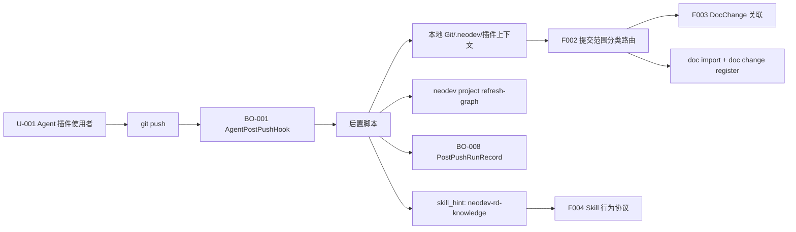

# F001 Push 后编排 Hook PRD

## 1. 功能信息

| 项 | 内容 |
| --- | --- |
| 功能编号 | F001 |
| 功能名称 | Push 后编排 Hook |
| 优先级 | P0 |
| 状态 | 已定稿，待确认问题已关闭 |
| 所属总 PRD | `../01-master-prd.md` |
| 主要事实源 | SRC-U-001, SRC-U-004, SRC-U-005, SRC-U-006, SRC-U-007, SRC-C-001, SRC-C-007, SRC-C-008, SRC-A-001, SRC-A-002 |

## 2. 引用业务口径

| 类型 | 编号 | 名称 | 来源章节 | 来源编号 |
| --- | --- | --- | --- | --- |
| 业务对象 | BO-001 | AgentPostPushHook | 总 PRD 4 | SRC-C-001 |
| 业务对象 | BO-002 | PushChangeRange | 总 PRD 4 | SRC-C-004, SRC-U-007 |
| 业务对象 | BO-006 | BranchGraphRefresh | 总 PRD 4 | SRC-C-007, SRC-A-002 |
| 业务对象 | BO-007 | AgentPostPushSkill | 总 PRD 4 | SRC-U-006, SRC-U-007 |
| 业务对象 | BO-008 | PostPushRunRecord | 总 PRD 4 | SRC-U-007 |
| 跨功能规则 | BR-G-02 | 本地获取上下文 | 总 PRD 6 | SRC-U-007 |
| 跨功能规则 | BR-G-07 | 固定流程脚本化，skill 只做收口 | 总 PRD 6 | SRC-U-006, SRC-D-006 |
| 跨功能规则 | BR-G-08 | 持久化追加覆盖 | 总 PRD 6 | SRC-U-007 |
| 跨功能规则 | BR-G-10 | 原子性与失败回滚 | 总 PRD 6 | SRC-U-007 |

## 3. 功能目标

F001 将现有 Agent 插件层 `Bash(git push *)` 的 push 后提醒升级为可执行的后置编排入口。push 成功后，Hook 调用插件内确定性脚本；脚本从本地 Git、`.neodev`、插件上下文和本地可直接获取的配置中解析 project、branch、push range、doc binding 等上下文，完成分类路由、DocChange 关联、文档导入/登记、分支图谱刷新、运行记录持久化和结果输出。（SRC-U-001, SRC-U-004, SRC-U-005, SRC-U-007, SRC-C-001）

F001 不要求 Hook 内联复杂逻辑，也不要求 Agent 临场拼接 NeoDev CLI 命令。核心动作由脚本执行，Agent 按 F004 中扩展的 `neodev-rd-knowledge` skill 行为协议解读脚本输出、汇报状态和执行补救。（SRC-U-006, SRC-U-007, SRC-D-006）

## 4. 用户故事与场景

| 场景编号 | 用户角色 | 场景描述 | 业务价值 | 来源编号 |
| --- | --- | --- | --- | --- |
| US-F001-01 | U-001 Agent 插件使用者 | 通过 Agent 执行 `git push` 成功后，无需手动复制提醒命令 | 自动保持 NeoDev 图谱和关联数据新鲜 | SRC-U-001, SRC-U-004 |
| US-F001-02 | U-002 研发负责人 | 查看 Agent 输出即可判断本次 push 后图谱刷新、文档导入、DocChange 登记和关联是否成功 | 减少漏刷图谱和闭环缺失 | SRC-U-001, SRC-A-005 |
| US-F001-03 | U-001 Agent 插件使用者 | 后置流程失败时，Agent 得到回滚结果和可执行补救建议 | 避免部分成功状态污染图谱和关联数据 | SRC-U-007 |

## 5. 前置条件

- 当前场景是 Agent 插件层工具调用，不是普通终端或 IDE 原生 Git push。（SRC-U-005）
- NeoDev CLI 可用，且脚本可从本地直接获取或推断 project、branch、push range、doc binding 等上下文。（SRC-U-007）
- push 命令已成功完成；若 Agent hook 无法确认成功状态，脚本必须整体失败并输出 not_ready，不执行业务写入。（SRC-A-001, SRC-U-007）
- 后置处理协议扩展在现有 `neodev-rd-knowledge` skill 中。（SRC-U-007）

## 6. 入口与触发

| 入口编号 | 能力入口 | 入口位置 | 触发方式 | 到达结果 | 来源编号 |
| --- | --- | --- | --- | --- | --- |
| EN-F001-01 | Agent `PostToolUse` hook | `plugins/neodev-rd-knowledge/hooks/hooks.json` | `Bash(git push *)` 工具调用成功完成后 | 调用插件后置脚本 | SRC-C-001, SRC-A-001 |
| EN-F001-02 | 后置处理 skill | 后置脚本 JSON 的 `skill_hint` 或 `neodev-rd-knowledge` skill 触发描述 | 脚本返回结构化结果后 | Agent 按 F004 协议解释结果和补救 | SRC-U-006, SRC-U-007 |

## 7. 交互说明

| 交互编号 | 触发动作 | 系统反馈 | 状态变化 | 失败反馈 | 退出路径 | 来源编号 |
| --- | --- | --- | --- | --- | --- | --- |
| IA-F001-01 | Agent push 成功后触发 hook | Hook 调用后置脚本并输出 JSON/摘要 | BO-001 已触发；BO-008 started | 输出失败阶段、回滚结果、错误信息、建议重试命令 | 后置脚本退出并由 Agent 汇报 | SRC-C-001, SRC-U-007 |
| IA-F001-02 | 脚本调用 `project refresh-graph` | 返回 graph_id/head_commit/node_count/edge_count 或 rolled_back | BO-006 completed/rolled_back | 返回 CLI 错误详情并触发整体回滚 | 后置脚本结束，保留错误摘要 | SRC-C-007, SRC-A-002, SRC-U-007 |
| IA-F001-03 | 脚本持久化运行结果 | 追加 run 历史并覆盖最新有效状态 | BO-008 completed/failed/rolled_back | 持久化失败视为核心失败并整体回滚 | Agent 汇报最终状态 | SRC-U-007 |

## 8. 业务规则

| 规则编号 | 规则类型 | 规则内容 | 影响对象/属性 | 例外情况 | 关联 AC | 来源编号 | 确认状态 |
| --- | --- | --- | --- | --- | --- | --- | --- |
| BR-F001-01 | 触发 | 后置编排只由 Agent 插件层 `PostToolUse` 的 `Bash(git push *)` 入口触发。 | BO-001-A01 | 无 | AC-F001-01 | SRC-U-005, SRC-C-001 | 已确认 |
| BR-F001-02 | 编排 | Hook 配置只负责调用插件脚本，具体逻辑由脚本处理。 | BO-001-A02 | 无 | AC-F001-02 | SRC-C-001 | 已确认 |
| BR-F001-03 | 参数 | 后置脚本参数只能选择本地可直接获取或控制执行形态的值；Hook 不传 `--project-id`、`--project-name`、`--branch`、`--commit-range` 等需由脚本本地解析的业务参数。 | BO-001-A02, BO-002 | 测试可传临时 repo root fixture | AC-F001-03 | SRC-U-007 | 已确认 |
| BR-F001-04 | 图谱 | 分支图谱刷新必须调用 `neodev project refresh-graph`。 | BO-006 | 无 | AC-F001-04 | SRC-D-005, SRC-C-008, SRC-A-002 | 已确认 |
| BR-F001-05 | 输出 | 后置编排必须输出成功、失败、回滚、持久化和 `skill_hint` 的结构化结果。 | BO-006-A01, BO-007-A02, BO-008 | 无 | AC-F001-05 | SRC-A-005, SRC-U-007 | 已确认 |
| BR-F001-06 | 原子性 | 任一核心步骤失败时必须回滚已执行的文档导入、DocChange 登记、CodeChangeLink、图谱刷新和最新状态覆盖。 | BO-004, BO-005, BO-006, BO-008 | 可保留失败审计日志 | AC-F001-06 | SRC-U-007 | 已确认 |
| BR-F001-07 | Skill 边界 | Skill 只能解释脚本 JSON、汇报结果和提示补救，不得直接替代脚本执行核心写入和刷新。 | BO-007 | 调试模式可要求 Agent 手动执行同一脚本命令 | AC-F001-07 | SRC-U-006, SRC-D-006 | 已确认 |

## 9. 字段、状态与校验

| 字段编号 | 字段名 | 所属对象属性 | 输入/展示 | 校验规则 | 错误提示 | 来源编号 |
| --- | --- | --- | --- | --- | --- | --- |
| FLD-F001-01 | project_id/project_name | BO-006 | 本地解析输出 | 从本地可直接获取来源解析，不由 Hook 传入 | `project is required for post-push graph refresh` | SRC-U-007, SRC-A-002 |
| FLD-F001-02 | branch | BO-002-A01 | 本地解析输出 | 非空 Git branch 名称，不由 Hook 传入 | `branch is required for post-push graph refresh` | SRC-U-007, SRC-A-002 |
| FLD-F001-03 | graph_action | BO-006-A01 | 输出 | 来自 `project refresh-graph` 返回或 rollback 结果 | `graph refresh failed` | SRC-A-005 |
| FLD-F001-04 | skill_hint | BO-007-A02 | 输出 | 指向现有 `neodev-rd-knowledge` skill | `skill hint missing` | SRC-U-006, SRC-U-007 |
| FLD-F001-05 | rollback_status | BO-008-A02 | 输出 | not_needed/rolled_back/rollback_failed | `rollback failed` | SRC-U-007 |

## 10. 功能内数据流

## 11. 接口与数据口径

| 项 | 内容 | 来源编号 | 确认状态 |
| --- | --- | --- | --- |
| 输入数据 | 当前仓库路径、Agent 插件执行上下文、本地 Git refs、`.neodev` 配置、本地 doc binding 配置 | SRC-U-007, SRC-A-001 | 已确认 |
| 脚本参数 | 必需 `--json`；可选 `--dry-run`、测试用 `--repo-root`；不得在 Hook 正常路径传入 project/branch/range 等业务参数 | SRC-U-007 | 已确认 |
| 输出数据 | hook_status、classification_summary、doc_import_results、docchange_register_results、docchange_link_results、graph_refresh_result、run_record、rollback_status、skill_hint、errors | SRC-A-005, SRC-U-007 | 已确认 |
| 写数据边界 | 只通过 `neodev doc import`、`neodev doc change register`、`neodev git verify-doc-change` 和 `neodev project refresh-graph` 触发写入；不直接写库 | SRC-C-006, SRC-C-007, SRC-C-013 | 已确认 |
| skill_hint | `{"skill":"neodev-rd-knowledge","action":"interpret_post_push_result"}` 或等价结构 | SRC-U-007 | 已确认 |

## 12. 异常与边界场景

| 场景编号 | 场景 | 处理规则 | 用户反馈 | 关联 AC | 来源编号 |
| --- | --- | --- | --- | --- | --- |
| EX-F001-01 | 无法本地解析 project、branch、push range 或 doc binding | 不执行业务写入，输出 not_ready | 告知缺失的本地上下文 | AC-F001-03 | SRC-U-007 |
| EX-F001-02 | `project refresh-graph` 失败 | 标记 graph_refresh failed 并触发整体回滚 | 输出 CLI stderr/stdout 摘要和 rollback_status | AC-F001-06 | SRC-C-007, SRC-U-007 |
| EX-F001-03 | 运行记录持久化失败 | 视为核心失败并触发整体回滚 | 输出 persistence failed 和 rollback_status | AC-F001-06 | SRC-U-007 |
| EX-F001-04 | `neodev-rd-knowledge` skill 不可用 | 脚本仍输出完整 JSON；Agent 展示原始摘要并提示更新插件 | 输出 skill_unavailable 提示 | AC-F001-07 | SRC-U-007 |

## 13. 验收标准

| AC 编号 | Given | When | Then | 覆盖规则 | 来源编号 |
| --- | --- | --- | --- | --- | --- |
| AC-F001-01 | Agent 执行 `git push` 成功 | PostToolUse 匹配 `Bash(git push *)` | 插件后置脚本被调用，而不是只 echo 提醒 | BR-F001-01 | SRC-C-001 |
| AC-F001-02 | hook 配置存在 | 检查 `hooks.json` | `Bash(git push *)` 调用插件脚本，逻辑不内联在 JSON 中 | BR-F001-02 | SRC-C-001 |
| AC-F001-03 | 后置脚本启动 | 检查脚本参数和上下文解析 | project、branch、range 等业务上下文由脚本本地解析，不由 Hook 传入 | BR-F001-03 | SRC-U-007 |
| AC-F001-04 | project 与 branch 可解析 | 后置流程执行到图谱刷新 | `project refresh-graph` 被调用并返回结构化结果 | BR-F001-04 | SRC-A-002, SRC-A-005 |
| AC-F001-05 | 后置流程完成 | 查看输出 | 能看到分类、文档导入、关联、图谱刷新、持久化、skill_hint 和错误摘要 | BR-F001-05 | SRC-U-007 |
| AC-F001-06 | 任一核心步骤失败 | 后置流程结束 | 已执行业务写入全部回滚，输出 rollback_status，不保留部分成功 | BR-F001-06 | SRC-U-007 |
| AC-F001-07 | 脚本输出 JSON result | Agent 处理结果 | Agent 按 F004 Skill 协议解读和汇报，不自行替代脚本执行核心写入 | BR-F001-07 | SRC-U-006, SRC-U-007 |

## 14. 测试场景建议

| 测试编号 | 优先级 | 场景 | 前置条件 | 操作 | 预期结果 | 覆盖 AC | 来源编号 |
| --- | --- | --- | --- | --- | --- | --- | --- |
| TC-F001-01 | P0 | hook 从 echo 改为脚本调用 | 读取 hooks.json | 检查 `Bash(git push *)` hook command | command 包含插件脚本解析和执行 | AC-F001-01, AC-F001-02 | SRC-C-001 |
| TC-F001-02 | P0 | 本地上下文解析 | 准备带 `.neodev` 和 Git upstream 的测试仓库 | 执行后置脚本 | 输出 project、branch、range，且不是 Hook 参数传入 | AC-F001-03 | SRC-U-007 |
| TC-F001-03 | P0 | 图谱刷新成功 | stub `neodev project refresh-graph` 返回成功 JSON | 执行后置脚本 | 输出 graph_refresh_result 和 run_record | AC-F001-04, AC-F001-05 | SRC-A-002 |
| TC-F001-04 | P0 | 核心步骤失败回滚 | stub `project refresh-graph` 或持久化失败 | 执行后置脚本 | 输出 rolled_back，不保留部分成功写入 | AC-F001-06 | SRC-U-007 |
| TC-F001-05 | P0 | skill_hint 输出 | 后置脚本完成或失败 | 检查脚本 JSON | 输出指向 `neodev-rd-knowledge` 的 skill_hint | AC-F001-07 | SRC-U-007 |

## 15. 关联需求与依赖

- 依赖 F002 提供提交范围分类、document-only 导入/登记路由。
- 依赖 F003 对代码提交执行 DocChange 关联。
- 依赖 F004 定义 Agent 对脚本结果的解释、汇报和补救协议。
- 依赖现有 `neodev doc import`、`neodev doc change register`、`neodev project refresh-graph` 和 `neodev git verify-doc-change` CLI。

## 16. 待确认问题

| 问题编号 | 状态 | 确认结论 | 来源 |
| --- | --- | --- | --- |
| Q-101 | 已关闭 | Agent/脚本自己从本地获取 push 范围、project、branch 等上下文。 | SRC-U-007 |
| Q-104 | 已关闭 | 参数只能选择本地可以直接获取的上下文；Hook 不传远端业务参数。 | SRC-U-007 |
| Q-106 | 已关闭 | 失败需要全部回滚，保持原子性。 | SRC-U-007 |
| Q-107 | 已关闭 | 扩展现有 `neodev-rd-knowledge` skill。 | SRC-U-007 |
