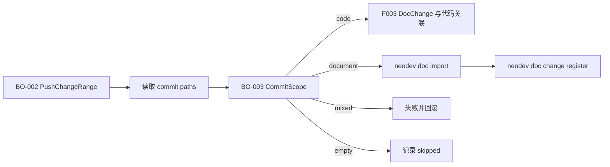

# F002 提交范围分类路由 PRD

## 1. 功能信息

| 项 | 内容 |
| --- | --- |
| 功能编号 | F002 |
| 功能名称 | 提交范围分类路由 |
| 优先级 | P0 |
| 状态 | 已定稿，待确认问题已关闭 |
| 所属总 PRD | `../01-master-prd.md` |
| 主要事实源 | SRC-U-002, SRC-U-007, SRC-C-003, SRC-C-004, SRC-C-010, SRC-C-013, SRC-D-003, SRC-D-004 |

## 2. 引用业务口径

| 类型 | 编号 | 名称 | 来源章节 | 来源编号 |
| --- | --- | --- | --- | --- |
| 业务对象 | BO-002 | PushChangeRange | 总 PRD 4 | SRC-C-004, SRC-U-007 |
| 业务对象 | BO-003 | CommitScope | 总 PRD 4 | SRC-C-003, SRC-C-004 |
| 业务对象 | BO-004 | DocChange | 总 PRD 4 | SRC-C-011 |
| 术语 | T-004 | 混合提交 | 总 PRD 4 | SRC-D-003, SRC-C-003, SRC-C-004 |
| 跨功能规则 | BR-G-02 | 本地获取上下文后分类 | 总 PRD 6 | SRC-U-002, SRC-U-007 |
| 跨功能规则 | BR-G-09 | document-only 自动导入并登记 | 总 PRD 6 | SRC-U-007, SRC-C-013 |
| 跨功能规则 | BR-G-10 | 原子性与失败回滚 | 总 PRD 6 | SRC-U-007 |

## 3. 功能目标

F002 在 push 后置流程中识别本次 push 范围内每个 commit 的路径分类，并输出 document/code/mixed/empty 的路由结果。分类结果决定是否进入 F003 的代码 DocChange 关联，以及 document-only 是否执行 `neodev doc import` 和 `neodev doc change register`。（SRC-U-002, SRC-U-007, SRC-C-003, SRC-C-013）

## 4. 用户故事与场景

| 场景编号 | 用户角色 | 场景描述 | 业务价值 | 来源编号 |
| --- | --- | --- | --- | --- |
| US-F002-01 | U-001 Agent 插件使用者 | push 范围包含代码提交 | 自动进入 DocChange 校验与关联 | SRC-U-002, SRC-C-004 |
| US-F002-02 | U-001 Agent 插件使用者 | push 范围只包含文档提交 | 自动导入文档并登记 DocChange，不误要求代码 trailer | SRC-U-007, SRC-C-013 |
| US-F002-03 | U-002 研发负责人 | push 范围出现 mixed commit | 能看到明确风险与回滚结果，不产生错误关联 | SRC-D-003, SRC-U-007 |

## 5. 前置条件

- F001 已由 Agent/脚本本地取得或推断本次 push 范围。（SRC-U-007）
- 本地 Git 仓库可读取 commit paths 和 commit message。（SRC-C-004）
- document-only 自动处理所需 doc binding、document id、document commit 必须可从本地上下文和 `doc import` 结果解析；无法解析时整体失败并回滚。（SRC-U-007, SRC-C-013）

## 6. 入口与交互

| 编号 | 触发动作 | 系统反馈 | 状态变化 | 失败反馈 | 来源编号 |
| --- | --- | --- | --- | --- | --- |
| IA-F002-01 | 读取 commit paths | 输出每个 commit 的 scope | BO-003 待分类 -> document/code/mixed/empty | Git 读取失败时整体失败并回滚 | SRC-C-004, SRC-U-007 |
| IA-F002-02 | 发现 code commit | 路由到 F003 | 进入代码 DocChange 关联 | F003 失败时整体回滚 | SRC-U-003, SRC-U-007 |
| IA-F002-03 | 发现 document-only commit | 执行 `doc import` 后 `doc change register` | BO-004 pending_implementation | 任一步失败时整体回滚 | SRC-U-007, SRC-C-013 |
| IA-F002-04 | 发现 mixed commit | 标记为风险并终止核心写入 | BO-008 failed/rolled_back | 输出 mixed paths 与拆分建议 | SRC-D-003, SRC-U-007 |

## 7. 业务规则

| 规则编号 | 规则类型 | 规则内容 | 影响对象/属性 | 例外情况 | 关联 AC | 来源编号 | 确认状态 |
| --- | --- | --- | --- | --- | --- | --- | --- |
| BR-F002-01 | 分类 | 路径分类沿用 document/code/mixed/empty 四类。 | BO-003-A01 | 无 | AC-F002-01 | SRC-C-003 | 已确认 |
| BR-F002-02 | 路由 | code commit 路由到 F003 DocChange 关联。 | BO-003 | 无 | AC-F002-02 | SRC-U-003, SRC-C-004 | 已确认 |
| BR-F002-03 | 路由 | document-only commit 必须先执行 `neodev doc import --json`，再执行 `neodev doc change register --json`。 | BO-003, BO-004 | 无法解析 doc binding/document id 时整体失败并回滚 | AC-F002-03 | SRC-U-007, SRC-C-013 | 已确认 |
| BR-F002-04 | 风险 | mixed commit 不自动关联或导入，输出拆分提示并按失败处理，保持原子性。 | BO-003, BO-008 | 无 | AC-F002-04 | SRC-D-003, SRC-U-007 | 已确认 |
| BR-F002-05 | 空范围 | empty 或无待处理 commit 时，不调用 F003，不执行 document 导入，可记录 skipped run。 | BO-002, BO-003, BO-008 | 无 | AC-F002-05 | SRC-C-003, SRC-U-007 | 已确认 |
| BR-F002-06 | 原子性 | document-only 的导入和 DocChange 登记必须纳入 F001 整体事务/补偿回滚边界。 | BO-004, BO-008 | 仅可保留失败审计日志 | AC-F002-06 | SRC-U-007 | 已确认 |

## 8. 字段、状态与校验

| 字段编号 | 字段名 | 所属对象属性 | 输入/展示 | 校验规则 | 错误提示 | 来源编号 |
| --- | --- | --- | --- | --- | --- | --- |
| FLD-F002-01 | scope | BO-003-A01 | 输出 | 只能为 document/code/mixed/empty | `unknown commit scope` | SRC-C-003 |
| FLD-F002-02 | paths | BO-002 | 输入/输出 | commit path 列表，可为空 | `commit paths unavailable` | SRC-C-004 |
| FLD-F002-03 | route | BO-003 | 输出 | code->F003, document->doc_import_then_register, mixed->rollback_failure, empty->skip | `unsupported route` | SRC-U-007 |
| FLD-F002-04 | doc_binding_id | BO-004 | 本地解析/CLI 输入 | 必须可从本地上下文解析 | `doc binding unavailable` | SRC-C-013, SRC-U-007 |
| FLD-F002-05 | document_id | BO-004 | `doc import` 输出/`doc change register` 输入 | 必须对应导入后的文档 | `document id unavailable` | SRC-C-013 |

## 9. 功能内数据流

## 10. 接口与数据口径

| 项 | 内容 | 来源编号 | 确认状态 |
| --- | --- | --- | --- |
| 输入数据 | commit sha 列表、repo root、branch、本地 doc binding 上下文 | SRC-C-004, SRC-U-007 | 已确认 |
| 输出数据 | per-commit scope、paths、route、doc_import_results、docchange_register_results、errors | SRC-C-003, SRC-C-013 | 已确认 |
| 读数据边界 | Git diff-tree 或等价命令读取 commit paths；本地配置解析 doc binding | SRC-C-004, SRC-U-007 | 已确认 |
| 写数据边界 | F002 仅通过 `neodev doc import` 和 `neodev doc change register` 触发文档写入，不直接写库 | SRC-C-013 | 已确认 |

## 11. 异常与边界场景

| 场景编号 | 场景 | 处理规则 | 用户反馈 | 关联 AC | 来源编号 |
| --- | --- | --- | --- | --- | --- |
| EX-F002-01 | 无法读取 commit paths | 整体失败并回滚 | 输出 commit sha 和 Git 错误 | AC-F002-01 | SRC-C-004, SRC-U-007 |
| EX-F002-02 | mixed commit | 不调用 F003 或 document 导入；整体失败并回滚 | 展示文档路径和代码路径 | AC-F002-04 | SRC-D-003, SRC-U-007 |
| EX-F002-03 | document-only commit 无法解析 doc binding | 整体失败并回滚 | 输出 doc binding unavailable | AC-F002-03 | SRC-U-007 |
| EX-F002-04 | doc import 成功但 register 失败 | 回滚 doc import 产生的业务写入 | 输出 register 失败和 rollback_status | AC-F002-06 | SRC-U-007, SRC-C-013 |

## 12. 验收标准

| AC 编号 | Given | When | Then | 覆盖规则 | 来源编号 |
| --- | --- | --- | --- | --- | --- |
| AC-F002-01 | 给定 paths 列表 | 执行分类 | 返回 document/code/mixed/empty 之一 | BR-F002-01 | SRC-C-003 |
| AC-F002-02 | push 范围含 code commit | 分类完成 | code commit 被路由到 F003 | BR-F002-02 | SRC-C-004 |
| AC-F002-03 | push 范围只含 document commit | 分类完成 | 自动执行 doc import 后登记 DocChange | BR-F002-03 | SRC-U-007, SRC-C-013 |
| AC-F002-04 | push 范围含 mixed commit | 分类完成 | mixed 被标记为失败并触发整体回滚 | BR-F002-04 | SRC-D-003, SRC-U-007 |
| AC-F002-05 | push 范围为空 | 分类完成 | 输出 skipped，且不调用 F003 或 doc import | BR-F002-05 | SRC-C-003 |
| AC-F002-06 | document-only 子步骤失败 | 后置流程结束 | 已执行文档写入全部回滚 | BR-F002-06 | SRC-U-007 |

## 13. 测试场景建议

| 测试编号 | 优先级 | 场景 | 前置条件 | 操作 | 预期结果 | 覆盖 AC | 来源编号 |
| --- | --- | --- | --- | --- | --- | --- | --- |
| TC-F002-01 | P0 | code paths 分类 | paths 为 `src/app.py` | 调用分类函数 | scope=code，route=F003 | AC-F002-01, AC-F002-02 | SRC-C-003 |
| TC-F002-02 | P0 | document paths 分类 | paths 为 `docs/requirements/x.md` | 执行后置脚本 | 调用 doc import 和 doc change register | AC-F002-03 | SRC-U-007, SRC-C-013 |
| TC-F002-03 | P0 | mixed paths 分类 | paths 同时包含 docs 和 src | 执行后置脚本 | scope=mixed，整体回滚 | AC-F002-04 | SRC-D-003 |
| TC-F002-04 | P1 | doc register 失败回滚 | doc import 成功，register stub 失败 | 执行后置脚本 | 输出 rolled_back，不保留文档写入 | AC-F002-06 | SRC-U-007 |

## 14. 关联需求与依赖

- 依赖 F001 提供本地解析的 push range 和事务/补偿回滚边界。
- 为 F003 提供 code commit 列表和 commit message 读取依据。
- 复用现有 `check_git_commit_scope.py`、`neodev doc import` 和 `neodev doc change register`。

## 15. 待确认问题

| 问题编号 | 状态 | 确认结论 | 来源 |
| --- | --- | --- | --- |
| Q-101 | 已关闭 | Agent/脚本自己从本地获取 push 范围、project、branch 等上下文。 | SRC-U-007 |
| Q-105 | 已关闭 | 选择 C：document-only 自动 doc import 后登记 DocChange。 | SRC-U-007 |
