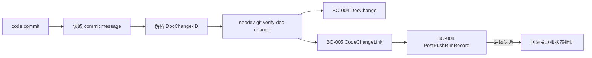

# F003 DocChange 与代码关联 PRD

## 1. 功能信息

| 项 | 内容 |
| --- | --- |
| 功能编号 | F003 |
| 功能名称 | DocChange 与代码关联 |
| 优先级 | P0 |
| 状态 | 已定稿，待确认问题已关闭 |
| 所属总 PRD | `../01-master-prd.md` |
| 主要事实源 | SRC-U-003, SRC-U-007, SRC-C-005, SRC-C-006, SRC-C-009, SRC-C-011, SRC-A-003, SRC-A-004, SRC-T-004 |

## 2. 引用业务口径

| 类型 | 编号 | 名称 | 来源章节 | 来源编号 |
| --- | --- | --- | --- | --- |
| 业务对象 | BO-004 | DocChange | 总 PRD 4 | SRC-C-011 |
| 业务对象 | BO-005 | CodeChangeLink | 总 PRD 4 | SRC-C-006, SRC-A-004 |
| 业务对象 | BO-008 | PostPushRunRecord | 总 PRD 4 | SRC-U-007 |
| 术语 | T-002 | DocChange-ID | 总 PRD 4 | SRC-U-003, SRC-C-005 |
| 术语 | T-006 | 追加覆盖 | 总 PRD 4 | SRC-U-007 |
| 跨功能规则 | BR-G-03 | 合法 DocChange-ID 才自动关联 | 总 PRD 6 | SRC-U-003, SRC-C-005, SRC-C-006 |
| 跨功能规则 | BR-G-08 | 持久化追加覆盖 | 总 PRD 6 | SRC-U-007 |
| 跨功能规则 | BR-G-10 | 原子性与失败回滚 | 总 PRD 6 | SRC-U-007 |

## 3. 功能目标

F003 对 F002 路由出的 code commit 执行 `neodev git verify-doc-change`。当 commit message 中存在唯一合法 `DocChange-ID`，且远端 DocChange 可用时，系统自动创建文档变更与代码提交的关联数据，并将 DocChange 推进到 `in_implementation`。（SRC-U-003, SRC-C-005, SRC-C-006, SRC-A-003）

F003 的关联结果必须纳入 F001 的持久化与原子性边界：每次运行追加记录；同一业务键的最新有效状态覆盖更新；任一核心步骤失败时，已创建的关联和状态推进必须回滚。（SRC-U-007）

## 4. 用户故事与场景

| 场景编号 | 用户角色 | 场景描述 | 业务价值 | 来源编号 |
| --- | --- | --- | --- | --- |
| US-F003-01 | U-001 Agent 插件使用者 | 代码提交消息包含合法 `DocChange-ID` | push 后自动形成文档与代码关联 | SRC-U-003, SRC-C-006 |
| US-F003-02 | U-002 研发负责人 | 追踪某个 DocChange 的代码提交 | 可通过 `CodeChangeLink` 查看关联 commit | SRC-A-004, SRC-T-004 |
| US-F003-03 | U-001 Agent 插件使用者 | DocChange-ID 缺失或无效 | 后置流程失败并整体回滚，不误创建部分关联 | SRC-C-005, SRC-U-007 |

## 5. 前置条件

- F002 已确认 commit scope 为 code。（SRC-C-004）
- 可以从本地 Git 读取 commit sha 和 commit message。（SRC-C-004, SRC-A-003）
- NeoDev CLI 可连接远端服务，且 `git verify-doc-change` 可用。（SRC-A-003, SRC-T-004）
- F001 提供事务或补偿回滚边界，保证 F003 失败或后续步骤失败时不保留部分成功业务写入。（SRC-U-007）

## 6. 入口与交互

| 编号 | 触发动作 | 系统反馈 | 状态变化 | 失败反馈 | 来源编号 |
| --- | --- | --- | --- | --- | --- |
| IA-F003-01 | code commit 进入关联流程 | 输出 verify result 和 link 摘要 | BO-005 未创建 -> 已创建；BO-004 -> in_implementation | 输出 DocChange-ID 缺失、未知、已 implemented 等原因，并触发整体回滚 | SRC-C-006, SRC-C-009, SRC-U-007 |
| IA-F003-02 | 关联成功后进入后续图谱刷新 | 暂不提交最终有效状态，等待全流程成功 | BO-008 running | 后续失败时回滚本步骤写入 | SRC-U-007 |
| IA-F003-03 | 同一业务键重复触发 | 追加运行历史，覆盖最新有效状态 | BO-008 append_history + overwrite_latest | 覆盖失败视为核心失败并回滚 | SRC-U-007 |

## 7. 业务规则

| 规则编号 | 规则类型 | 规则内容 | 影响对象/属性 | 例外情况 | 关联 AC | 来源编号 | 确认状态 |
| --- | --- | --- | --- | --- | --- | --- | --- |
| BR-F003-01 | 校验 | 每个 code commit 必须通过 `git verify-doc-change` 完成 DocChange-ID 解析与校验。 | BO-004-A01, BO-005-A01 | 无 | AC-F003-01 | SRC-C-005, SRC-A-003 | 已确认 |
| BR-F003-02 | 关联 | 校验成功时必须写入或复用 `CodeChangeLink`。 | BO-005 | 重复触发按追加覆盖策略处理 | AC-F003-02 | SRC-C-006, SRC-A-004, SRC-U-007 | 已确认 |
| BR-F003-03 | 状态 | 校验成功后 DocChange 可推进到 `in_implementation`，不得自动推进到 `implemented`。 | BO-004 | 无 | AC-F003-03 | SRC-C-006, SRC-C-011 | 已确认 |
| BR-F003-04 | 异常 | DocChange-ID 缺失、重复、格式非法、未知或已 implemented 时，不创建成功关联，并触发整体回滚。 | BO-004, BO-005, BO-008 | 可保留失败审计日志 | AC-F003-04 | SRC-C-005, SRC-C-009, SRC-U-007 | 已确认 |
| BR-F003-05 | 路由 | document-only、mixed、empty commit 不进入自动代码关联。 | BO-003, BO-005 | document-only 由 F002 执行文档导入与登记 | AC-F003-05 | SRC-D-003, SRC-C-004, SRC-U-007 | 已确认 |
| BR-F003-06 | 原子性 | F003 成功后若图谱刷新、运行记录持久化或其他后续核心步骤失败，F003 已写入的关联和状态推进必须回滚。 | BO-004, BO-005, BO-008 | 无 | AC-F003-06 | SRC-U-007 | 已确认 |

## 8. 字段、状态与校验

| 字段编号 | 字段名 | 所属对象属性 | 输入/展示 | 校验规则 | 错误提示 | 来源编号 |
| --- | --- | --- | --- | --- | --- | --- |
| FLD-F003-01 | doc_change_id | BO-004-A01 | 输入/输出 | 40 位十六进制文档 commit hash | `DocChange-ID must be a 40-character document commit hash` | SRC-C-005 |
| FLD-F003-02 | commit_sha | BO-005-A01 | 输入/输出 | 非空，最多 40 字符 | `commit_sha must be at most 40 characters` | SRC-C-006, SRC-A-003 |
| FLD-F003-03 | verification_status | BO-005 | 输出 | verified/skipped_duplicate/rolled_back/错误分类 | `doc change verification failed` | SRC-C-006, SRC-U-007 |
| FLD-F003-04 | doc_change_status | BO-004 | 输出 | pending_implementation/in_implementation/implemented 等现有状态 | `doc change is already implemented` | SRC-C-006, SRC-C-011 |

## 9. 功能内数据流

## 10. 接口与数据口径

| 项 | 内容 | 来源编号 | 确认状态 |
| --- | --- | --- | --- |
| 输入数据 | project_id、branch、commit_sha、commit_message | SRC-A-003 | 已确认 |
| 输出数据 | status、doc_change_id、doc_change_pk、doc_change_status、code_change_link、rollback_status、errors | SRC-C-006, SRC-C-009, SRC-U-007 | 已确认 |
| 读数据边界 | commit message 来自本地 Git；DocChange 来自 NeoDev 服务 | SRC-A-003 | 已确认 |
| 写数据边界 | 通过 `git verify-doc-change` 创建 `CodeChangeLink` 和状态推进；不直接写库 | SRC-C-006, SRC-A-004 | 已确认 |
| 持久化口径 | F001 追加运行历史，覆盖同一业务键的最新有效状态 | SRC-U-007 | 已确认 |

## 11. 异常与边界场景

| 场景编号 | 场景 | 处理规则 | 用户反馈 | 关联 AC | 来源编号 |
| --- | --- | --- | --- | --- | --- |
| EX-F003-01 | 缺少 DocChange-ID | 不创建成功关联，整体失败并回滚 | 输出缺失 trailer | AC-F003-04 | SRC-C-005, SRC-U-007 |
| EX-F003-02 | DocChange-ID 非 40 位 hash | 不创建成功关联，整体失败并回滚 | 输出格式错误 | AC-F003-04 | SRC-C-005 |
| EX-F003-03 | DocChange 不存在 | 不创建成功关联，整体失败并回滚 | 输出 doc change not found | AC-F003-04 | SRC-C-009 |
| EX-F003-04 | DocChange 已 implemented | 不创建成功关联，整体失败并回滚 | 输出 conflict | AC-F003-04 | SRC-C-009 |
| EX-F003-05 | 后续图谱刷新失败 | 回滚 F003 已写入关联和状态推进 | 输出 graph_refresh failed + rolled_back | AC-F003-06 | SRC-U-007 |

## 12. 验收标准

| AC 编号 | Given | When | Then | 覆盖规则 | 来源编号 |
| --- | --- | --- | --- | --- | --- |
| AC-F003-01 | code commit 有合法 DocChange-ID | 后置流程处理该 commit | 调用 `git verify-doc-change` | BR-F003-01 | SRC-A-003 |
| AC-F003-02 | `git verify-doc-change` 返回 verified | 后置流程汇总结果 | 输出 CodeChangeLink 信息并纳入持久化运行结果 | BR-F003-02 | SRC-C-006, SRC-U-007 |
| AC-F003-03 | 关联成功 | 查看 DocChange 状态 | 状态为 in_implementation 或现有服务返回状态，不自动 implemented | BR-F003-03 | SRC-C-006, SRC-C-011 |
| AC-F003-04 | DocChange-ID 缺失/非法/未知/已 implemented | 后置流程处理 | 输出失败原因并整体回滚 | BR-F003-04 | SRC-C-005, SRC-U-007 |
| AC-F003-05 | commit scope 为 document/mixed/empty | 后置流程处理 | 不调用代码关联 | BR-F003-05 | SRC-D-003, SRC-C-004 |
| AC-F003-06 | F003 成功但后续核心步骤失败 | 后置流程结束 | F003 关联和状态推进被回滚 | BR-F003-06 | SRC-U-007 |

## 13. 测试场景建议

| 测试编号 | 优先级 | 场景 | 前置条件 | 操作 | 预期结果 | 覆盖 AC | 来源编号 |
| --- | --- | --- | --- | --- | --- | --- | --- |
| TC-F003-01 | P0 | 合法 DocChange-ID 关联成功 | stub `git verify-doc-change` 返回 verified | 执行后置脚本处理 code commit | 输出 link 信息和持久化结果 | AC-F003-01, AC-F003-02 | SRC-T-004 |
| TC-F003-02 | P0 | 缺失 DocChange-ID | code commit message 无 trailer | 执行后置脚本 | 输出 invalid_argument，整体回滚 | AC-F003-04 | SRC-C-005 |
| TC-F003-03 | P0 | 已 implemented DocChange | stub 返回 conflict | 执行后置脚本 | 输出 conflict，整体回滚 | AC-F003-04 | SRC-C-009 |
| TC-F003-04 | P1 | document commit 不关联 | F002 返回 document | 执行后置脚本 | 未调用 verify-doc-change | AC-F003-05 | SRC-D-003 |
| TC-F003-05 | P0 | 后续失败回滚关联 | verify 成功，graph refresh stub 失败 | 执行后置脚本 | CodeChangeLink 和状态推进被回滚 | AC-F003-06 | SRC-U-007 |

## 14. 关联需求与依赖

- 依赖 F002 只把 code commit 交给本功能。
- 依赖现有 `neodev git verify-doc-change` CLI。
- 与 F001 的图谱刷新、持久化和回滚边界共同形成原子后置流程。

## 15. 待确认问题

| 问题编号 | 状态 | 确认结论 | 来源 |
| --- | --- | --- | --- |
| Q-102 | 已关闭 | 需要持久化，运行历史追加，最新有效状态覆盖。 | SRC-U-007 |
| Q-106 | 已关闭 | 失败需要全部回滚，保持原子性。 | SRC-U-007 |
