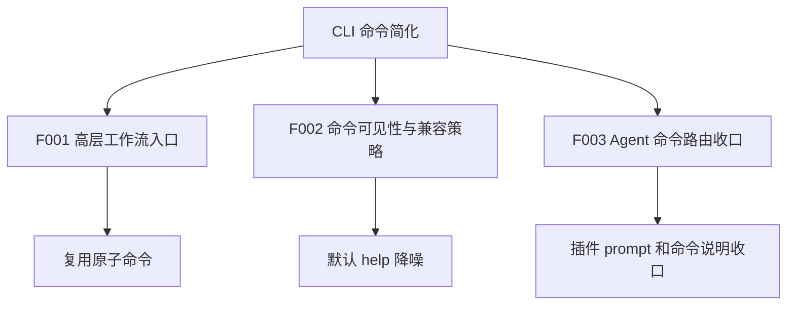
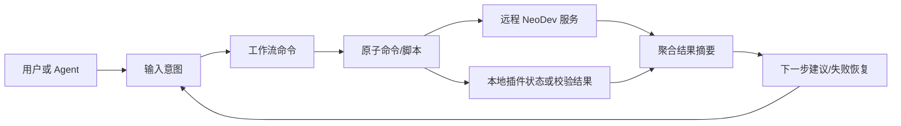
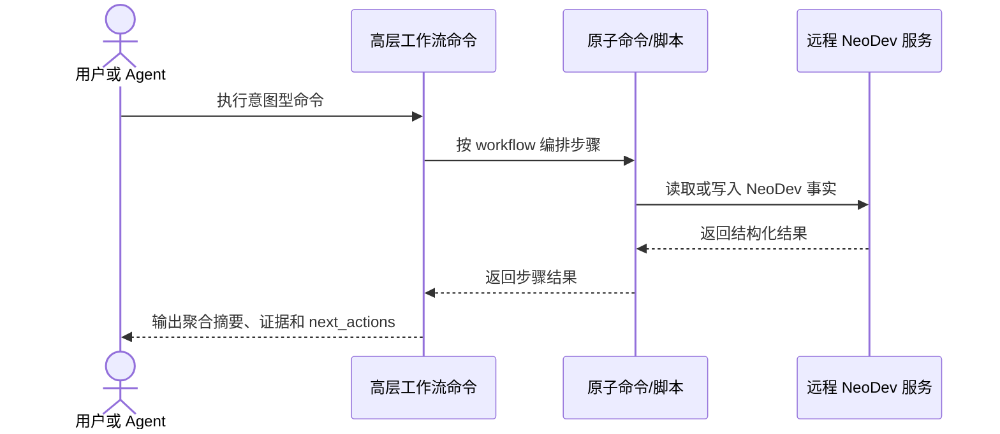

# CLI 命令简化总 PRD

## 1. 文档信息

| 项 | 内容 |
| --- | --- |
| 文档编号 | R-CLI-COMMAND-SIMPLIFICATION |
| 版本 | v0.1 |
| 状态 | 草稿 |
| 负责人 | 产品负责人 |
| 最后更新 | 2026-06-10 |
| 事实源 | 见 `00-source-index.md` |
| 输出路径 | `docs/requirements/cli-command-simplification/` |

## 2. 背景与目标

### 2.1 背景

NeoDev 当前 CLI 已覆盖产品、版本、项目、文档、DocChange、图谱、Git 一致性和插件后置自动化等多类原子能力。用户评估认为命令数量较多，存在简化和压缩空间。（SRC-U-001）

从本地代码和插件配置看，命令多的原因是底层事实能力完整：产品版本、文档导入、图谱刷新、Git 校验和手工图谱操作都需要稳定原子接口。（SRC-C-001 至 SRC-C-005）但日常用户和 Agent 的真实意图通常不是“调用某个原子命令”，而是完成“初始化仓库上下文”“同步文档”“开始一个变更”“检查提交是否合规”等工作流。（SRC-D-002, SRC-D-003）

### 2.2 目标

- 新增少量高层工作流入口，把常用原子命令聚合为用户可理解的意图型命令。（SRC-U-004, SRC-D-002）
- 保留现有底层命令兼容性，避免破坏脚本、测试和排障路径。（SRC-U-004, SRC-C-001 至 SRC-C-005）
- 将内部/高级命令从默认 help 和插件默认推荐路径中降噪，减少误用。（SRC-U-004, SRC-C-004, SRC-C-005）
- 让 Agent 插件优先使用高层入口或明确 workflow，而不是直接拼接多个原子命令。（SRC-C-006, SRC-C-007）
- 采用已确认的顶层入口命名、全量 help 入口和插件命令说明收口策略，避免继续在实现阶段摇摆。（SRC-U-005）
- 明确每个高层命令的操作、读写数据、输出证据、下一步动作和失败恢复，确保单命令可以形成操作与数据闭环。（SRC-U-006）
- 确保高层命令之间在业务上形成从上下文确认到提交后状态回看的端到端闭环，而不是彼此孤立的命令清单。（SRC-U-007）
- 用典型业务场景说明每个需求点的触发条件、命令顺序、数据读写、输出证据、下一步动作和验收关注点，避免停留在抽象编号描述。（SRC-U-008, SRC-U-009）

### 2.3 非目标

- 不删除现有 `product`、`project`、`doc`、`graph`、`git` 原子命令。（SRC-U-004）
- 不改变远程服务的事实读写边界，仍以本地 `neodev` CLI 调远程服务为主。（SRC-D-003）
- 不在本需求中设计新的数据库表结构或 Web UI。（SRC-U-002）
- 不把 hook 内部命令变成普通用户日常入口。（SRC-C-005, SRC-C-006）

## 3. 范围

### 3.1 纳入范围

- 高层工作流命令的已确认集合、职责边界、输入输出和失败反馈。（F001）
- 底层命令的可见性分级、兼容策略和 help 展示规则。（F002）
- 插件命令说明、defaultPrompt、hooks 与 Agent 行为路由的收口规则。（F003）

### 3.2 不纳入范围

- 现有原子命令的业务语义重写。
- 直接修改 post-push 原子更新事务边界。
- 重新设计 Neo4j 或 PostgreSQL 存储模型。
- 一次性迁移所有历史文档和脚本。

## 4. 用户角色

| 角色编号 | 角色名称 | 定义 | 主要诉求 | 权限边界 |
| --- | --- | --- | --- | --- |
| U-001 | NeoDev 使用者 | 通过 CLI 完成产品、文档、变更、图谱和 Git 校验的开发者。 | 少记命令，能按意图完成常用闭环。 | 只通过 CLI/API 使用 NeoDev 状态。 |
| U-002 | Agent 插件使用者 | 通过 Codex/Claude/Cursor 等 Agent 调用 NeoDev 插件的人。 | Agent 能自动选择正确工作流，减少误用原子命令。 | 不绕过插件约束直接写数据库。 |
| U-003 | NeoDev 维护者 | 维护 CLI、插件、脚本和服务端契约的人。 | 保留原子命令兼容性和排障能力。 | 可使用高级/内部命令，但需明确风险。 |

## 5. 业务对象、属性、术语统一

### 5.1 业务对象清单

| 对象编号 | 标准名称 | 别名 | 定义 | 所属域 | 主标识 | 生命周期 | 关联对象 | 来源编号 | 确认状态 |
| --- | --- | --- | --- | --- | --- | --- | --- | --- | --- |
| BO-001 | 原子命令 | 底层命令、low-level command | 直接承载单一事实读写或查询能力的 `neodev` 子命令。 | CLI | command_name | 注册 -> 使用 -> 隐藏或保留 -> 废弃候选 | BO-002, BO-003 | SRC-C-001 至 SRC-C-005 | 已确认 |
| BO-002 | 工作流命令 | 高层入口、workflow command | 面向用户意图，按固定顺序聚合多个原子命令并输出统一结果的命令。 | CLI | workflow_name | 候选 -> 发布 -> 推荐 -> 稳定 | BO-001, BO-004 | SRC-U-004, SRC-U-005, SRC-D-002 | 已确认 |
| BO-003 | 命令可见性等级 | visibility | 命令在帮助、插件提示和用户文档中的默认曝光级别。 | CLI | level | 默认 -> 调整 -> 稳定 | BO-001, BO-002 | SRC-U-004, SRC-U-005 | 已确认 |
| BO-004 | Agent 路由规则 | plugin routing | 插件根据用户意图选择工作流命令、原子命令或 hook 内部命令的规则。 | Plugin | route_id | 候选 -> 发布 -> 验证 -> 调整 | BO-001, BO-002 | SRC-U-005, SRC-C-006, SRC-C-007 | 已确认 |
| BO-005 | 业务闭环 | command lifecycle | 高层命令之间围绕一次 NeoDev 研发工作形成的业务阶段链路。 | CLI/Plugin | closure_id | 确认上下文 -> 接入仓库 -> 同步文档 -> 启动变更 -> 分析影响 -> 检查提交 -> 回看状态 | BO-002, BO-004 | SRC-U-007 | 已确认 |

### 5.2 业务对象属性字典

| 属性编号 | 所属对象 | 中文名 | 英文名 | 类型 | 必填 | 取值范围 | 来源编号 | 可编辑 | 展示口径 | 校验规则 | 确认状态 |
| --- | --- | --- | --- | --- | --- | --- | --- | --- | --- | --- | --- |
| BO-002-A01 | BO-002 | 命令名 | name | string | 是 | `neodev doctor`、`neodev context show`、`neodev setup repo`、`neodev docs sync`、`neodev change start`、`neodev change impact`、`neodev git check`、`neodev status` | SRC-U-005 | 是 | 用户可见 | 不得与现有命令冲突 | 已确认 |
| BO-002-A02 | BO-002 | 聚合步骤 | steps | list | 是 | 原子命令或本地脚本列表 | SRC-D-002 | 是 | 结果摘要展示 | 每步必须有失败反馈 | 候选 |
| BO-002-A03 | BO-002 | 输出摘要 | summary | object | 是 | JSON 对象 | SRC-A-003 | 是 | 默认展示核心证据 | 必须包含 `ok/errors/next_actions` 或等价字段 | 候选 |
| BO-003-A01 | BO-003 | 可见性等级 | level | enum | 是 | primary/advanced/internal/hidden | SRC-U-004 | 是 | help 与文档分级 | internal 不得作为普通推荐入口 | 候选 |
| BO-004-A01 | BO-004 | 用户意图 | intent | string | 是 | context/docs/change/submit | SRC-U-005, SRC-D-002 | 是 | 插件命令说明 | 必须映射到明确 workflow 或高层命令 | 已确认 |
| BO-005-A01 | BO-005 | 当前业务阶段 | stage | enum | 是 | context/setup/docs/change/impact/submit/status | SRC-U-007 | 是 | 聚合摘要、Agent 汇报 | 阶段必须能映射到至少一个高层命令 | 已确认 |
| BO-005-A02 | BO-005 | 下一命令 | next_command | string | 是 | 已确认高层命令集合 | SRC-U-006, SRC-U-007 | 是 | next_actions | 成功和失败都必须给出下一步或终止原因 | 已确认 |
| BO-005-A03 | BO-005 | 闭环证据 | closure_evidence | list | 是 | 产品/版本/项目/分支/doc binding/DocChange/impact/commit risk/hook status | SRC-U-006, SRC-U-007 | 是 | 结果摘要和审计 | 证据必须来自原子命令或服务端事实 | 已确认 |
| BO-005-A04 | BO-005 | 典型场景 | scenario_id | enum | 是 | S01/S02/S03/S04/S05/S06 | SRC-U-008, SRC-U-009 | 是 | 聚合摘要、Agent 汇报、测试断言 | 每个场景必须声明触发条件、命令顺序、数据读写、输出证据和验收关注点 | 已确认 |

### 5.3 术语与定义

| 术语编号 | 标准术语 | 别名/旧称 | 定义 | 禁用叫法 | 适用范围 | 来源编号 | 确认状态 |
| --- | --- | --- | --- | --- | --- | --- | --- |
| T-001 | 工作流命令 | 高层命令、意图命令 | 聚合多个原子能力，用一个用户意图入口完成常用闭环的 CLI 命令。 | 魔法命令 | CLI 简化 | SRC-U-004, SRC-U-005 | 已确认 |
| T-002 | 原子命令 | 底层命令 | 现有 `product/project/doc/graph/git` 下直接操作单一业务对象或事实的命令。 | 废弃命令 | CLI 兼容 | SRC-C-001 至 SRC-C-005 | 已确认 |
| T-003 | 内部命令 | hook-only command | 仅供 hook、脚本或服务端原子流程调用，不作为普通用户入口推荐的命令。 | 用户命令 | post-push 与维护操作 | SRC-C-005, SRC-C-006 | 候选 |
| T-004 | 业务闭环 | command lifecycle | 命令执行结果能推进到下一业务阶段，并最终回到状态确认或下一轮变更入口的闭合链路。 | 命令堆叠 | CLI 简化、Agent 路由 | SRC-U-007 | 已确认 |

## 6. 功能地图与拆分

### 6.1 功能地图

### 6.2 功能拆分清单

| 功能编号 | 功能名称 | 用户价值 | 优先级 | 子 PRD | 依赖 | 来源编号 | 确认状态 |
| --- | --- | --- | --- | --- | --- | --- | --- |
| F001 | 高层工作流入口 | 用户用少量命令完成常用 NeoDev 闭环。 | P0 | `features/F001-workflow-entrypoints.md` | 现有原子命令 | SRC-U-004, SRC-U-005, SRC-D-002 | 已确认 |
| F002 | 命令可见性与兼容策略 | 降低 help 和文档噪声，同时保留兼容性。 | P0 | `features/F002-command-visibility-and-compatibility.md` | F001 命名稳定 | SRC-U-004, SRC-U-005, SRC-C-001 至 SRC-C-005 | 已确认 |
| F003 | Agent 命令路由收口 | Agent 默认走工作流，不误用内部/高级命令。 | P1 | `features/F003-agent-command-routing.md` | F001/F002 | SRC-U-005, SRC-C-006, SRC-C-007 | 已确认 |

## 7. 跨功能业务规则

| 规则编号 | 规则内容 | 影响对象 | 影响功能 | 例外情况 | 关联 AC | 来源编号 | 确认状态 |
| --- | --- | --- | --- | --- | --- | --- | --- |
| BR-G-01 | 新增高层入口不得删除或破坏现有原子命令。 | BO-001, BO-002 | F001, F002 | 明确标记 deprecated 且有迁移期的命令除外 | AC-G-01 | SRC-U-004 | 已确认 |
| BR-G-02 | 日常用户文档和插件默认提示应优先展示工作流命令。 | BO-002, BO-004 | F002, F003 | 排障文档可展示高级命令 | AC-G-02 | SRC-U-004, SRC-U-005, SRC-C-007 | 已确认 |
| BR-G-03 | hook-only 命令不得作为普通用户推荐入口。 | BO-003 | F002, F003 | 维护者调试时可显式调用 | AC-G-03 | SRC-C-005, SRC-C-006 | 已确认 |
| BR-G-04 | 高层命令必须输出聚合结果和下一步建议，不能只透传最后一个原子命令结果。 | BO-002 | F001 | 只读诊断命令可输出简化摘要 | AC-G-04 | SRC-D-002 | 候选 |
| BR-G-05 | 失败时必须暴露失败步骤、原始错误摘要和可重试命令。 | BO-002 | F001, F003 | 安全敏感字段需脱敏 | AC-G-05 | SRC-A-002, SRC-A-003 | 候选 |
| BR-G-06 | 每个高层命令必须定义输入事实、读写事实、输出证据、下一步动作和失败恢复，形成单命令操作与数据闭环。 | BO-002, BO-005 | F001, F003 | `doctor` 仅做只读诊断时可不写事实，但仍必须输出状态证据和下一步 | AC-G-06 | SRC-U-006 | 已确认 |
| BR-G-07 | 高层命令之间必须形成业务闭环：`doctor/context show` 确认环境与上下文，`setup repo` 接入仓库，`docs sync` 同步文档，`change start/impact` 形成实现上下文，`git check` 做提交前检查，`status` 回看闭环状态并指向下一轮动作。 | BO-005 | F001, F003 | 排障场景可从任意阶段进入，但输出必须声明当前阶段和可回到的闭环位置 | AC-G-07 | SRC-U-007 | 已确认 |
| BR-G-08 | 每个需求点必须有具体场景说明；场景必须包含触发条件、命令顺序、数据读写、输出证据、下一步动作、失败反馈和验收关注点。 | BO-005-A04 | F001, F002, F003 | 实现阶段可增加更多场景，但不得用抽象编号替代场景细节 | AC-G-08 | SRC-U-008, SRC-U-009 | 已确认 |

### 7.1 典型业务场景与闭环细节

| 场景编号 | 场景 | 触发条件 | 命令顺序 | 数据读写细节 | 输出示例关注点 | 下一步 | 验收关注点 |
| --- | --- | --- | --- | --- | --- | --- | --- |
| S01 | 新仓库首次接入 NeoDev | 用户在一个未绑定仓库中开始使用 NeoDev。 | `neodev doctor` -> `neodev context show` -> `neodev setup repo` -> `neodev status` | 读取本地 config、server、当前 repo；创建或更新 product/version/project/branch binding；可触发图谱初始化。 | `server_ok=true`、`missing_fields=[project,branch]`、`repo_binding.created=true`、`graph_init_status=ready`。 | 进入 S02 文档同步。 | 无绑定时能明确提示接入命令；接入后 `status` 能看到产品、版本、项目、分支。 |
| S02 | 文档修改后同步到当前版本 | 用户更新了 `docs/requirements` 或版本文档，希望 NeoDev 图谱可查询。 | `neodev context show` -> `neodev docs sync` -> `neodev status` | 读取 doc binding、文件树和已有文档图谱；写入 doc imports、doc chunks、doc graph。 | `imported_docs=12`、`failed_docs=[]`、`doc_graph_status=updated`。 | 若要开发进入 S03；只同步则结束。 | 同步失败时列出具体文件和修复命令；成功后 `status` 能显示文档图谱已更新。 |
| S03 | 根据一条需求开始开发 | 用户要从已同步文档中启动一个可追踪变更。 | `neodev docs sync` -> `neodev change start` -> `neodev change impact` | 读取文档图谱、代码事实和已有 DocChange；写入 DocChange、关联文档和实现上下文。 | `doc_change_id=DC-...`、`linked_docs=[...]`、`impacted_nodes=[...]`、`risk_points=[...]`。 | 进入编码；编码后进入 S04。 | 必须产出 DocChange-ID；无法定位文档时要提示先回到 `docs sync` 或补充关联文档。 |
| S04 | 开发完成后提交前检查 | 用户已有代码 diff，准备 commit/push。 | `neodev change impact` -> `neodev git check` | 读取 Git diff、DocChange、dangerous commit 记录；可写入检查结果或风险状态。 | `commit_scope=code_only`、`required_trailer=DocChange-ID`、`risk_summary=pass/blocking`。 | 通过后 commit/push；失败则修复 diff、trailer 或拆分提交。 | 混合提交、缺少 DocChange-ID、危险提交必须被阻断或明确提示。 |
| S05 | push 后回看闭环状态 | 用户已 push，post-push hook 可能已运行。 | `neodev status` | 读取分支、DocChange、doc graph、code graph、hook 执行结果；不直接写业务事实。 | `hook_status=success/skipped/failed`、`open_gaps=[]`、`next_actions=[done]`。 | 有缺口则回到 S02/S03/S04；无缺口则进入 S06。 | Agent 不得手动替代 hook 刷新图谱；只解释 hook 结果和缺口。 |
| S06 | 下一轮变更入口 | 上一轮闭环完成，用户开始新需求或只想确认当前状态。 | `neodev context show` 或 `neodev status` | 读取当前上下文和上一轮闭环摘要；不写业务事实。 | `ready_for_next_change=true`、`last_doc_change=...`、`suggested_next=docs/change/submit`。 | 开始新需求则进入 S02 或 S03。 | `status` 必须能说明当前无待处理动作，或明确下一步入口。 |

## 8. 跨功能数据流图

## 9. 跨功能主时序图

## 10. 非功能需求

| 编号 | 类型 | 要求 | 度量方式 | 确认状态 |
| --- | --- | --- | --- | --- |
| NFR-001 | 兼容性 | 现有原子命令在至少一个迁移周期内保持可调用。 | 旧命令契约测试通过 | 候选 |
| NFR-002 | 可解释性 | 高层命令输出必须说明实际执行了哪些步骤。 | JSON 中包含 steps 或 evidence 摘要 | 候选 |
| NFR-003 | 可诊断性 | 高层命令失败不得吞掉底层错误。 | 失败响应包含 failed_step 和 retry_hint | 候选 |
| NFR-004 | 可维护性 | 高层命令编排应复用现有 service/CLI 能力，不复制业务逻辑。 | 代码审查确认无重复核心业务逻辑 | 候选 |

## 11. 权限、安全与兼容性

### 11.1 权限规则

高层命令不得绕过现有 CLI 和远程服务权限边界。所有状态变更仍通过现有服务端命令、事务和校验执行。（SRC-D-003）

### 11.2 安全约束

命令摘要不得输出 repo password、token、数据库连接串等敏感字段。失败重试命令中如包含 payload 文件路径，应避免泄露 payload 内容。

### 11.3 兼容性约束

默认策略是新增高层命令并隐藏高级命令，不立即删除旧命令。任何废弃计划必须另有迁移说明、测试覆盖和版本提示。（BR-G-01）

## 12. 总体验收标准

| AC 编号 | 验收内容 | 覆盖功能 | 覆盖规则 | 来源编号 | 验收方式 |
| --- | --- | --- | --- | --- | --- |
| AC-G-01 | 现有原子命令仍可通过 CLI 注册测试。 | F002 | BR-G-01 | SRC-T-001 | 运行 CLI contract tests |
| AC-G-02 | 用户文档和插件默认推荐入口优先展示高层命令。 | F002, F003 | BR-G-02 | SRC-C-007 | 文档和 manifest diff 检查 |
| AC-G-03 | `git post-push-graph-update` 被标记为内部/hook-only，不出现在普通推荐路径。 | F002, F003 | BR-G-03 | SRC-C-005, SRC-C-006 | help 与插件文档检查 |
| AC-G-04 | 高层命令输出聚合摘要和下一步建议。 | F001 | BR-G-04 | SRC-D-002 | 单元测试/CLI 输出快照 |
| AC-G-05 | 高层命令失败时返回 failed_step、error 和 retry_hint。 | F001 | BR-G-05 | SRC-A-002 | 失败路径测试 |
| AC-G-06 | 每个高层命令都有输入事实、读写事实、输出证据、下一步动作和失败恢复说明。 | F001, F003 | BR-G-06 | SRC-U-006 | 命令闭环矩阵审查和 CLI 输出快照 |
| AC-G-07 | 从 `context/setup/docs/change/git/status` 可以串起一次从仓库接入到提交后状态回看的业务闭环。 | F001, F003 | BR-G-07 | SRC-U-007 | 端到端场景测试或文档化 dry-run |
| AC-G-08 | F001/F002/F003 均有具体场景说明，覆盖触发条件、命令顺序、数据读写、输出示例和验收关注点。 | F001, F002, F003 | BR-G-08 | SRC-U-008, SRC-U-009 | 场景表审查和端到端测试用例映射 |

## 13. 待确认问题索引

当前无阻塞或非阻塞待确认问题。原 Q-101、Q-102、Q-103 已按 SRC-U-005 关闭；详见 `99-open-questions.md`。

## 关联文档

- [[requirements/cli-command-simplification/README|CLI 命令简化 PRD 产物索引]]
- [[requirements/cli-command-simplification/00-source-index|CLI 命令简化事实源索引]]
- [[requirements/cli-command-simplification/features/F001-workflow-entrypoints|F001 高层工作流入口 PRD]]
- [[requirements/cli-command-simplification/features/F002-command-visibility-and-compatibility|F002 命令可见性与兼容策略 PRD]]
- [[requirements/cli-command-simplification/features/F003-agent-command-routing|F003 Agent 命令路由收口 PRD]]
- [[requirements/cli-command-simplification/99-open-questions|CLI 命令简化待确认问题]]
