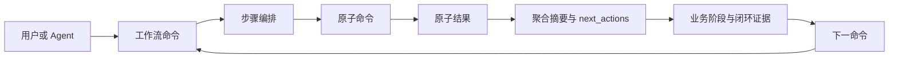
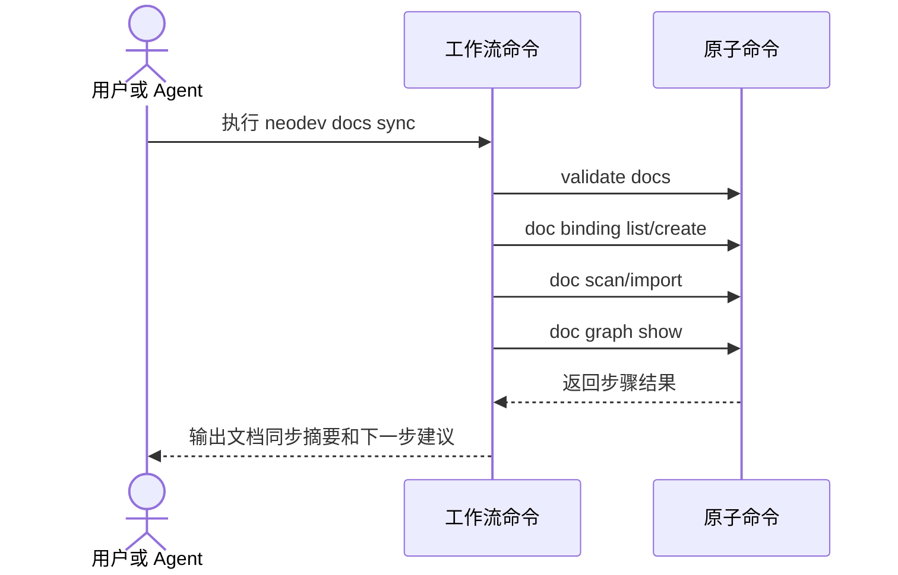

# F001 高层工作流入口 PRD

## 1. 功能信息

| 项 | 内容 |
| --- | --- |
| 功能编号 | F001 |
| 功能名称 | 高层工作流入口 |
| 优先级 | P0 |
| 状态 | 草稿 |
| 所属总 PRD | `../01-master-prd.md` |
| 主要事实源 | SRC-U-004, SRC-D-002, SRC-C-001 至 SRC-C-005 |

## 2. 引用业务口径

| 类型 | 编号 | 名称 | 来源章节 | 来源编号 |
| --- | --- | --- | --- | --- |
| 业务对象 | BO-001 | 原子命令 | 总 PRD 5.1 | SRC-C-001 至 SRC-C-005 |
| 业务对象 | BO-002 | 工作流命令 | 总 PRD 5.1 | SRC-U-004, SRC-D-002 |
| 属性 | BO-002-A02 | 聚合步骤 | 总 PRD 5.2 | SRC-D-002 |
| 规则 | BR-G-04 | 聚合结果输出 | 总 PRD 7 | SRC-D-002 |
| 规则 | BR-G-05 | 失败步骤和重试提示 | 总 PRD 7 | SRC-A-002 |

## 3. 功能目标

提供少量面向用户意图的高层命令，把多步原子命令聚合成稳定工作流，降低使用者记忆成本和 Agent 误选命令的概率。（SRC-U-001, SRC-U-004）

## 4. 用户故事与使用场景

| 场景编号 | 用户角色 | 场景描述 | 业务价值 | 来源编号 |
| --- | --- | --- | --- | --- |
| US-F001-01 | U-001 | 开发者想确认当前机器和仓库是否具备 NeoDev 操作条件。 | 不需要分别记 `config show` 和 `version-check`。 | SRC-A-001, SRC-A-002 |
| US-F001-02 | U-001 | 开发者想初始化产品版本、项目和分支图谱。 | 用一个入口完成仓库接入闭环。 | SRC-D-002, SRC-C-001, SRC-C-002 |
| US-F001-03 | U-001 | 开发者想同步当前版本文档。 | 用一个入口完成校验、binding、scan、import 和验证。 | SRC-C-003, SRC-D-002 |
| US-F001-04 | U-002 | Agent 想根据文档变更开始实现任务。 | 用一个入口返回 DocChange、影响和上下文证据。 | SRC-D-002, SRC-C-003, SRC-C-004 |

## 5. 前置条件

- 本地 `neodev` CLI 已安装或可通过 `python neodev.py` 调用。（SRC-D-003）
- 远程服务地址已配置，或用户提供 `--server` / 环境变量入口。（SRC-A-001）
- 相关底层原子命令仍存在且契约测试可覆盖。（SRC-T-001）

## 6. 能力入口

| 入口编号 | 命令 | 入口位置 | 触发方式 | 到达结果 | 来源编号 |
| --- | --- | --- | --- | --- | --- |
| EN-F001-01 | `neodev doctor` | CLI root | 用户或 Agent 显式执行 | 环境、远程服务和兼容状态摘要 | SRC-A-001, SRC-A-002 |
| EN-F001-02 | `neodev context show` | CLI root | 用户或 Agent 显式执行 | 当前产品/版本/项目/分支/doc binding/图谱状态 | SRC-D-002 |
| EN-F001-03 | `neodev setup repo` | CLI root | 用户或 Agent 显式执行 | 产品、版本、项目、分支绑定和图谱刷新摘要 | SRC-C-001, SRC-C-002 |
| EN-F001-04 | `neodev docs sync` | CLI root | 用户或 Agent 显式执行 | 文档校验、扫描、导入和文档图谱摘要 | SRC-C-003 |
| EN-F001-05 | `neodev change start` | CLI root | 用户或 Agent 显式执行 | DocChange 登记、影响分析和实现上下文摘要 | SRC-C-003, SRC-C-004 |
| EN-F001-06 | `neodev change impact` | CLI root | 用户或 Agent 显式执行 | impact、chain、entity context 聚合结果 | SRC-C-004 |
| EN-F001-07 | `neodev git check` | CLI root | 用户或 Agent 显式执行 | 提交范围、DocChange-ID 和 dangerous commit 摘要 | SRC-C-005 |
| EN-F001-08 | `neodev status` | CLI root | 用户或 Agent 显式执行 | 当前闭环状态总览 | SRC-D-002 |

## 7. 典型场景与命令细节

| 场景编号 | 场景 | 示例触发 | 推荐命令顺序 | 数据读写细节 | 输出示例关注点 | 失败反馈 | 验收关注点 |
| --- | --- | --- | --- | --- | --- | --- | --- |
| S01 | 新仓库首次接入 | 用户在新 repo 中说“把这个仓库接入 NeoDev”。 | `neodev doctor` -> `neodev context show` -> `neodev setup repo` -> `neodev status` | 读取 config、server、repo path；写入或更新 product/version/project/branch binding；可初始化图谱。 | `server_ok=true`、`missing_fields=[project,branch]`、`repo_binding.created=true`、`graph_init_status=ready`。 | server 不通时停在 `doctor`；缺少 product/version 时提示必填字段。 | 接入后 `status` 能显示产品、版本、项目、分支和图谱状态。 |
| S02 | 文档同步 | 用户修改 PRD 后说“同步当前版本文档”。 | `neodev context show` -> `neodev docs sync` -> `neodev status` | 读取 doc binding、文件树、已有文档图谱；写入 doc imports、doc chunks、doc graph。 | `imported_docs=12`、`failed_docs=[]`、`doc_graph_status=updated`。 | YAML/front matter 失败时列出文件和字段；binding 缺失时回到 `context/setup`。 | 成功后 `status` 能说明文档图谱已更新，失败时有可重试命令。 |
| S03 | 从需求启动开发 | 用户说“按这个需求开始实现”。 | `neodev docs sync` -> `neodev change start` -> `neodev change impact` | 读取文档图谱、代码事实、已有 DocChange；写入 DocChange、关联文档、实现上下文。 | `doc_change_id=DC-...`、`linked_docs=[...]`、`impacted_nodes=[...]`、`risk_points=[...]`。 | 无法关联文档时提示补充文档路径或先执行 `docs sync`。 | 必须产出 DocChange-ID 和初始影响范围。 |
| S04 | 提交前检查 | 用户完成代码后准备 commit/push。 | `neodev change impact` -> `neodev git check` | 读取 git diff、DocChange、dangerous commit 记录；可写入检查结果或风险状态。 | `commit_scope=code_only`、`required_trailer=DocChange-ID`、`risk_summary=pass/blocking`。 | 混合提交、缺 trailer、危险提交时输出阻断原因和修复动作。 | 通过时可以安全进入 commit/push；失败时不得建议继续提交。 |
| S05 | push 后回看 | 用户 push 后询问“现在闭环了吗”。 | `neodev status` | 读取分支、DocChange、doc graph、code graph、post-push hook 状态；不写业务事实。 | `hook_status=success/skipped/failed`、`open_gaps=[]`、`next_actions=[done]`。 | hook failed 时解释原始结果和缺口，不手动刷新图谱。 | 能说明闭环完成、未完成原因，或需要回到文档/变更/提交检查。 |
| S06 | 下一轮任务入口 | 上一轮完成后用户继续新需求。 | `neodev context show` 或 `neodev status` | 读取当前上下文、上次 DocChange、图谱和 hook 状态；不写业务事实。 | `ready_for_next_change=true`、`last_doc_change=...`、`suggested_next=docs/change/submit`。 | 如果还有缺口，指向最小修复入口而不是开始新闭环。 | 明确当前可开始新需求，或说明未完成项。 |

## 8. 交互说明

| 交互编号 | 触发动作 | 系统反馈 | 状态变化 | 失败反馈 | 退出路径 | 来源编号 |
| --- | --- | --- | --- | --- | --- | --- |
| IA-F001-01 | 执行高层命令 | 输出聚合 JSON 和人类可读摘要 | 只读命令不变更状态；写命令按原子命令变更 | 返回 failed_step、error、retry_hint | 用户按 next_actions 继续 | SRC-D-002, SRC-A-003 |
| IA-F001-02 | 高层命令调用多个原子步骤 | 每步记录 step id、command、status | 写入远程服务的步骤仍由服务端事务控制 | 失败时停止后续非补偿步骤 | 可使用底层 retry 命令排障 | SRC-D-002 |
| IA-F001-03 | `version-check` 超时 | 标记 CLI compatibility unknown | 不写远程状态 | 输出超时说明和重试建议 | 用户重试或指定 server | SRC-A-002 |
| IA-F001-04 | 命令执行成功 | 输出当前业务阶段、闭环证据和下一命令 | 根据命令读写事实推进闭环阶段 | 无 | 用户进入下一业务阶段 | SRC-U-006, SRC-U-007 |

## 9. 业务规则

| 规则编号 | 规则类型 | 规则内容 | 影响对象/属性 | 例外情况 | 关联 AC | 来源编号 | 确认状态 |
| --- | --- | --- | --- | --- | --- | --- | --- |
| BR-F001-01 | 聚合 | 高层命令必须复用现有原子命令或 service 能力，不复制核心业务逻辑。 | BO-002-A02 | 无 | AC-F001-01 | SRC-C-001 至 SRC-C-005 | 候选 |
| BR-F001-02 | 输出 | 每个高层命令必须输出执行步骤摘要和下一步建议。 | BO-002-A03 | `doctor` 可简化但仍需 next_actions | AC-F001-02 | BR-G-04 | 候选 |
| BR-F001-03 | 失败 | 多步骤工作流失败时必须指出失败步骤，不能只返回笼统错误。 | BO-002-A03 | 底层异常不可解析时输出 unknown failed_step | AC-F001-03 | BR-G-05 | 候选 |
| BR-F001-04 | 命名 | 命令名采用 `doctor/context/setup/docs/change/git/status` 这组顶层入口，并面向用户意图，不暴露底层数据库或图谱实现细节。 | BO-002-A01 | 高级命令除外 | AC-F001-04 | SRC-U-004, SRC-U-005 | 已确认 |
| BR-F001-05 | 单命令闭环 | 每个高层命令必须在输出中声明当前业务阶段、读写事实、闭环证据和下一命令。 | BO-005-A01, BO-005-A02, BO-005-A03 | 失败时下一命令可替换为恢复命令 | AC-F001-05 | SRC-U-006 | 已确认 |
| BR-F001-06 | 命令间闭环 | 高层命令集合必须能支撑 S01 至 S06 的典型业务场景。 | BO-005 | 排障可从中间命令进入，但必须说明当前场景和下一步 | AC-F001-06 | SRC-U-007, SRC-U-008, SRC-U-009 | 已确认 |
| BR-F001-07 | 场景完整性 | 每个典型场景必须声明触发条件、命令顺序、数据读写、输出示例关注点、失败反馈和验收关注点。 | BO-005-A04 | 实现阶段可增加场景，但不得删减既有场景要素 | AC-F001-07 | SRC-U-008, SRC-U-009 | 已确认 |

## 10. 字段、状态、枚举与校验

| 字段编号 | 字段名 | 所属对象属性 | 输入/展示 | 校验规则 | 错误提示 | 来源编号 | 确认状态 |
| --- | --- | --- | --- | --- | --- | --- | --- |
| FLD-F001-01 | command | BO-002-A01 | 输入/展示 | 必须属于已确认的高层命令集合，且不得与现有命令冲突 | `workflow command conflicts with existing command` | SRC-U-005, SRC-C-001 至 SRC-C-005 | 已确认 |
| FLD-F001-02 | steps | BO-002-A02 | 输出 | 每个 step 包含 id/status/summary | `workflow step summary missing` | SRC-D-002 | 候选 |
| FLD-F001-03 | next_actions | BO-002-A03 | 输出 | 成功和失败都应返回 | `next_actions missing` | BR-G-04 | 候选 |
| FLD-F001-04 | failed_step | BO-002-A03 | 失败输出 | 失败时必填 | `failed_step missing` | BR-G-05 | 候选 |
| FLD-F001-05 | stage | BO-005-A01 | 输出 | 必须属于 context/setup/docs/change/impact/submit/status | `business stage missing` | SRC-U-007 | 已确认 |
| FLD-F001-06 | closure_evidence | BO-005-A03 | 输出 | 至少包含一个来自服务端或原子命令的事实证据 | `closure evidence missing` | SRC-U-006 | 已确认 |
| FLD-F001-07 | scenario_id | BO-005-A04 | 输出 | S01/S02/S03/S04/S05/S06 或 ad-hoc | `scenario id missing` | SRC-U-008, SRC-U-009 | 已确认 |

## 11. 功能内数据流图

## 12. 功能内时序图

## 13. 接口与数据口径

| 项 | 内容 | 来源编号 | 确认状态 |
| --- | --- | --- | --- |
| 输入数据 | 高层命令参数，复用 product/version/project/branch/doc_binding/doc_change 等现有定位字段。 | SRC-C-001 至 SRC-C-005 | 候选 |
| 输出数据 | 聚合 JSON，包含 ok、command、scenario_id、stage、steps、summary、closure_evidence、next_actions、errors。 | SRC-U-006, SRC-U-007, SRC-U-008, SRC-U-009, SRC-A-003 | 已确认 |
| 读数据边界 | 通过现有 CLI/API 读取远程状态。 | SRC-D-003 | 已确认 |
| 写数据边界 | 写入仍由现有服务端命令处理。 | SRC-D-003 | 已确认 |
| 接口候选 | 暂不确认 HTTP API 变更；优先 CLI 层聚合。 | SRC-U-002 | 候选 |

## 14. 异常与边界场景

| 场景编号 | 场景 | 处理规则 | 用户反馈 | 关联 AC | 来源编号 |
| --- | --- | --- | --- | --- | --- |
| EX-F001-01 | `version-check` 超时 | `doctor` 标记兼容状态 unknown，不执行后续写命令 | 提示重试或检查远程服务 | AC-F001-03 | SRC-A-002 |
| EX-F001-02 | 某个原子步骤失败 | 停止后续依赖步骤，保留已执行步骤摘要 | 输出 failed_step 和 retry_hint | AC-F001-03 | BR-G-05 |
| EX-F001-03 | 参数不足 | 不猜测业务上下文，提示缺少 product/version/project/branch | 输出 required_fields | AC-F001-04 | SRC-D-003 |
| EX-F001-04 | 命令无法判断下一业务阶段 | 不猜测闭环位置，输出当前证据不足 | 提示需要先执行的上下文命令 | AC-F001-06 | SRC-U-007 |

## 15. 验收标准

| AC 编号 | Given | When | Then | 覆盖规则 | 来源编号 |
| --- | --- | --- | --- | --- | --- |
| AC-F001-01 | 现有原子命令可用 | 执行高层命令 | 高层命令复用原子能力完成步骤 | BR-F001-01 | SRC-C-001 至 SRC-C-005 |
| AC-F001-02 | 高层命令成功 | 查看输出 JSON | 可看到 steps、summary、next_actions | BR-F001-02 | SRC-D-002 |
| AC-F001-03 | 任一步骤失败 | 查看输出 JSON | 可看到 failed_step、error、retry_hint | BR-F001-03 | SRC-A-002 |
| AC-F001-04 | 用户查看帮助 | 阅读命令名和说明 | 命令名表达用户意图而非底层实现 | BR-F001-04 | SRC-U-004 |
| AC-F001-05 | 任一高层命令成功或失败 | 查看输出 JSON | 可看到 stage、closure_evidence、next_actions 或恢复命令 | BR-F001-05 | SRC-U-006 |
| AC-F001-06 | 从典型场景开始 | 顺序执行推荐命令 | 可完成 S01 至 S06 中对应业务场景，并输出下一步或 done | BR-F001-06 | SRC-U-007, SRC-U-008, SRC-U-009 |
| AC-F001-07 | 查看场景矩阵 | 检查每个场景 | 每个场景都有触发条件、命令顺序、数据读写、输出示例、失败反馈和验收关注点 | BR-F001-07 | SRC-U-008, SRC-U-009 |

## 16. 测试场景建议

| 测试编号 | 优先级 | 场景 | 前置条件 | 操作 | 预期结果 | 覆盖 AC | 来源编号 |
| --- | --- | --- | --- | --- | --- | --- | --- |
| TC-F001-01 | P0 | 高层命令注册 | CLI 初始化 | 查询 parser 或 help | 已确认高层命令可见 | AC-F001-04 | SRC-U-005, SRC-T-001 |
| TC-F001-02 | P0 | 远程转发 | 配置 server | 通过 shim 调用高层命令 | `/api/cli/execute` 可执行 | AC-F001-01 | SRC-T-002 |
| TC-F001-03 | P0 | 失败步骤输出 | stub 某原子步骤失败 | 执行高层命令 | 返回 failed_step 和 retry_hint | AC-F001-03 | SRC-A-002 |
| TC-F001-04 | P1 | `git check` 聚合 | 存在 code commit | 执行 `neodev git check` | 返回 scope、DocChange-ID 和 risk 摘要 | AC-F001-02 | SRC-T-003 |
| TC-F001-05 | P0 | 命令闭环输出 | 任意高层命令 | 执行命令并查看 JSON | 包含 stage、closure_evidence 和 next_actions | AC-F001-05 | SRC-U-006 |
| TC-F001-06 | P0 | 业务闭环 dry-run | 可用测试仓库和文档 | 按 S01 至 S06 选择场景执行命令 | 每一步输出 scenario_id 和下一步，最终 status 能说明闭环完成或缺口 | AC-F001-06 | SRC-U-007, SRC-U-008, SRC-U-009 |
| TC-F001-07 | P0 | 场景字段完整性 | 场景矩阵已定义 | 审查场景矩阵和输出契约 | 每个场景字段完整，输出契约包含 scenario_id | AC-F001-07 | SRC-U-008, SRC-U-009 |

## 17. 关联需求与依赖

- 依赖 `core-workflows.json` 中已存在的工作流定义。
- 依赖现有 `product/project/doc/graph/git` 原子命令。
- 与 F002 的 help 分级和 F003 的 Agent 路由同步推进。

## 18. 待确认问题

| 问题编号 | 当前已知事实 | 问题 | 需要确认的选项/开放点 | 影响范围 | 阻塞级别 | 需要谁确认 |
| --- | --- | --- | --- | --- | --- | --- |
| 无 | Q-101 已确认接受 `doctor/context/setup/docs/change/git/status` 这组顶层命名。 | 无 | 无 | F001/F002/F003 | 已关闭 | 产品负责人 |

## 关联文档

- [[requirements/cli-command-simplification/01-master-prd|CLI 命令简化总 PRD]]
- [[requirements/cli-command-simplification/00-source-index|CLI 命令简化事实源索引]]
- [[requirements/cli-command-simplification/99-open-questions|CLI 命令简化待确认问题]]
