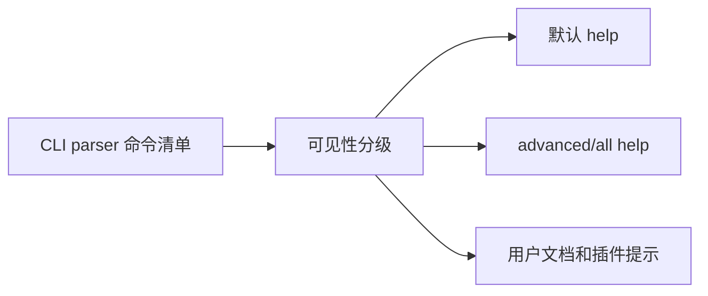
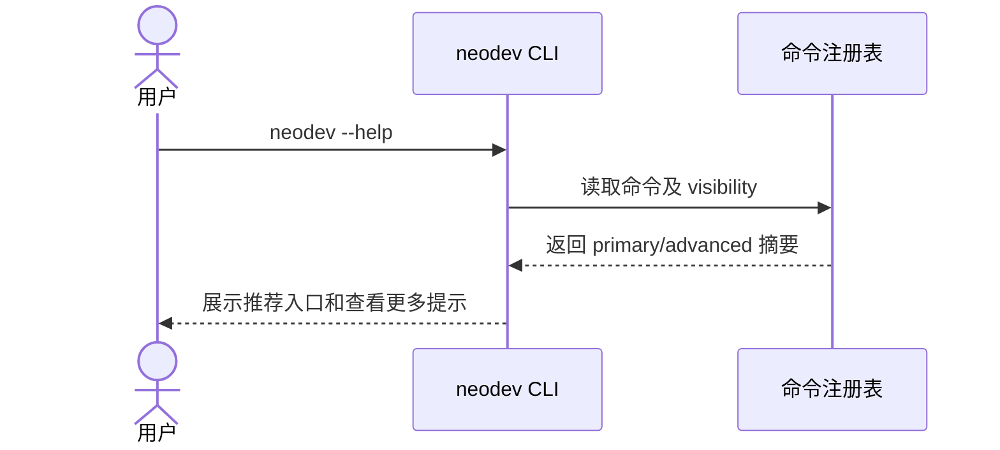

# F002 命令可见性与兼容策略 PRD

## 1. 功能信息

| 项 | 内容 |
| --- | --- |
| 功能编号 | F002 |
| 功能名称 | 命令可见性与兼容策略 |
| 优先级 | P0 |
| 状态 | 草稿 |
| 所属总 PRD | `../01-master-prd.md` |
| 主要事实源 | SRC-U-004, SRC-C-001 至 SRC-C-007 |

## 2. 引用业务口径

| 类型 | 编号 | 名称 | 来源章节 | 来源编号 |
| --- | --- | --- | --- | --- |
| 业务对象 | BO-001 | 原子命令 | 总 PRD 5.1 | SRC-C-001 至 SRC-C-005 |
| 业务对象 | BO-003 | 命令可见性等级 | 总 PRD 5.1 | SRC-U-004 |
| 属性 | BO-003-A01 | 可见性等级 | 总 PRD 5.2 | SRC-U-004 |
| 术语 | T-003 | 内部命令 | 总 PRD 5.3 | SRC-C-005, SRC-C-006 |
| 规则 | BR-G-01 | 保留原子命令兼容 | 总 PRD 7 | SRC-U-004 |

## 3. 功能目标

通过可见性分级降低用户默认接触到的命令数量，同时保证旧命令、脚本、测试和高级排障不被破坏。（SRC-U-004）

## 4. 用户故事与使用场景

| 场景编号 | 用户角色 | 场景描述 | 业务价值 | 来源编号 |
| --- | --- | --- | --- | --- |
| US-F002-01 | U-001 | 用户查看 `neodev --help` 时只看到推荐主路径。 | 降低学习成本。 | SRC-U-001, SRC-U-004 |
| US-F002-02 | U-003 | 维护者需要使用 graph node/edge/type 等高级命令。 | 保留排障和手工图谱能力。 | SRC-C-004 |
| US-F002-03 | U-002 | Agent 不应把 hook-only 命令当作普通建议。 | 减少错误流程。 | SRC-C-005, SRC-C-006 |

## 5. 前置条件

- F001 高层工作流入口已确定最小集合。
- 现有原子命令清单可由 CLI parser 或 contract tests 稳定枚举。（SRC-T-001）

## 6. 命令分级

| 等级 | 定义 | 命令示例 | 默认 help | 用户文档 |
| --- | --- | --- | --- | --- |
| primary | 日常推荐入口 | `doctor`, `context show`, `setup repo`, `docs sync`, `change start`, `change impact`, `git check`, `status` | 展示 | 展示 |
| advanced | 高级但可手工使用 | `product ...`, `project ...`, `doc ...`, `graph impact/get-chain/entity-context`, `git dangerous-commit list` | 折叠或 advanced help | 排障/参考文档展示 |
| internal | hook 或脚本内部入口 | `git post-push-graph-update`, `post_push_graph_update.py` | 不展示 | 内部文档展示 |
| hidden | 历史/兼容/不推荐入口 | `product version analyze/analyze-status/watch-status` | 不展示 | 迁移说明展示 |

## 7. 典型场景与展示细节

| 场景编号 | 场景 | 示例触发 | 期望展示/行为 | 数据读写细节 | 输出示例关注点 | 验收关注点 |
| --- | --- | --- | --- | --- | --- | --- |
| S-F002-01 | 新用户查看默认帮助 | 用户执行 `neodev --help`。 | 只展示 primary 命令和 `neodev help --all` 提示，不展示 internal/hook-only 命令。 | 读取命令注册表和 visibility 配置；不写业务数据。 | `primary: doctor/context/setup/docs/change/git/status`、`more: neodev help --all`。 | 默认 help 能在一屏内看到主路径；`git post-push-graph-update` 不出现。 |
| S-F002-02 | 高级用户查看全部命令 | 维护者执行 `neodev help --all`。 | 展示 primary、advanced、internal、hidden，并标注风险和推荐替代入口。 | 读取完整命令注册表和替代命令配置；不写业务数据。 | `visibility=internal`、`replacement=neodev status`、`risk=hook-only`。 | 全量命令可发现；每个 internal/hidden 命令有说明或替代入口。 |
| S-F002-03 | 脚本继续调用旧命令 | 既有脚本调用 `product ...` 或 `graph ...` 原子命令。 | 命令继续执行，不因默认 help 隐藏而失败。 | 读取/写入仍按原子命令原有契约；visibility 不改变业务语义。 | 原命令输出保持兼容，可附加 `recommended_command`。 | contract tests 证明旧命令仍注册并可调用。 |
| S-F002-04 | 用户误用 hook-only 命令 | 用户显式执行 `git post-push-graph-update`。 | 允许显式执行或按现有权限失败，但必须提示 internal/hook-only 和推荐入口。 | 按原命令读取/写入 hook 所需事实；不应被默认推荐。 | `warning=internal command`、`recommended=neodev status`。 | 用户知道该命令不是日常入口；插件 defaultPrompt 不推荐它。 |
| S-F002-05 | 命令 visibility 缺失 | 新增命令未配置 visibility。 | 默认按 advanced 暴露并让测试失败，避免命令静默消失。 | 读取命令注册表；测试报告缺失配置。 | `missing_visibility=[...]`。 | CI/contract test 能定位缺失命令名和配置文件。 |

## 8. 交互说明

| 交互编号 | 触发动作 | 系统反馈 | 状态变化 | 失败反馈 | 退出路径 | 来源编号 |
| --- | --- | --- | --- | --- | --- | --- |
| IA-F002-01 | 用户执行 `neodev --help` | 展示 primary 命令和 advanced help 提示 | 无 | help 生成失败时回退旧 help | 用户选择主入口 | SRC-U-004 |
| IA-F002-02 | 用户执行 advanced 命令 | 正常执行，但可输出推荐高层入口提示 | 按原命令变化 | 原命令错误处理 | 返回原命令结果 | SRC-C-001 至 SRC-C-005 |
| IA-F002-03 | 用户执行 internal 命令 | 允许显式调用，但提示 hook-only 或 internal | 按原命令变化 | 原命令错误处理 | 提示推荐入口 | SRC-C-005 |

## 9. 业务规则

| 规则编号 | 规则类型 | 规则内容 | 影响对象/属性 | 例外情况 | 关联 AC | 来源编号 | 确认状态 |
| --- | --- | --- | --- | --- | --- | --- | --- |
| BR-F002-01 | 兼容 | advanced/internal/hidden 命令不得因 help 隐藏而不可调用。 | BO-001 | 明确废弃后另行处理 | AC-F002-01 | BR-G-01 | 已确认 |
| BR-F002-02 | 展示 | 默认 help 只展示 primary 和 advanced 入口提示；全量 help 入口采用 `neodev help --all`。 | BO-003-A01 | 维护期可在输出中提示迁移说明 | AC-F002-02 | SRC-U-004, SRC-U-005 | 已确认 |
| BR-F002-03 | 内部 | hook-only 命令必须标记 internal，不作为 defaultPrompt 推荐。 | BO-003 | 维护文档可引用 | AC-F002-03 | SRC-C-005, SRC-C-006 | 候选 |
| BR-F002-04 | 迁移 | 被隐藏命令若仍被脚本使用，必须保留测试覆盖。 | BO-001 | 无 | AC-F002-04 | SRC-T-001 | 候选 |
| BR-F002-05 | 场景细节 | 命令分级需求必须覆盖默认 help、全量 help、旧命令兼容、hook-only 误用和 visibility 缺失五类场景。 | BO-003 | 后续可增加更多场景 | AC-F002-05 | SRC-U-009 | 已确认 |

## 10. 字段、状态、枚举与校验

| 字段编号 | 字段名 | 所属对象属性 | 输入/展示 | 校验规则 | 错误提示 | 来源编号 | 确认状态 |
| --- | --- | --- | --- | --- | --- | --- | --- |
| FLD-F002-01 | visibility | BO-003-A01 | 配置/展示 | primary/advanced/internal/hidden | `invalid command visibility` | SRC-U-004 | 候选 |
| FLD-F002-02 | replacement | BO-003 | 展示 | hidden/internal 命令建议提供替代入口 | `replacement command missing` | BR-F002-03 | 候选 |
| FLD-F002-03 | deprecated | BO-001 | 配置/展示 | bool | `deprecated flag invalid` | BR-F002-04 | 候选 |
| FLD-F002-04 | scenario_id | BO-005-A04 | 测试/文档 | S-F002-01 至 S-F002-05 | `visibility scenario missing` | SRC-U-009 | 已确认 |

## 11. 功能内数据流图

## 12. 功能内时序图

## 13. 接口与数据口径

| 项 | 内容 | 来源编号 | 确认状态 |
| --- | --- | --- | --- |
| 输入数据 | 命令注册信息与 visibility 配置。 | SRC-C-001 至 SRC-C-005 | 候选 |
| 输出数据 | help 分级展示、命令执行提示、visibility、replacement、scenario_id。 | SRC-U-004, SRC-U-009 | 已确认 |
| 读数据边界 | 读取本地 CLI 注册表或静态配置。 | SRC-T-001 | 候选 |
| 写数据边界 | 不写业务数据。 | SRC-U-002 | 已确认 |
| 接口口径 | 全量 help 入口采用 `neodev help --all`。 | SRC-U-005 | 已确认 |

## 14. 异常与边界场景

| 场景编号 | 场景 | 处理规则 | 用户反馈 | 关联 AC | 来源编号 |
| --- | --- | --- | --- | --- | --- |
| EX-F002-01 | 脚本仍调用 hidden 命令 | 命令继续可调用，测试覆盖保持 | 不影响脚本 | AC-F002-01 | BR-F002-01 |
| EX-F002-02 | 用户直接调用 internal 命令 | 允许显式执行，但提示 internal/hook-only | 推荐使用高层入口 | AC-F002-03 | SRC-C-005 |
| EX-F002-03 | help 分级配置缺失 | 默认按 advanced 暴露，避免命令消失 | 输出配置缺失警告 | AC-F002-04 | SRC-T-001 |

## 15. 验收标准

| AC 编号 | Given | When | Then | 覆盖规则 | 来源编号 |
| --- | --- | --- | --- | --- | --- |
| AC-F002-01 | 旧命令存在 | 直接执行旧命令 | 命令仍可用 | BR-F002-01 | SRC-C-001 至 SRC-C-005 |
| AC-F002-02 | 用户查看默认 help | 执行 `neodev --help` | 只展示 primary 和 advanced 提示 | BR-F002-02 | SRC-U-004 |
| AC-F002-03 | 用户查看推荐文档 | 搜索 `post-push-graph-update` | 不作为普通主入口推荐 | BR-F002-03 | SRC-C-005 |
| AC-F002-04 | 命令 visibility 缺失 | 运行 contract test | 测试能发现并失败 | BR-F002-04 | SRC-T-001 |
| AC-F002-05 | 查看命令分级需求 | 审查场景表 | 默认 help、全量 help、旧命令兼容、hook-only 误用、visibility 缺失均有具体细节 | BR-F002-05 | SRC-U-009 |

## 16. 测试场景建议

| 测试编号 | 优先级 | 场景 | 前置条件 | 操作 | 预期结果 | 覆盖 AC | 来源编号 |
| --- | --- | --- | --- | --- | --- | --- | --- |
| TC-F002-01 | P0 | 原子命令兼容 | CLI 初始化 | 运行现有 CLI contract tests | 原命令仍注册 | AC-F002-01 | SRC-T-001 |
| TC-F002-02 | P0 | 默认 help 降噪 | visibility 配置存在 | 执行 help | 不展示 internal 命令 | AC-F002-02 | SRC-U-004 |
| TC-F002-03 | P1 | internal 命令提示 | 执行 hook-only 命令 | 查看输出 | 提示 internal/hook-only | AC-F002-03 | SRC-C-005 |
| TC-F002-04 | P0 | 全量 help 可发现 | visibility 配置存在 | 执行 `neodev help --all` | 可看到所有等级和 replacement | AC-F002-05 | SRC-U-009 |

## 17. 关联需求与依赖

- 依赖 F001 的高层命令集合。
- 影响 F003 的插件 defaultPrompt 和命令说明。

## 18. 待确认问题

| 问题编号 | 当前已知事实 | 问题 | 需要确认的选项/开放点 | 影响范围 | 阻塞级别 | 需要谁确认 |
| --- | --- | --- | --- | --- | --- | --- |
| 无 | Q-102 已确认全量 help 入口采用 `neodev help --all`。 | 无 | 无 | F002 | 已关闭 | 产品负责人 |

## 关联文档

- [[requirements/cli-command-simplification/01-master-prd|CLI 命令简化总 PRD]]
- [[requirements/cli-command-simplification/00-source-index|CLI 命令简化事实源索引]]
- [[requirements/cli-command-simplification/99-open-questions|CLI 命令简化待确认问题]]
