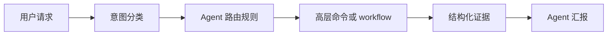
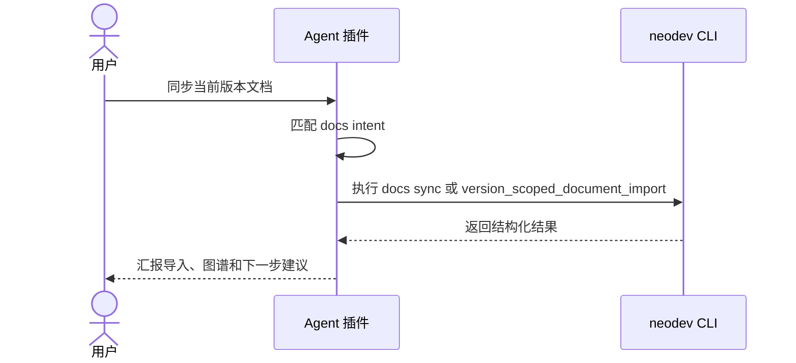

# F003 Agent 命令路由收口 PRD

## 1. 功能信息

| 项 | 内容 |
| --- | --- |
| 功能编号 | F003 |
| 功能名称 | Agent 命令路由收口 |
| 优先级 | P1 |
| 状态 | 草稿 |
| 所属总 PRD | `../01-master-prd.md` |
| 主要事实源 | SRC-C-006, SRC-C-007, SRC-D-002, SRC-D-003 |

## 2. 引用业务口径

| 类型 | 编号 | 名称 | 来源章节 | 来源编号 |
| --- | --- | --- | --- | --- |
| 业务对象 | BO-002 | 工作流命令 | 总 PRD 5.1 | SRC-U-004 |
| 业务对象 | BO-004 | Agent 路由规则 | 总 PRD 5.1 | SRC-C-006, SRC-C-007 |
| 属性 | BO-004-A01 | 用户意图 | 总 PRD 5.2 | SRC-D-002 |
| 规则 | BR-G-02 | 默认推荐工作流命令 | 总 PRD 7 | SRC-C-007 |
| 规则 | BR-G-03 | hook-only 不作为普通入口 | 总 PRD 7 | SRC-C-005, SRC-C-006 |

## 3. 功能目标

将插件命令说明、defaultPrompt、skill 文档和 workflow awareness 中的默认路径收口到高层工作流入口，减少 Agent 在多个原子命令之间自行拼接流程的风险。（SRC-C-006, SRC-C-007）

## 4. 用户故事与使用场景

| 场景编号 | 用户角色 | 场景描述 | 业务价值 | 来源编号 |
| --- | --- | --- | --- | --- |
| US-F003-01 | U-002 | 用户让 Agent “同步文档”。 | Agent 使用 `docs sync` 或对应 workflow，而不是手动拼接 binding/scan/import。 | SRC-D-002 |
| US-F003-02 | U-002 | 用户让 Agent “提交前检查”。 | Agent 使用 `git check` 或 commit routing workflow。 | SRC-D-002, SRC-C-005 |
| US-F003-03 | U-002 | Agent 完成 push 后解释结果。 | Agent 解释 post-push hook 结果，不手动刷新图谱。 | SRC-D-003, SRC-C-006 |

## 5. 前置条件

- F001 高层入口已确认采用 `doctor/context/setup/docs/change/git/status` 顶层命名。
- F002 已标记 internal/advanced 命令。
- 插件 manifest、commands、skills 和 core-workflows 可同步更新。

## 6. 入口与路由

| 入口编号 | 用户意图 | 推荐路由 | 禁止默认路由 | 来源编号 |
| --- | --- | --- | --- | --- |
| EN-F003-01 | context：查看上下文与接入仓库 | `neodev context show`、`neodev setup repo` 或对应 workflow | 直接猜 product/version/project/branch，或手动跳过 branch binding | SRC-U-005, SRC-D-002 |
| EN-F003-02 | docs：同步文档 | `neodev docs sync` 或 `version_scoped_document_import` | 直接 `doc import` 且不校验 docs | SRC-U-005, SRC-D-002 |
| EN-F003-03 | change：开始变更与影响分析 | `neodev change start`、`neodev change impact` 或 `doc_change_to_implementation` | 直接写 DocChange 或跳过 impact | SRC-U-005, SRC-D-002 |
| EN-F003-04 | submit：提交、状态检查与 push 后解释 | `neodev git check`、`neodev status`、`commit_scope_routing`，或读取 `post_push_graph_update.py --json` 结果 | 混合提交直接 commit，或手动 `project refresh-graph` 替代 hook | SRC-U-005, SRC-D-003, SRC-C-005, SRC-C-006 |

### 6.1 意图入口与典型场景映射

| 场景编号 | 意图入口 | 用户说法示例 | 推荐命令 | Agent 必须汇报的细节 | 下一意图 |
| --- | --- | --- | --- | --- | --- |
| S-F003-01 | context | “这个仓库现在绑定了吗？”“帮我接入当前仓库。” | `neodev doctor`、`neodev context show`、必要时 `neodev setup repo` | 当前环境是否可用、产品/版本/项目/分支是否缺失、接入后状态。 | docs 或 done |
| S-F003-02 | docs | “同步当前版本文档。”“PRD 改了，更新图谱。” | `neodev docs sync` | doc binding、导入数量、失败文档、文档图谱状态。 | change 或 done |
| S-F003-03 | change | “按这个需求开始实现。”“看看影响哪些代码。” | `neodev change start`、`neodev change impact` | DocChange-ID、关联文档、影响代码/实体、风险点。 | submit |
| S-F003-04 | submit | “提交前检查一下。”“push 后现在闭环了吗？” | `neodev git check`、`neodev status` | commit scope、DocChange trailer、危险提交风险、hook/status、未完成缺口。 | done 或回到 docs/change/submit |

## 7. 交互说明

| 交互编号 | 触发动作 | 系统反馈 | 状态变化 | 失败反馈 | 退出路径 | 来源编号 |
| --- | --- | --- | --- | --- | --- | --- |
| IA-F003-01 | Agent 收到用户意图 | 匹配高层入口或 workflow | 无 | 无法匹配时先澄清 | 执行推荐命令 | SRC-D-002 |
| IA-F003-02 | Agent 遇到 internal 命令 | 不默认推荐，解释内部用途 | 无 | 如必须调用需说明原因 | 使用高层入口 | SRC-C-005 |
| IA-F003-03 | post-push hook 返回结果 | 按 `skill_hint` 解释 hook_status 和 rollback_status | 只读本地运行记录 | invalid_result 时停止推断 | 报告原始 JSON 摘要 | SRC-D-003 |
| IA-F003-04 | Agent 收到高层命令结果 | 解释当前业务阶段、闭环证据和下一意图 | 无 | 缺少闭环证据时提示先补上下文 | 进入下一意图入口或报告闭环完成 | SRC-U-006, SRC-U-007 |

## 8. 业务规则

| 规则编号 | 规则类型 | 规则内容 | 影响对象/属性 | 例外情况 | 关联 AC | 来源编号 | 确认状态 |
| --- | --- | --- | --- | --- | --- | --- | --- |
| BR-F003-01 | 路由 | 插件 defaultPrompt 应优先表达高层意图，而不是列出多个原子命令。 | BO-004-A01 | 排障 prompt 可列原子命令 | AC-F003-01 | SRC-C-007 | 候选 |
| BR-F003-02 | 命令说明 | `commands/` 目录应从五个原子主题收口为四个意图入口。 | BO-004 | 迁移期可保留旧文档但标记 advanced | AC-F003-02 | SRC-U-005, SRC-C-007 | 已确认 |
| BR-F003-03 | post-push | Agent 成功 push 后只解释 hook 原子结果，不手动拆分运行 doc import、DocChange register、graph refresh。 | BO-004 | hook not_ready 且用户明确要求排障时可读取状态 | AC-F003-03 | SRC-D-003 | 已确认 |
| BR-F003-04 | 澄清 | 无法从用户话语判断意图时，Agent 应先澄清，不自行选择高风险写命令。 | BO-004-A01 | 只读查询可按 context show 执行 | AC-F003-04 | SRC-D-003 | 候选 |
| BR-F003-05 | 业务闭环 | Agent 汇报高层命令结果时必须说明当前业务场景、闭环证据、下一意图入口或闭环完成状态。 | BO-005 | 用户只要求原始输出时可附加简短闭环摘要 | AC-F003-05 | SRC-U-006, SRC-U-007, SRC-U-008, SRC-U-009 | 已确认 |
| BR-F003-06 | 场景映射 | 四个意图入口必须覆盖 context、docs、change、submit 四类典型场景，Agent 不得只按自然语言粗略分类而不说明业务细节。 | BO-005-A04 | 排障场景可直接定位到缺口场景 | AC-F003-06 | SRC-U-008, SRC-U-009 | 已确认 |

## 9. 字段、状态、枚举与校验

| 字段编号 | 字段名 | 所属对象属性 | 输入/展示 | 校验规则 | 错误提示 | 来源编号 | 确认状态 |
| --- | --- | --- | --- | --- | --- | --- | --- |
| FLD-F003-01 | intent | BO-004-A01 | 输入/内部匹配 | context/docs/change/submit/unknown | `unknown neodev intent` | SRC-U-005, SRC-D-002 | 已确认 |
| FLD-F003-02 | recommended_command | BO-004 | 输出 | 必须指向 primary 或 workflow | `recommended command is internal` | BR-F003-01 | 候选 |
| FLD-F003-03 | fallback_workflow | BO-004 | 输出 | 可指向 core-workflows 中已有 workflow | `fallback workflow missing` | SRC-D-002 | 候选 |
| FLD-F003-04 | current_stage | BO-005-A01 | 输出 | context/setup/docs/change/impact/submit/status | `current business stage missing` | SRC-U-007 | 已确认 |
| FLD-F003-05 | next_intent | BO-004-A01 | 输出 | context/docs/change/submit 或 done | `next intent missing` | SRC-U-006, SRC-U-007 | 已确认 |
| FLD-F003-06 | scenario_id | BO-005-A04 | 输出 | S-F003-01 至 S-F003-04 或 ad-hoc | `scenario id missing` | SRC-U-008, SRC-U-009 | 已确认 |

## 10. 功能内数据流图

## 11. 功能内时序图

## 12. 接口与数据口径

| 项 | 内容 | 来源编号 | 确认状态 |
| --- | --- | --- | --- |
| 输入数据 | 用户自然语言意图、插件 defaultPrompt、commands 文档和 workflow awareness。 | SRC-C-007, SRC-D-002 | 候选 |
| 输出数据 | 推荐命令、fallback workflow、当前业务场景、当前业务阶段、闭环证据、下一意图入口和禁止动作说明。 | SRC-U-006, SRC-U-007, SRC-U-008, SRC-U-009, SRC-D-002 | 已确认 |
| 读数据边界 | 读取插件本地配置和命令文档。 | SRC-C-007 | 已确认 |
| 写数据边界 | 插件文档和 prompt 更新，不直接写业务数据。 | SRC-U-002 | 已确认 |
| 接口口径 | 插件命令说明收口为 context、docs、change、submit 四个意图入口，分别覆盖上下文与接入、文档同步、变更实施、提交/状态检查。 | SRC-U-005 | 已确认 |

## 13. 异常与边界场景

| 场景编号 | 场景 | 处理规则 | 用户反馈 | 关联 AC | 来源编号 |
| --- | --- | --- | --- | --- | --- |
| EX-F003-01 | 用户意图模糊 | 只读上下文可先查；写操作前澄清 | 询问缺少范围 | AC-F003-04 | SRC-D-003 |
| EX-F003-02 | 高层命令未实现 | 回退到 core-workflows 的现有原子步骤，但报告为临时 fallback | 说明 fallback 原因 | AC-F003-02 | SRC-D-002 |
| EX-F003-03 | hook 结果缺少 skill_hint | 按 invalid_result 处理，不推断成功 | 报告原始结果摘要 | AC-F003-03 | SRC-D-003 |

## 14. 验收标准

| AC 编号 | Given | When | Then | 覆盖规则 | 来源编号 |
| --- | --- | --- | --- | --- | --- |
| AC-F003-01 | 插件 manifest 存在 defaultPrompt | 查看 prompt | prompt 优先推荐高层入口或 intent | BR-F003-01 | SRC-C-007 |
| AC-F003-02 | commands 文档存在 | 查看插件命令说明 | 文档收口为 context/docs/change/submit 四个意图入口，旧文档迁移或标记 advanced | BR-F003-02 | SRC-U-005, SRC-C-007 |
| AC-F003-03 | push 后 hook 返回结果 | Agent 解释结果 | 不手动替代 hook 刷新图谱 | BR-F003-03 | SRC-D-003 |
| AC-F003-04 | 用户请求缺少写操作范围 | Agent 处理请求 | 先澄清或只做只读 context show | BR-F003-04 | SRC-D-003 |
| AC-F003-05 | Agent 收到高层命令结果 | Agent 汇报结果 | 汇报包含当前业务场景、闭环证据和下一意图入口或 done | BR-F003-05 | SRC-U-006, SRC-U-007, SRC-U-009 |
| AC-F003-06 | Agent 处理任意意图入口 | 查看路由结果 | 可定位到一个典型业务场景，并给出推荐命令、数据关注点和下一意图 | BR-F003-06 | SRC-U-008, SRC-U-009 |

## 15. 测试场景建议

| 测试编号 | 优先级 | 场景 | 前置条件 | 操作 | 预期结果 | 覆盖 AC | 来源编号 |
| --- | --- | --- | --- | --- | --- | --- | --- |
| TC-F003-01 | P0 | manifest prompt 收口 | 插件 manifest 更新 | 运行插件平台测试 | prompt 不默认推荐 internal 命令 | AC-F003-01 | SRC-T-001 |
| TC-F003-02 | P1 | 命令说明收口 | commands 文档更新 | 文档 grep 检查 | context/docs/change/submit 四个意图入口存在，旧 command 文档有迁移或 advanced 标记 | AC-F003-02 | SRC-U-005, SRC-C-007 |
| TC-F003-03 | P0 | post-push 解释 | hook 返回 success/skipped/failed | Agent 按 skill 规则解释 | 不手动刷新图谱 | AC-F003-03 | SRC-T-004 |
| TC-F003-04 | P0 | Agent 闭环汇报 | 高层命令返回 stage 和 closure_evidence | Agent 汇报结果 | 汇报当前业务场景、下一意图入口或 done，不停留在单命令成功 | AC-F003-05 | SRC-U-006, SRC-U-007, SRC-U-009 |
| TC-F003-05 | P0 | 意图到场景映射 | 用户分别请求 context/docs/change/submit | Agent 路由请求 | 每个请求映射到正确业务场景，并输出推荐命令和下一意图 | AC-F003-06 | SRC-U-008, SRC-U-009 |

## 16. 关联需求与依赖

- 依赖 F001 高层入口命名。
- 依赖 F002 命令 visibility。
- 复用 `core-workflows.json` 中的 workflow awareness。

## 17. 待确认问题

| 问题编号 | 当前已知事实 | 问题 | 需要确认的选项/开放点 | 影响范围 | 阻塞级别 | 需要谁确认 |
| --- | --- | --- | --- | --- | --- | --- |
| 无 | Q-103 已确认插件命令说明收口为 context/docs/change/submit 四个意图入口。 | 无 | 无 | F003 | 已关闭 | 产品负责人 |

## 关联文档

- [[requirements/cli-command-simplification/01-master-prd|CLI 命令简化总 PRD]]
- [[requirements/cli-command-simplification/00-source-index|CLI 命令简化事实源索引]]
- [[requirements/cli-command-simplification/99-open-questions|CLI 命令简化待确认问题]]
