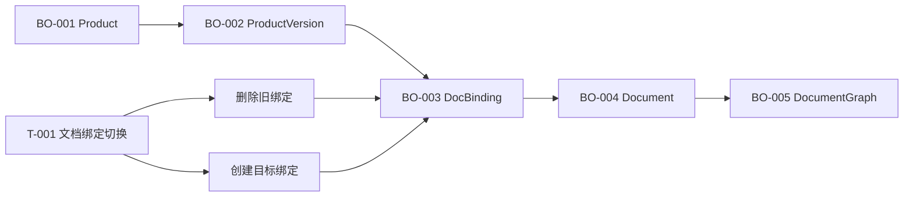
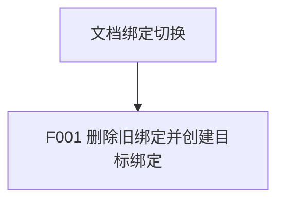
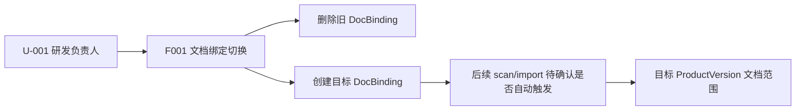
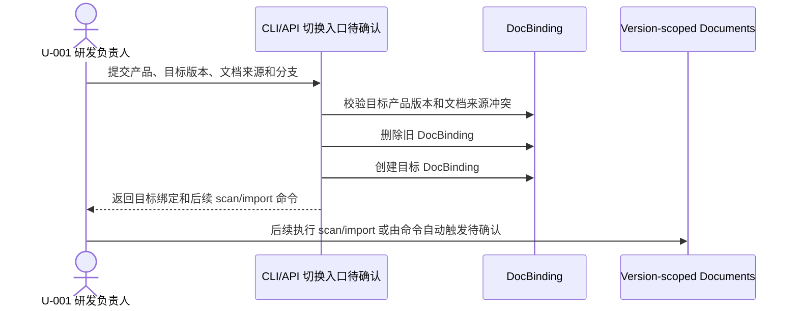

# 文档绑定切换总 PRD

## 1. 文档信息

| 项 | 内容 |
| --- | --- |
| 文档编号 | R-002 |
| 版本 | v0.1 |
| 状态 | 草稿，核心切换语义已确认 |
| 负责人 | 待确认 |
| 最后更新 | 2026-05-11 |
| 事实源 | 见 `00-source-index.md` |
| 输出路径 | `docs/requirements/doc-binding-switch/` |

## 2. 背景与目标

### 2.1 背景

NeoDev 已具备产品版本、文档绑定、文档扫描、文档导入和版本文档图能力。现有绑定创建能力要求文档绑定指向 `ProductVersion`，并在文档扫描和导入时把 `product_version_id` 写入文档记录和文档图。用户新增需求是：文档和产品版本之间需要支持“切换绑定”。用户已确认切换语义采用“旧绑定需要删除”，即切换不是软删除、复制绑定或覆盖更新。（SRC-U-001, SRC-U-002, SRC-C-001, SRC-C-004, SRC-C-005）

### 2.2 目标

| 需求编号 | 目标 | 来源编号 |
| --- | --- | --- |
| R-001 | 支持把一个产品版本的文档绑定切换到新的文档来源或目标产品版本。 | SRC-U-001 |
| R-002 | 切换绑定时必须删除旧绑定，再建立新的目标绑定。 | SRC-U-002, SRC-U-003 |
| R-003 | CLI/API 层必须提供可验证的切换入口或等价命令组合，不能要求用户手工操作数据库。 | SRC-U-001, SRC-C-002, SRC-A-001 |
| R-004 | 切换完成后，旧版本不再拥有旧绑定文档范围，新版本或新来源可按版本作用域扫描、导入和查询文档图。 | SRC-D-003, SRC-C-003, SRC-C-006 |
| R-005 | 切换过程必须避免同一 active 文档来源同时归属多个产品版本。 | SRC-D-003, SRC-C-001, SRC-A-002 |

### 2.3 非目标

- 不新增文档 UI 页面或审批流。（SRC-P-001）
- 不设计数据库表结构细节，表结构调整进入后续技术设计或实现计划。（Q-103）
- 不在本需求中改变 DocChange 状态机或 Git trailer 规则。（SRC-D-001, SRC-D-002）
- 不要求切换命令自动执行文档导入，是否自动导入作为待确认实现策略。（Q-104）

## 3. 范围

### 3.1 纳入范围

- 产品版本与文档绑定的显式切换能力。（R-001）
- 切换时删除旧绑定并创建目标绑定。（R-002）
- 切换前的产品、版本、文档来源、分支和冲突校验。（R-003, R-005）
- 切换后的文档扫描、导入和文档图版本范围验收。（R-004）

### 3.2 不纳入范围

- 文档 UI。
- 自动迁移 DocChange 历史状态。
- 自动生成或提交文档仓库 Git commit。
- 手工数据库修复脚本。

## 4. 用户角色

| 角色编号 | 角色名称 | 定义 | 主要诉求 | 权限边界 |
| --- | --- | --- | --- | --- |
| U-001 | 研发负责人 | 管理产品、版本、项目和文档范围的人 | 在版本迭代时把文档来源切到正确产品版本 | 权限模型待确认，当前需求只确认能力边界（Q-101） |
| U-002 | 开发者或插件使用者 | 通过 CLI/插件触发 NeoDev 文档工作流的人 | 用结构化命令完成切换、扫描、导入和图查询 | 具体 CLI 命令名待确认（Q-102） |

## 5. 业务对象、属性、术语统一

### 5.1 业务对象清单

| 对象编号 | 标准名称 | 别名 | 定义 | 所属域 | 主标识 | 生命周期 | 关联对象 | 来源编号/问题编号 | 确认状态 |
| --- | --- | --- | --- | --- | --- | --- | --- | --- | --- |
| BO-001 | Product | 产品 | NeoDev 组织研发文档和代码事实的业务容器 | 产品版本 | `product_id`, `product_key` | 已有 | 包含 ProductVersion | SRC-D-001 | 已确认 |
| BO-002 | ProductVersion | 产品版本 | 承载版本级代码分支和文档范围的作用域 | 产品版本 | `product_version_id`, `version_name` | 已有 | 绑定 DocBinding | SRC-D-001, SRC-D-003 | 已确认 |
| BO-003 | DocBinding | 文档绑定 | 产品版本指向文档 Git 来源和分支的绑定关系 | 文档闭环 | `doc_binding_id` | 创建、切换删除、重新创建 | 关联 ProductVersion 和 Document | SRC-U-001, SRC-U-002, SRC-C-001 | 已确认 |
| BO-004 | Document | 受控文档 | 文档仓库中的单篇受控 Markdown 文档 | 文档闭环 | `document_id`, `doc_id`, `product_version_id` | scan/import 创建或更新，删除策略待确认 | 属于 DocBinding 和 ProductVersion | SRC-C-003, SRC-C-004 | 部分确认 |
| BO-005 | DocumentGraph | 版本文档图 | 以产品版本为范围的文档节点和关系图 | 文档图 | `product_name`, `version_name`, `doc_id` | import 后可查询 | 来源于 Document | SRC-C-006 | 已确认 |

### 5.2 业务对象属性字典

| 属性编号 | 所属对象 | 中文名 | 英文名 | 类型 | 必填 | 取值范围 | 来源编号/问题编号 | 可编辑 | 展示口径 | 校验规则 | 确认状态 |
| --- | --- | --- | --- | --- | --- | --- | --- | --- | --- | --- | --- |
| BO-003-A01 | BO-003 | 绑定 ID | `doc_binding_id` | integer | 是 | 系统生成 | SRC-C-001 | 否 | 用于 scan/import 定位 | 必须存在 | 已确认 |
| BO-003-A02 | BO-003 | 产品版本 ID | `product_version_id` | integer | 是 | 已存在产品版本 | SRC-C-001, SRC-A-002 | 切换时通过删除旧绑定并新建目标绑定变更 | 版本作用域字段 | 不能为空 | 已确认 |
| BO-003-A03 | BO-003 | 文档仓库路径 | `repo_path` | string | 条件必填 | 本地路径 | SRC-C-001, SRC-C-002 | 切换时可变 | 文档来源之一 | 与 `repo_url` 至少有一个有效来源 | 已确认 |
| BO-003-A04 | BO-003 | 文档仓库地址 | `repo_url` | string | 条件必填 | Git URL | SRC-C-001, SRC-C-002 | 切换时可变 | 文档来源之一 | 与 `repo_path` 至少有一个有效来源 | 已确认 |
| BO-003-A05 | BO-003 | 默认分支 | `default_branch` | string | 是 | Git 分支名称 | SRC-C-001, SRC-C-002 | 切换时可变 | 文档来源分支 | 空值按实现默认策略处理 | 已确认 |
| BO-004-A01 | BO-004 | 文档版本作用域 | `product_version_id` | integer | 是 | 绑定所属产品版本 | SRC-C-003, SRC-C-004 | 否 | 文档隔离范围 | 扫描/导入时来自 DocBinding | 已确认 |

### 5.3 术语与定义

| 术语编号 | 标准术语 | 别名/旧称 | 定义 | 禁用叫法 | 适用范围 | 来源编号/问题编号 | 确认状态 |
| --- | --- | --- | --- | --- | --- | --- | --- |
| T-001 | 文档绑定切换 | 切换绑定 | 删除旧 DocBinding，并按目标产品版本和文档来源创建新 DocBinding 的业务动作 | 软删除切换、复制绑定、覆盖更新 | F001 | SRC-U-002, SRC-U-003 | 已确认 |
| T-002 | 旧绑定 | 原绑定 | 切换发生前需要被删除的 DocBinding | inactive 绑定 | F001 | SRC-U-002 | 已确认 |
| T-003 | 目标绑定 | 新绑定 | 切换后创建并用于后续扫描、导入和图查询的 DocBinding | 覆盖后的旧记录 | F001 | SRC-U-003 | 已确认 |

### 5.4 对象关系

### 5.5 生命周期与状态

| 对象编号 | 状态 | 状态定义 | 进入条件 | 退出条件 | 可执行操作 | 来源编号/问题编号 | 确认状态 |
| --- | --- | --- | --- | --- | --- | --- | --- |
| BO-003 | 已创建 | DocBinding 已指向某个产品版本和文档来源 | 创建绑定或切换创建目标绑定 | 被切换删除 | scan/import/list | SRC-C-001, SRC-C-002 | 已确认 |
| BO-003 | 已删除 | 旧 DocBinding 不再存在于有效绑定集合 | 执行文档绑定切换 | 不恢复，恢复需重新创建 | 不可 scan/import | SRC-U-002 | 已确认 |
| BO-004 | 有效 | 文档记录属于当前版本绑定范围 | scan/import 成功 | 旧绑定删除后的清理策略待确认 | 查询、图谱写入 | SRC-C-003, Q-103 | 部分确认 |

## 6. 功能地图与拆分

### 6.1 功能地图

### 6.2 功能拆分清单

| 功能编号 | 功能名称 | 用户价值 | 优先级 | 子 PRD | 依赖 | 来源编号/问题编号 | 确认状态 |
| --- | --- | --- | --- | --- | --- | --- | --- |
| F001 | 文档绑定切换 | 用户可把文档范围切换到正确产品版本，并明确旧绑定被删除 | P0 | `features/F001-doc-binding-switch.md` | 现有 ProductVersion、DocBinding、scan/import 能力 | SRC-U-001, SRC-U-002, SRC-C-001 | 核心语义已确认 |

## 7. 跨功能业务规则

| 规则编号 | 规则内容 | 影响对象 | 影响功能 | 例外情况 | 关联 AC | 来源编号/问题编号 | 确认状态 |
| --- | --- | --- | --- | --- | --- | --- | --- |
| BR-G-01 | 文档绑定必须归属于某个产品版本，不能创建无版本作用域绑定。 | BO-002, BO-003 | F001 | 无 | AC-G-01 | SRC-C-001, SRC-A-002 | 已确认 |
| BR-G-02 | 文档绑定切换必须删除旧 DocBinding，再创建目标 DocBinding。 | BO-003 | F001 | 无 | AC-G-02 | SRC-U-002, SRC-U-003 | 已确认 |
| BR-G-03 | 切换后旧绑定不可再作为 scan/import/list 的有效对象。 | BO-003, BO-004 | F001 | 已删除绑定的错误分类待实现确认 | AC-G-03 | SRC-U-002, SRC-C-002 | 已确认 |
| BR-G-04 | 同一 active 文档 Git 来源和分支不能同时绑定到多个产品版本。 | BO-003 | F001 | 空来源的兼容边界待实现确认 | AC-G-04 | SRC-D-003, SRC-C-001, SRC-A-002 | 已确认 |
| BR-G-05 | 目标绑定创建后，后续 scan/import 必须按目标 `product_version_id` 写入文档和文档图。 | BO-004, BO-005 | F001 | 是否由切换命令自动 scan/import 待确认 | AC-G-05 | SRC-C-004, SRC-C-005, SRC-C-006, Q-104 | 部分确认 |

## 8. 跨功能数据流图

## 9. 跨功能主时序图

## 10. 非功能需求

| 编号 | 类型 | 要求 | 度量方式 | 确认状态 |
| --- | --- | --- | --- | --- |
| NFR-001 | 可追踪性 | 切换结果必须返回旧绑定删除结果和目标绑定信息 | CLI/API 响应断言 | 已确认 |
| NFR-002 | 一致性 | 切换失败不得留下同一来源多版本 active 绑定 | 事务测试或集成测试 | 已确认 |
| NFR-003 | 兼容性 | 已有 `doc scan/import --doc-binding-id` 行为不能被破坏 | 现有测试和新增回归测试 | 已确认 |

## 11. 权限、安全与兼容性

### 11.1 权限规则

权限模型当前未在代码事实和用户输入中确认，本需求仅要求切换入口属于产品版本与文档绑定管理能力；具体权限角色进入 Q-101。

### 11.2 安全约束

- 不允许通过切换绕过产品版本校验。（SRC-C-001, SRC-A-002）
- 不允许同一 active Git 来源和分支同时绑定到多个产品版本。（SRC-C-001）

### 11.3 兼容性约束

- 保持现有 `doc binding create/list`、`doc scan`、`doc import` 基本行为可用。（SRC-A-001, SRC-T-001）
- 若新增 CLI 命令，必须补充 help 注册测试。（SRC-T-002）

## 12. 总体验收标准

| AC 编号 | 验收内容 | 覆盖功能 | 覆盖规则 | 来源编号/问题编号 | 验收方式 |
| --- | --- | --- | --- | --- | --- |
| AC-G-01 | 创建或切换目标绑定时，目标产品版本必须存在且绑定结果包含 `product_version_id`。 | F001 | BR-G-01 | SRC-C-001 | CLI/API 集成测试 |
| AC-G-02 | 执行切换后，旧 DocBinding 被删除，新 DocBinding 创建成功。 | F001 | BR-G-02 | SRC-U-002, SRC-U-003 | Repository/CLI 测试 |
| AC-G-03 | 使用旧 `doc_binding_id` 执行 scan/import 返回 not_found 或等价错误。 | F001 | BR-G-03 | SRC-U-002 | CLI 测试 |
| AC-G-04 | 当目标文档来源和分支已被其他产品版本 active 绑定占用时，切换被拒绝且不删除旧绑定。 | F001 | BR-G-04 | SRC-C-001 | 事务/服务测试 |
| AC-G-05 | 切换后对目标绑定执行 scan/import，文档和文档图写入目标产品版本作用域。 | F001 | BR-G-05 | SRC-C-004, SRC-C-005, SRC-C-006 | 服务和图谱测试 |

## 13. 待确认问题索引

详见 `99-open-questions.md`。当前无阻塞问题；非阻塞问题包括权限、命令命名、关联数据清理深度和自动导入策略。

## 关联文档
- [[requirements/doc-binding-switch/README|文档绑定切换 PRD 产物索引]]
- [[requirements/doc-binding-switch/00-source-index|文档绑定切换事实源索引]]
- [[requirements/doc-binding-switch/features/F001-doc-binding-switch|F001 文档绑定切换 PRD]]
- [[requirements/doc-binding-switch/99-open-questions|文档绑定切换待确认问题]]
