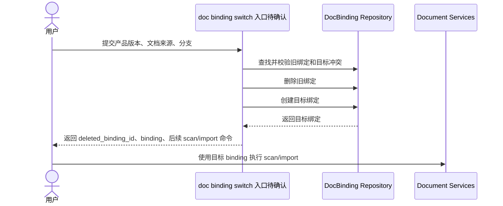

# F001 文档绑定切换 PRD

## 1. 功能信息

| 项 | 内容 |
| --- | --- |
| 功能编号 | F001 |
| 功能名称 | 文档绑定切换 |
| 优先级 | P0 |
| 状态 | 草稿，核心语义已确认 |
| 所属总 PRD | `../01-master-prd.md` |
| 主要事实源 | SRC-U-001, SRC-U-002, SRC-U-003, SRC-C-001, SRC-C-002, SRC-C-003, SRC-C-004, SRC-C-005, SRC-C-006 |

## 2. 引用业务口径

| 类型 | 编号 | 名称 | 来源章节 | 来源编号/问题编号 |
| --- | --- | --- | --- | --- |
| 业务对象 | BO-002 | ProductVersion | 总 PRD 5.1 | SRC-D-001, SRC-D-003 |
| 业务对象 | BO-003 | DocBinding | 总 PRD 5.1 | SRC-U-001, SRC-U-002, SRC-C-001 |
| 业务对象 | BO-004 | Document | 总 PRD 5.1 | SRC-C-003, SRC-C-004 |
| 业务对象 | BO-005 | DocumentGraph | 总 PRD 5.1 | SRC-C-006 |
| 术语 | T-001 | 文档绑定切换 | 总 PRD 5.3 | SRC-U-002, SRC-U-003 |
| 跨功能规则 | BR-G-02 | 删除旧绑定并创建目标绑定 | 总 PRD 7 | SRC-U-002, SRC-U-003 |

## 3. 功能目标

F001 允许用户把产品版本的文档绑定切换到新的产品版本、文档仓库路径、文档仓库 URL 或分支。切换必须以“删除旧 DocBinding，创建目标 DocBinding”为唯一业务语义。旧绑定不能被保留为 inactive，不能通过原记录覆盖更新，也不能与目标绑定并存。（SRC-U-001, SRC-U-002, SRC-U-003）

## 4. 用户故事与使用场景

| 场景编号 | 用户角色 | 场景描述 | 业务价值 | 来源编号/问题编号 |
| --- | --- | --- | --- | --- |
| US-F001-01 | U-001 研发负责人 | 版本文档来源发生变化时，用户切换文档绑定并删除旧绑定 | 避免旧版本继续持有错误文档范围 | SRC-U-001, SRC-U-002 |
| US-F001-02 | U-002 开发者或插件使用者 | 通过 CLI/API 执行切换，并拿到目标绑定与后续 scan/import 指令 | 形成可自动化的文档工作流 | SRC-C-002, SRC-A-001, Q-102 |
| US-F001-03 | U-001 研发负责人 | 切换后查询目标版本文档图，只看到目标版本范围内文档 | 保证版本图和文档范围一致 | SRC-D-003, SRC-C-006 |

## 5. 前置条件

- Product 已存在。（SRC-D-001）
- 目标 ProductVersion 已存在。（SRC-C-001）
- 用户提供目标文档来源：`repo_path` 或 `repo_url` 至少一个有效。（SRC-C-002）
- 用户提供目标文档分支或使用默认分支策略。（SRC-C-001, SRC-C-002）
- 待切换的旧绑定可被定位；定位方式待实现计划确认。（Q-102）

## 6. 页面入口与导航路径

| 入口编号 | 页面/模块/能力入口 | 入口位置 | 触发方式 | 到达结果 | 来源编号/问题编号 |
| --- | --- | --- | --- | --- | --- |
| EN-F001-01 | CLI/API 文档绑定切换入口 | `doc binding` 命令族或等价 API | 用户提交产品、目标版本、文档来源和分支 | 返回旧绑定删除结果、目标绑定、后续 scan/import 指令 | SRC-C-002, SRC-A-001, Q-102 |

## 7. 交互说明

| 交互编号 | 触发动作 | 系统反馈 | 状态变化 | 失败反馈 | 退出路径 | 来源编号/问题编号 |
| --- | --- | --- | --- | --- | --- | --- |
| IA-F001-01 | 用户发起文档绑定切换 | 返回目标绑定详情和旧绑定删除结果 | 旧 DocBinding 删除，目标 DocBinding 创建 | 产品或版本不存在时返回 not_found | 用户按返回指令执行 scan/import | SRC-U-002, SRC-C-001 |
| IA-F001-02 | 目标文档来源已被其他版本 active 绑定占用 | 拒绝切换 | 不删除旧绑定，不创建目标绑定 | 返回冲突错误 | 用户更换来源或先处理冲突绑定 | SRC-C-001, SRC-A-002 |
| IA-F001-03 | 用户使用旧绑定 ID 执行 scan/import | 返回 not_found 或等价错误 | 无状态变化 | 明确旧绑定不存在 | 用户改用目标绑定 ID | SRC-U-002, SRC-T-001 |

## 8. 业务规则

| 规则编号 | 规则类型 | 规则内容 | 影响对象/属性 | 例外情况 | 关联 AC | 来源编号/问题编号 | 确认状态 |
| --- | --- | --- | --- | --- | --- | --- | --- |
| BR-F001-01 | 校验 | 切换前必须校验目标 ProductVersion 存在且属于目标 Product。 | BO-002, BO-003-A02 | 无 | AC-F001-01 | SRC-C-001 | 已确认 |
| BR-F001-02 | 删除 | 切换必须删除旧 DocBinding。 | BO-003 | 无 | AC-F001-02 | SRC-U-002 | 已确认 |
| BR-F001-03 | 创建 | 删除旧绑定后必须创建目标 DocBinding，目标绑定必须带 `product_version_id`。 | BO-003-A02 | 无 | AC-F001-02 | SRC-C-001, SRC-U-003 | 已确认 |
| BR-F001-04 | 一致性 | 目标文档来源和分支若已被其他产品版本 active 绑定占用，切换必须失败且旧绑定保持不变。 | BO-003-A03, BO-003-A04, BO-003-A05 | 空 Git 来源兼容边界待实现确认 | AC-F001-03 | SRC-C-001, SRC-A-002 | 已确认 |
| BR-F001-05 | 后续扫描 | 切换完成后，scan 只能对目标绑定执行，写入目标版本作用域文档。 | BO-004-A01 | 是否自动 scan 待确认 | AC-F001-04 | SRC-C-004, Q-104 | 部分确认 |
| BR-F001-06 | 后续导入 | 切换完成后，import 只能对目标绑定执行，写入目标版本文档图。 | BO-005 | 是否自动 import 待确认 | AC-F001-05 | SRC-C-005, SRC-C-006, Q-104 | 部分确认 |
| BR-F001-07 | 清理 | 旧绑定删除后，其关联文档、chunk、扫描错误、文档图关系的清理深度必须在实现计划中明确。 | BO-003, BO-004, BO-005 | 当前作为非阻塞待确认问题 | AC-F001-06 | Q-103 | 待确认 |

## 9. 字段、状态、枚举与校验

| 字段编号 | 字段名 | 所属对象属性 | 输入/展示 | 校验规则 | 错误提示 | 来源编号/问题编号 | 确认状态 |
| --- | --- | --- | --- | --- | --- | --- | --- |
| FLD-F001-01 | `product_code` 或 `product_id` | BO-001 | 输入 | 必须定位到唯一 Product | product not found | SRC-C-002 | 已确认 |
| FLD-F001-02 | `version_name` 或 `version_id` | BO-002 | 输入 | 必须定位到目标 Product 下的 ProductVersion | product version not found | SRC-C-002 | 已确认 |
| FLD-F001-03 | `repo_path` | BO-003-A03 | 输入/输出 | 与 `repo_url` 至少有一个有效来源 | provide repo source | SRC-C-002 | 已确认 |
| FLD-F001-04 | `repo_url` | BO-003-A04 | 输入/输出 | 与 `repo_path` 至少有一个有效来源 | provide repo source | SRC-C-002 | 已确认 |
| FLD-F001-05 | `branch` | BO-003-A05 | 输入/输出 | 空值按默认分支策略处理 | invalid branch | SRC-C-001, SRC-C-002 | 已确认 |
| FLD-F001-06 | `deleted_binding_id` | BO-003-A01 | 输出 | 必须是被删除的旧绑定 ID | 不适用 | SRC-U-002 | 已确认 |
| FLD-F001-07 | `binding` | BO-003 | 输出 | 必须是新建目标绑定 | 不适用 | SRC-U-003 | 已确认 |

## 10. 功能内数据流图

## 11. 功能内时序图

## 12. 接口与数据口径

| 项 | 内容 | 来源编号/问题编号 | 确认状态 |
| --- | --- | --- | --- |
| 输入数据 | Product 定位、目标 ProductVersion 定位、目标文档来源、目标分支、旧绑定定位方式 | SRC-U-001, SRC-C-002, Q-102 | 部分确认 |
| 输出数据 | `deleted_binding_id`、目标 `binding`、`scan_command`、`import_command`、冲突或错误信息 | SRC-U-002, SRC-A-001 | 已确认 |
| 读数据边界 | Product、ProductVersion、DocBinding、Project 可选来源 | SRC-C-001, SRC-C-002 | 已确认 |
| 写数据边界 | 删除旧 DocBinding，创建目标 DocBinding；关联数据清理深度待确认 | SRC-U-002, Q-103 | 部分确认 |
| 接口候选 | `doc binding switch` 或 `doc binding replace`，命名和参数在实现计划确认 | Q-102 | 待确认 |

## 13. 异常与边界场景

| 场景编号 | 场景 | 处理规则 | 用户反馈 | 关联 AC | 来源编号/问题编号 |
| --- | --- | --- | --- | --- | --- |
| EX-F001-01 | Product 不存在 | 拒绝切换，不删除旧绑定 | product not found | AC-F001-01 | SRC-C-002 |
| EX-F001-02 | 目标 ProductVersion 不存在或不属于 Product | 拒绝切换，不删除旧绑定 | product version not found | AC-F001-01 | SRC-C-002 |
| EX-F001-03 | 目标文档来源已被其他版本绑定 | 拒绝切换，不删除旧绑定 | binding source conflict | AC-F001-03 | SRC-C-001 |
| EX-F001-04 | 旧绑定不存在 | 拒绝切换，不创建目标绑定 | doc binding not found | AC-F001-02 | SRC-U-002 |
| EX-F001-05 | 删除旧绑定后创建目标绑定失败 | 必须整体回滚，不留下无绑定状态 | database operation failed 或 conflict | AC-F001-03 | SRC-A-002 |
| EX-F001-06 | 使用旧绑定 ID 扫描或导入 | 返回 not_found | doc binding not found | AC-F001-06 | SRC-T-001 |

## 14. 验收标准

| AC 编号 | Given | When | Then | 覆盖规则 | 来源编号/问题编号 |
| --- | --- | --- | --- | --- | --- |
| AC-F001-01 | Product 和目标 ProductVersion 已存在 | 用户执行文档绑定切换 | 返回目标绑定，且 `binding.product_version_id` 等于目标版本 ID | BR-F001-01, BR-F001-03 | SRC-C-001 |
| AC-F001-02 | 旧绑定存在 | 用户执行文档绑定切换 | 旧绑定被删除，新绑定被创建，响应包含 `deleted_binding_id` 和 `binding.id` | BR-F001-02, BR-F001-03 | SRC-U-002, SRC-U-003 |
| AC-F001-03 | 目标文档来源已被其他产品版本 active 绑定 | 用户执行文档绑定切换 | 命令失败，旧绑定仍存在，目标绑定未创建 | BR-F001-04 | SRC-C-001 |
| AC-F001-04 | 切换已成功 | 用户对目标绑定执行 `doc scan` | 扫描文档写入目标 `product_version_id` | BR-F001-05 | SRC-C-004 |
| AC-F001-05 | 切换已成功且文档仓库可导入 | 用户对目标绑定执行 `doc import` | 文档和文档图写入目标产品版本作用域 | BR-F001-06 | SRC-C-005, SRC-C-006 |
| AC-F001-06 | 切换已成功 | 用户使用旧绑定 ID 执行 scan/import/list 相关操作 | 旧绑定不可用，返回 not_found 或等价错误 | BR-F001-02, BR-F001-07 | SRC-U-002, Q-103 |

## 15. 测试场景建议

| 测试编号 | 优先级 | 场景 | 前置条件 | 操作 | 预期结果 | 覆盖 AC | 来源编号/问题编号 |
| --- | --- | --- | --- | --- | --- | --- | --- |
| TC-F001-01 | P0 | CLI/API 切换命令注册 | 本地 CLI 可运行 | 查看 help 或调用测试入口 | 命令/参数存在且输出结构稳定 | AC-F001-01 | SRC-T-002, Q-102 |
| TC-F001-02 | P0 | 删除旧绑定并创建目标绑定 | 旧绑定和目标版本存在 | 执行切换 | 旧绑定被删除，新绑定返回 | AC-F001-02 | SRC-U-002 |
| TC-F001-03 | P0 | 冲突时不删除旧绑定 | 目标来源被其他版本占用 | 执行切换 | 返回冲突，旧绑定仍可查询 | AC-F001-03 | SRC-C-001 |
| TC-F001-04 | P0 | 旧绑定 ID 不可继续扫描 | 切换成功 | 对旧绑定执行 scan | 返回 not_found | AC-F001-06 | SRC-T-001 |
| TC-F001-05 | P0 | 目标绑定扫描写入目标版本 | 切换成功且文档仓库有受控文档 | 对目标绑定执行 scan | documents 带目标 `product_version_id` | AC-F001-04 | SRC-C-004 |
| TC-F001-06 | P1 | 目标绑定导入写入文档图 | 切换成功且 Git 文档仓库可导入 | 对目标绑定执行 import 和 doc graph show | 文档图按目标 version 可查询 | AC-F001-05 | SRC-C-005, SRC-C-006 |

## 16. 关联需求与依赖

- 依赖现有 Product / ProductVersion 创建和查询能力。（SRC-D-001）
- 依赖现有 DocBinding 创建、扫描、导入能力。（SRC-C-001, SRC-C-004, SRC-C-005）
- 依赖现有文档图版本作用域写入和查询能力。（SRC-C-006）

## 17. 待确认问题

| 问题编号 | 当前已知事实 | 问题 | 需要确认的选项/开放点 | 影响范围 | 阻塞级别 | 需要谁确认 |
| --- | --- | --- | --- | --- | --- | --- |
| Q-101 | 当前需求未提供权限模型 | 谁可以执行文档绑定切换？ | 是否所有 CLI 使用者可执行，还是需要产品管理员角色 | 权限、安全、API 设计 | 非阻塞 | 产品负责人 |
| Q-102 | 现有 CLI 只有 `doc binding create/list` | 切换入口命名和参数如何确定？ | `switch`、`replace`、或扩展 `create --replace` | CLI 契约、测试、README | 非阻塞 | 产品负责人/实现负责人 |
| Q-103 | 用户确认旧绑定需要删除，但关联数据清理深度未确认 | 删除旧绑定时，旧 documents、chunks、scan errors、Neo4j 文档图关系是否硬删除、级联删除或标记失效？ | 后续技术设计需逐项明确 | 数据一致性、迁移、回滚 | 非阻塞 | 实现负责人 |
| Q-104 | 现有 scan/import 是独立命令 | 切换命令是否自动执行 scan/import？ | 仅返回后续命令，或可选 `--scan/--import` | 用户体验、事务边界、测试 | 非阻塞 | 产品负责人 |

## 关联文档
- [[requirements/doc-binding-switch/01-master-prd|文档绑定切换总 PRD]]
- [[requirements/doc-binding-switch/00-source-index|文档绑定切换事实源索引]]
- [[requirements/doc-binding-switch/99-open-questions|文档绑定切换待确认问题]]
