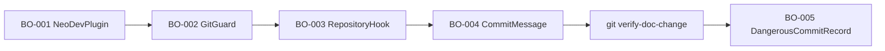
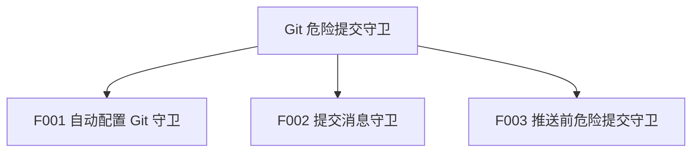
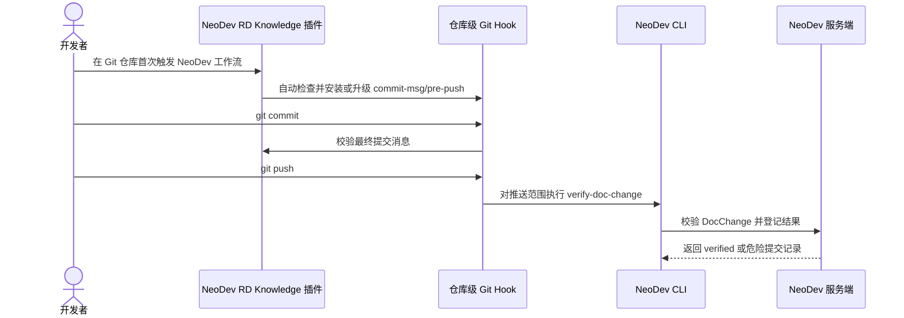

---

doc_id: NEODEV-DOC-REQUIREMENTS-GIT-DANGEROUS-COMMIT-GUARD-MASTER-PRD
title: Git 危险提交守卫总 PRD
aliases:

- Git 危险提交守卫总 PRD
tags:
- neodev/docs
- neodev/prd
- neodev/requirements
- requirements/git-dangerous-commit-guard
created: 2026-05-11
updated: 2026-05-11
related:
- '[[README|Git 危险提交守卫 PRD 产物索引]]'
- '[[00-source-index|Git 危险提交守卫事实源索引]]'
- '[[features/F001-auto-git-guard-setup|F001 自动配置 Git 守卫 PRD]]'
- '[[features/F002-commit-message-guard|F002 提交消息守卫 PRD]]'
- '[[features/F003-pre-push-dangerous-commit-guard|F003 推送前危险提交守卫 PRD]]'
- '[[99-open-questions|Git 危险提交守卫待确认问题]]'
doc_type: prd
product_key: NEODEV
status: draft
relations:
target:
  - NEODEV-DOC-REQUIREMENTS-GIT-DANGEROUS-COMMIT-GUARD-README
  - NEODEV-DOC-REQUIREMENTS-GIT-DANGEROUS-COMMIT-GUARD-SOURCE-INDEX
  - NEODEV-DOC-REQUIREMENTS-GIT-DANGEROUS-COMMIT-GUARD-F001-AUTO-GIT-GUARD-SETUP
  - NEODEV-DOC-REQUIREMENTS-GIT-DANGEROUS-COMMIT-GUARD-F002-COMMIT-MESSAGE-GUARD
  - NEODEV-DOC-REQUIREMENTS-GIT-DANGEROUS-COMMIT-GUARD-F003-PRE-PUSH-DANGEROUS-COMMIT-GUARD
  - NEODEV-DOC-REQUIREMENTS-GIT-DANGEROUS-COMMIT-GUARD-OPEN-QUESTIONS

---

# Git 危险提交守卫总 PRD

## 1. 文档信息

| 项    | 内容                     |
| ---- | ---------------------- |
| 文档编号 | R-003                  |
| 版本   | v0.1                   |
| 状态   | 草稿，核心方向已确认             |
| 最后更新 | 2026-05-11             |
| 事实源  | 见 `00-source-index.md` |

## 2. 背景与目标

### 2.1 背景

NeoDev MVP 已要求代码提交必须引用 `DocChange-ID`，并在推送前完成 `git verify-doc-change`。当前已经具备 `git verify-doc-change`、`git dangerous-commit list/resolve` 和插件工具层 hook，但本机检查显示仓库级 `.git/hooks/commit-msg` 与 `.git/hooks/pre-push` 未安装，插件 hook 也只能覆盖 Agent 工具调用，不能覆盖 IDE、普通终端或脚本直接执行 Git 的场景。（SRC-D-001, SRC-D-002, SRC-D-003, SRC-L-001, SRC-L-002, SRC-L-003）

用户明确希望插件足够内聚，并希望这些配置在安装插件后自动完成。经确认，本期采用“插件安装后在仓库首次使用时自动配置 Git 守卫”的方式，不内嵌 Git，不替代用户本机 Git。（SRC-U-003, SRC-U-004, SRC-U-005, SRC-A-001）

### 2.2 目标

| 需求编号  | 目标                                                                            | 来源编号                            |
| ----- | ----------------------------------------------------------------------------- | ------------------------------- |
| R-001 | 代码提交缺少、重复或非法 `DocChange-ID` 时，必须在本地提交或推送前被识别。                                 | SRC-U-001, SRC-D-001            |
| R-002 | NeoDev RD Knowledge 插件必须内聚提供守卫安装、hook 模板、校验脚本和工具层提醒。                          | SRC-U-002, SRC-U-003            |
| R-003 | 插件安装后，首次在 Git 仓库内使用 NeoDev 工作流时自动、幂等配置仓库级 Git 守卫。                             | SRC-U-004, SRC-U-005, SRC-L-003 |
| R-004 | 服务端 `verify-doc-change` 失败路径必须登记 open 状态危险提交记录，使 `dangerous-commit list` 不漏报。 | SRC-U-001, SRC-D-003, SRC-C-001 |
| R-005 | 本期不内嵌 Git，不实现 Git 客户端替代品。                                                     | SRC-U-005, SRC-A-001            |

### 2.3 非目标

- 不内嵌 Git，也不封装完整 Git 提交、推送流程。（SRC-A-001）
- 不全局静默修改所有仓库的 Git hook。（SRC-U-005）
- 不依赖 Agent 工具层 hook 作为唯一防线。（SRC-A-003）
- 不新增复杂审批流；危险提交仍通过现有 `dangerous-commit resolve` 关闭。（SRC-D-003）

## 3. 用户角色

| 角色编号  | 角色名称  | 定义                                           | 主要诉求                               |
| ----- | ----- | -------------------------------------------- | ---------------------------------- |
| U-001 | 开发者   | 在本地仓库中提交和推送代码的人                              | 坏提交在 commit/push 前被明确阻止或提示         |
| U-002 | 插件使用者 | 通过 NeoDev RD Knowledge 插件和 Agent 工作流完成研发闭环的人 | 插件自动配置守卫，不需要手工写 hook               |
| U-003 | 研发负责人 | 关注 DocChange 闭环和危险提交审计的人                     | `dangerous-commit list` 能看到未合规提交记录 |

## 4. 业务对象、属性、术语统一

### 4.1 业务对象清单

| 对象编号   | 标准名称                  | 定义                                          | 主标识                      | 生命周期           | 来源编号                 |
| ------ | --------------------- | ------------------------------------------- | ------------------------ | -------------- | -------------------- |
| BO-001 | NeoDevPlugin          | NeoDev RD Knowledge 插件包，承载 hooks、脚本、模板和技能说明 | plugin name, version     | 安装、启用、升级       | SRC-L-001            |
| BO-002 | GitGuard              | 插件提供的 Git 守卫能力集合                            | guard version            | 未安装、已安装、需升级    | SRC-U-003, SRC-U-005 |
| BO-003 | RepositoryHook        | 当前 Git 仓库中的 `commit-msg`、`pre-push` hook 文件 | hook path                | 未安装、已安装、冲突、需升级 | SRC-L-003, SRC-A-001 |
| BO-004 | CommitMessage         | Git 提交消息                                    | commit sha, message file | 编写、校验、提交       | SRC-C-005, SRC-A-001 |
| BO-005 | DangerousCommitRecord | 危险提交登记记录                                    | record id, commit_sha    | open、resolved  | SRC-D-003, SRC-C-002 |

### 4.2 业务对象属性字典

| 属性编号       | 所属对象   | 中文名               | 英文名              | 类型     | 必填     | 校验规则                                         | 来源编号                 |
| ---------- | ------ | ----------------- | ---------------- | ------ | ------ | -------------------------------------------- | -------------------- |
| BO-002-A01 | BO-002 | 守卫版本              | `guard_version`  | string | 是      | 用于判断 hook 是否需升级                              | SRC-U-005            |
| BO-003-A01 | BO-003 | Hook 路径           | `hook_path`      | string | 是      | 只能写当前仓库 `.git/hooks` 或 `core.hooksPath` 指向路径 | SRC-A-001            |
| BO-003-A02 | BO-003 | 管理标记              | `managed_marker` | string | 是      | NeoDev 管理的 hook 必须可识别，避免误覆盖用户 hook           | SRC-U-003            |
| BO-004-A01 | BO-004 | DocChange trailer | `DocChange-ID`   | string | 代码提交必填 | 必须是唯一 40 字符文档 Git commit hash                | SRC-D-001, SRC-C-005 |
| BO-005-A01 | BO-005 | 风险原因              | `reason`         | string | 是      | 必须说明缺失、重复、非法、未知或已实现等原因                       | SRC-U-001, SRC-C-002 |

### 4.3 术语与定义

| 术语编号  | 标准术语       | 定义                                                              | 禁用叫法     | 来源编号                 |
| ----- | ---------- | --------------------------------------------------------------- | -------- | -------------------- |
| T-001 | 插件内聚守卫     | 守卫安装入口、hook 模板、校验脚本、Agent hook 和文档说明统一归属 NeoDev RD Knowledge 插件 | 仓库零散脚本   | SRC-U-003            |
| T-002 | 仓库级 Git 守卫 | 安装在具体 Git 仓库中的 `commit-msg` 与 `pre-push` hook                   | 内嵌 Git   | SRC-U-005, SRC-A-001 |
| T-003 | 工具层 hook   | 插件 `hooks/hooks.json` 对 Agent 工具调用的拦截                           | Git hook | SRC-L-002, SRC-A-003 |
| T-004 | 危险提交漏报     | 不合规代码提交未被本地阻止，也未出现在 `dangerous-commit list` 中                   | 正常提交     | SRC-U-001            |

### 4.4 对象关系

## 5. 功能地图与拆分

| 功能编号 | 功能名称        | 用户价值                            | 优先级 | 子 PRD                                              |
| ---- | ----------- | ------------------------------- | --- | -------------------------------------------------- |
| F001 | 自动配置 Git 守卫 | 插件安装后在仓库首次使用时自动具备真实 Git hook 防线 | P0  | `features/F001-auto-git-guard-setup.md`            |
| F002 | 提交消息守卫      | 坏提交在最终 commit message 阶段被阻止     | P0  | `features/F002-commit-message-guard.md`            |
| F003 | 推送前危险提交守卫   | 已存在的坏提交在 push 前被扫描并登记为危险提交      | P0  | `features/F003-pre-push-dangerous-commit-guard.md` |

## 6. 跨功能业务规则

| 规则编号    | 规则内容                                                              | 影响功能             | 关联 AC   | 来源编号                            |
| ------- | ----------------------------------------------------------------- | ---------------- | ------- | ------------------------------- |
| BR-G-01 | 代码提交必须有且只有一个合法 `DocChange-ID` trailer。                            | F002, F003       | AC-G-01 | SRC-D-001, SRC-C-005            |
| BR-G-02 | 插件不得内嵌 Git；本地 Git 操作仍由用户本机 Git 执行。                                | F001             | AC-G-02 | SRC-A-001, SRC-U-005            |
| BR-G-03 | Git 守卫的安装、模板、脚本和工具层提示必须归属 NeoDev RD Knowledge 插件。                 | F001, F002, F003 | AC-G-03 | SRC-U-003                       |
| BR-G-04 | 插件安装后在仓库首次使用时必须自动检查并幂等配置仓库级 Git 守卫。                               | F001             | AC-G-02 | SRC-U-004, SRC-U-005            |
| BR-G-05 | 工具层 hook 只能作为补充提醒，不能替代仓库级 `commit-msg` 与 `pre-push` hook。         | F001, F002, F003 | AC-G-03 | SRC-L-002, SRC-A-003            |
| BR-G-06 | `verify-doc-change` 的失败路径必须创建或复用 open 状态 `DangerousCommitRecord`。 | F003             | AC-G-04 | SRC-U-001, SRC-C-001, SRC-C-002 |
| BR-G-07 | 自动安装不得静默覆盖用户已有非 NeoDev hook；必须保留、串联或明确提示冲突。                       | F001             | AC-G-05 | SRC-U-003, SRC-A-001            |

## 7. 总体流程

## 8. 非功能需求

| 编号      | 类型   | 要求                                      | 度量方式         |
| ------- | ---- | --------------------------------------- | ------------ |
| NFR-001 | 幂等性  | 多次触发自动配置不会重复追加 hook 内容                  | 重复安装测试       |
| NFR-002 | 内聚性  | 守卫逻辑集中在插件脚本，Git hook 只做薄转发              | 文件结构和测试断言    |
| NFR-003 | 可审计性 | 危险提交失败路径必须可在 `dangerous-commit list` 查询 | CLI 集成测试     |
| NFR-004 | 兼容性  | 已有用户 hook 不被静默破坏                        | 用户 hook 保留测试 |

## 9. 总体验收标准

| AC 编号   | 验收内容                                                              | 覆盖规则             | 来源编号                 |
| ------- | ----------------------------------------------------------------- | ---------------- | -------------------- |
| AC-G-01 | 代码提交缺少、重复或非法 `DocChange-ID` 时，commit-msg 或 pre-push 阻止操作。         | BR-G-01          | SRC-U-001            |
| AC-G-02 | 插件不内嵌 Git，仓库首次使用时自动配置真实 Git hook。                                 | BR-G-02, BR-G-04 | SRC-U-004, SRC-U-005 |
| AC-G-03 | Agent 工具层 hook 与仓库级 Git hook 共存，且核心规则集中在插件脚本。                     | BR-G-03, BR-G-05 | SRC-U-003            |
| AC-G-04 | `verify-doc-change` 失败后，`git dangerous-commit list` 能查询到 open 记录。 | BR-G-06          | SRC-U-001, SRC-D-003 |
| AC-G-05 | 当前仓库已有用户自定义 hook 时，自动配置不会静默覆盖。                                    | BR-G-07          | SRC-U-003            |

## 10. 待确认问题索引

详见 `99-open-questions.md`。当前无阻塞问题，无非阻塞问题；自动配置时机、内聚边界和不内嵌 Git 已由用户确认。

## 关联文档

- [[README|Git 危险提交守卫 PRD 产物索引]]
- [[00-source-index|Git 危险提交守卫事实源索引]]
- [[features/F001-auto-git-guard-setup|F001 自动配置 Git 守卫 PRD]]
- [[features/F002-commit-message-guard|F002 提交消息守卫 PRD]]
- [[features/F003-pre-push-dangerous-commit-guard|F003 推送前危险提交守卫 PRD]]
- [[99-open-questions|Git 危险提交守卫待确认问题]]
