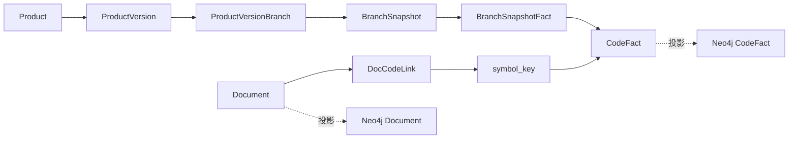

# 图谱存储结构设计

## 1. 设计目标

本文定义研发知识图谱 MVP 的最终存储结构。新的设计以 PG 作为事实源，以 Neo4j 作为查询投影，支持产品版本下从文档定位到方法、函数等最小功能单位。

核心目标：

- 一个产品可以包含多个项目。
- 一个项目只能对应一个代码仓库。
- `project_id` 即项目身份，也是仓库身份，不再引入 `repo_id`。
- 分支名称只存在于产品版本绑定和分支快照层。
- 代码事实节点不存储分支名称。
- 删除 commit 增量同步能力，统一使用分支图谱刷新。
- 分支快照直接关联方法、函数、构造器、类、接口、文件等代码事实节点。
- PG 和 Neo4j 都不存储源码正文，只存 hash、路径、符号和必要元数据。
- 文档长期绑定稳定功能锚点 `symbol_key`，刷新图谱后自动解析到当前版本可见的实际代码事实 `fact_id`。

## 2. 总体架构



核心链路：

```text
product_version
-> product_version_branches
-> project_id + branch_name
-> latest completed branch_snapshot
-> branch_snapshot_facts
-> code_facts
```

文档到代码链路：

```text
document
-> doc_code_links.symbol_key
-> 当前产品版本可见的 code_facts
```

## 3. 存储边界

### 3.1 PG 事实源

PG 负责保存可重建图谱的事实数据：

- 产品版本和项目分支绑定。
- 分支刷新快照。
- 当前分支快照可见的代码事实节点。
- 文档到代码稳定锚点关系。
- 文档关系当前解析结果。

PG 不保存：

- 源码正文。
- 代码节点之间的结构边。
- 分支名到代码事实节点的冗余字段。
- AI 生成的代码语义描述或 embedding。

### 3.2 Neo4j 查询投影

Neo4j 负责图查询加速：

- 投影 `CodeFact` 节点。
- 投影 `Document` 节点。
- 投影代码结构关系。
- 投影文档到代码关系。

Neo4j 不是唯一事实源。Neo4j 数据可以删除后从 PG 和当前仓库重新生成。

Neo4j 节点不存储：

- `branch_name`
- 源码正文
- AI/语义搜索字段

## 4. 核心概念

### 4.1 project_id

`project_id` 是项目身份，也是仓库身份。

由于业务约束是“一个项目只能有一个仓库”，因此不需要 `repo_id`。

示例：

```text
project_id=1 -> dsc-web-server 仓库
project_id=2 -> dsc-job-server 仓库
```

即使两个项目存在相同路径、相同方法名、相同代码内容，也会因为 `project_id` 不同而形成不同代码事实。

### 4.2 branch_name

`branch_name` 表示项目仓库中的分支，只存在于：

- `product_version_branches`
- `branch_snapshots`

代码事实节点不包含 `branch_name`。同一项目不同分支中内容相同的方法应复用同一个 `code_fact`。

### 4.3 symbol_key

`symbol_key` 是稳定功能锚点，不包含代码内容 hash。

生成规则：

```text
symbol_key = hash(project_id + node_type + file_path + qualified_name)
```

用途：

- 文档长期绑定功能。
- 方法内容变化后仍能通过同一个 `symbol_key` 找到新版本代码事实。
- 查询产品版本时解析到当前分支快照可见的 `fact_id`。

### 4.4 fact_id

`fact_id` 是具体代码事实身份，包含代码内容 hash。

生成规则：

```text
fact_id = hash(project_id + node_type + file_path + qualified_name + content_hash)
```

用途：

- 表示某个文件、类、方法、函数等节点的具体内容版本。
- 被 `branch_snapshot_facts` 引用。
- 被 Neo4j 投影为代码事实节点。

## 5. 表结构

### 5.1 projects

```text
projects
- id
- name
- repo_url
- repo_path
- created_at
- updated_at
```

说明：

- 一个项目对应一个仓库。
- `project_id` 直接作为仓库隔离维度。

### 5.2 product_versions

```text
product_versions
- id
- product_id
- version_name
- description
- status
- created_at
- updated_at
```

说明：

- 产品版本是业务版本。
- 产品版本不直接存储代码图。
- 产品版本通过 `product_version_branches` 组合多个项目分支。

### 5.3 product_version_branches

```text
product_version_branches
- id
- product_version_id
- project_id
- branch_name
- created_at
- updated_at
```

唯一约束：

```text
unique(product_version_id, project_id)
```

含义：

- 一个产品版本可以绑定多个项目。
- 一个产品版本下，一个项目只能绑定一个分支。
- 同一项目可以在不同产品版本中绑定不同分支。

### 5.4 branch_snapshots

```text
branch_snapshots
- id
- project_id
- branch_name
- head_commit
- snapshot_hash
- status
- created_at
```

状态：

```text
running
completed
failed
```

索引：

```text
(project_id, branch_name, id desc)
(project_id, branch_name, status)
```

说明：

- 记录某个项目分支一次刷新后的可见代码事实集合。
- 不保存 `base_snapshot_id`。
- 不保存 `created_from_action=incremental/copy_data/full`。
- `snapshot_hash` 用于判断本次刷新结果是否与最新快照一致。

### 5.5 code_facts

```text
code_facts
- id
- project_id
- fact_id
- symbol_key
- node_type
- file_path
- qualified_name
- name
- signature_hash
- content_hash
- structure_hash
- parent_fact_id
- start_line
- end_line
- metadata_json
- status
- created_at
- updated_at
```

唯一约束：

```text
unique(project_id, fact_id)
```

节点类型：

```text
File
Class
Interface
Enum
Annotation
Method
Function
Constructor
```

说明：

- 文件、类、方法、函数等都存为 `code_facts`。
- `content_hash` 基于规范化后的源码内容计算，但不保存源码。
- `structure_hash` 用于整棵子树复用。
- `parent_fact_id` 表达父级事实节点，例如方法属于类、类属于文件。

### 5.6 branch_snapshot_facts

```text
branch_snapshot_facts
- id
- snapshot_id
- fact_id
```

唯一约束：

```text
unique(snapshot_id, fact_id)
```

说明：

- 这是快照和代码事实的唯一关联表。
- 快照条目粒度是代码事实，不再只是文件。
- 首版只保留 `snapshot_id + fact_id`。如果后续查询性能不足，再考虑冗余 `project_id`、`node_type`、`symbol_key`。

### 5.7 doc_code_links

```text
doc_code_links
- id
- product_id
- product_version_id nullable
- doc_id
- doc_node_id
- code_project_id
- symbol_key
- resolved_fact_id nullable
- resolved_snapshot_id nullable
- relation_type
- source
- confidence
- resolution_status
- metadata_json
- status
- created_at
- updated_at
```

关系类型：

```text
DESCRIBES
REQUIRES
IMPLEMENTS
VALIDATES
TESTS
DEPENDS_ON
```

解析状态：

```text
resolved
unresolved
stale
ambiguous
```

说明：

- `symbol_key` 是长期稳定关系。
- `resolved_fact_id` 是当前解析到的实际代码事实。
- `resolved_snapshot_id` 表示解析基于哪个分支快照。
- 刷新图谱后，如果 `resolved_fact_id` 不再属于当前快照，必须按 `symbol_key` 重建解析结果。

## 6. Hash 规则

系统不存源码，但 hash 必须基于源码内容计算。

```text
signature_hash = hash(名称 + 参数 + 返回值 + 修饰符 + 注解)
content_hash = hash(规范化后的代码内容)
structure_hash = hash(node_type + signature_hash + content_hash + sorted(child.structure_hash))
```

计算顺序：

```text
自底向上计算 hash
自顶向下判断复用
```

复用规则：

- 文件 `structure_hash` 一致时，文件下整棵子树复用。
- 类 `structure_hash` 一致时，类下方法整体复用。
- 方法或函数 `content_hash` 一致时，最小功能节点复用。
- 同一项目不同分支中内容一致的代码事实复用同一个 `fact_id`。
- 不同项目即使内容一致，也不复用同一个 `fact_id`。

## 7. 分支刷新逻辑

命令示例：

```bash
neodev project refresh-graph --project-id 1 --branch release/V2.0R26C01
```

处理流程：

```text
1. 拉取项目仓库
2. checkout 指定分支
3. 获取 head_commit
4. 扫描代码文件
5. 解析 AST，生成 File/Class/Method/Function 等代码树
6. 自底向上计算 signature_hash/content_hash/structure_hash
7. 生成 symbol_key 和 fact_id
8. 按 fact_id 查找 code_facts
9. 命中则复用，未命中则新增
10. 计算 snapshot_hash
11. 如果最新快照 snapshot_hash 相同，返回 no_change
12. 如果不同，创建 branch_snapshots
13. 批量写入 branch_snapshot_facts
14. 投影当前快照相关节点和关系到 Neo4j
15. 重建受影响 doc_code_links 的解析结果
```

说明：

- 刷新是全分支刷新，不是 commit 增量同步。
- 全分支刷新不等于全量重建，复用由 hash 决定。
- `project refresh-graph` 不再要求 `version_id`。
- `sync_commit_graph_for_version` 废弃。

## 8. 产品版本逻辑

### 8.1 创建产品版本

```bash
neodev product version create --product dsc --name V2.0R26C01
```

逻辑：

```text
1. 创建 product_versions
2. 不自动绑定项目
3. 不自动刷新图谱
```

### 8.2 绑定项目分支

```bash
neodev product version bind-project \
  --version-id 1 \
  --project-id 1 \
  --branch release/V2.0R26C01
```

逻辑：

```text
1. 校验产品版本存在
2. 校验项目存在
3. 写入或更新 product_version_branches
4. 检查 project_id + branch_name 是否已有 completed 快照
5. 没有快照时提示执行 project refresh-graph
6. 不自动刷新其他项目
```

### 8.3 查询产品版本功能节点

输入：

```text
product_version_id
```

逻辑：

```text
1. 查询 product_version_branches
2. 对每个 project_id + branch_name 找最新 completed 快照
3. 读取 branch_snapshot_facts
4. join code_facts
5. 过滤 node_type in Method, Function, Constructor, Class, Interface
6. 返回当前产品版本可见功能节点
```

## 9. 文档到代码关系

### 9.1 建立关系

文档关系绑定稳定锚点：

```text
Document -> symbol_key
```

不是只绑定具体代码事实：

```text
Document -> fact_id
```

原因：

- 方法实现变化后 `content_hash` 会变化。
- `fact_id` 会变化。
- `symbol_key` 可以保持稳定。
- 查询产品版本时再解析到当前分支快照可见的实际 `fact_id`。

### 9.2 刷新后重建关系

分支刷新完成后：

```text
1. 找到绑定当前 project_id + branch_name 的产品版本
2. 找到这些产品版本下 code_project_id = project_id 的 doc_code_links
3. 检查 resolved_fact_id 是否仍在当前 branch_snapshot_facts 中
4. 如果仍在，保持 resolution_status = resolved
5. 如果不在，按 symbol_key 在当前快照可见 code_facts 中查找
6. 找到唯一候选，更新 resolved_fact_id/resolved_snapshot_id，状态为 resolved
7. 找不到候选，状态为 unresolved
8. 找到多个候选，状态为 ambiguous
```

### 9.3 查询文档对应功能节点

输入：

```text
product_version_id + doc_id
```

逻辑：

```text
1. 查询 doc_code_links
2. 根据 product_version_branches 找目标项目在该产品版本下绑定的分支
3. 获取该分支最新 completed 快照
4. 校验 resolved_fact_id 是否仍属于该快照
5. 有效则返回对应 code_facts
6. 无效则按 symbol_key 即时解析并更新 doc_code_links
7. 返回解析后的实际方法、函数、类或接口节点
```

## 10. Neo4j 投影

Neo4j 投影节点：

```text
CodeFact
Document
```

Neo4j 投影关系：

```text
CONTAINS
DEFINES
CALLS
EXTENDS
IMPLEMENTS
IMPORTS
DOC_RELATES_TO_CODE
```

查询规则：

```text
1. 先由 PG 根据 product_version_id 计算 visible_fact_ids
2. 再把 visible_fact_ids 传给 Neo4j
3. Neo4j 只返回这些可见代码事实及其关系
```

示例：

```cypher
MATCH (n:CodeFact)
WHERE n.fact_id IN $visible_fact_ids
RETURN n
```

## 11. 删除和废弃项

必须删除或废弃：

- `repo_id`
- 项目级 `versions` 作为图谱核心链路
- 旧 `branch_snapshot_entries` 文件级设计
- `base_snapshot_id`
- `created_from_action=copy_data/incremental/full`
- `sync_commit_graph_for_version`
- commit 增量图谱同步
- `git post-push-refresh`
- 代码节点语义搜索
- 代码节点 AI 处理
- `code_fact_edges`

说明：

- `code_fact_edges` 不作为 PG 事实源保存。
- 代码关系由刷新时解析并投影到 Neo4j。
- 如果后续需要纯 PG 图遍历，再重新评估代码关系表。

## 12. 与旧方案对比

| 项目 | 旧方案 | 新方案 |
| --- | --- | --- |
| 仓库身份 | `repo_id`，实际等于 `project_id` | 只使用 `project_id` |
| 分支归属 | 部分逻辑依赖文件级快照 | 分支只属于绑定和快照 |
| 快照粒度 | 文件节点 | 方法、函数、类、文件等代码事实 |
| 同内容复用 | 文件级复用 | 方法/函数级复用 |
| 增量同步 | commit diff 增量 | 全分支刷新 + hash 复用 |
| 文档关系 | 未稳定表达到代码节点 | `symbol_key + resolved_fact_id` |
| PG 代码边 | 可考虑保存 | 不保存，Neo4j 投影 |
| 源码存储 | 不应存储 | 明确不存储 |
| 代码 AI/语义 | 有旧路径 | 删除 |

## 13. 验收标准

- `project refresh-graph` 不再要求 `version_id`。
- 刷新分支后可以生成 `branch_snapshots` 和 `branch_snapshot_facts`。
- 快照可以直接关联到方法、函数、类、接口等代码事实。
- `code_facts` 不包含源码正文。
- `code_facts` 不包含分支字段。
- 数据模型不再使用 `repo_id`。
- 同一项目不同分支中内容一致的代码事实可以复用。
- 文档到代码关系使用 `symbol_key + resolved_fact_id`。
- 刷新分支后能检测并重建失效文档关系。
- Neo4j 不包含 `branch_name`、源码正文、AI/语义字段。
- Neo4j 可从 PG 事实源和仓库重新投影。
