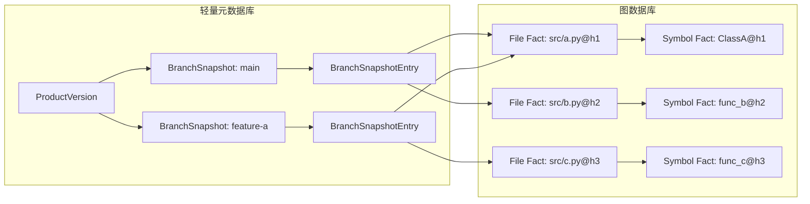
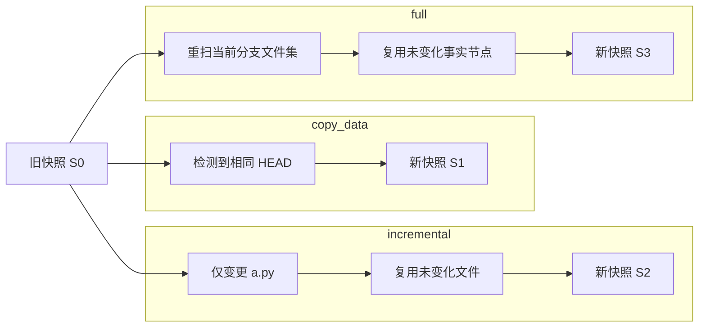
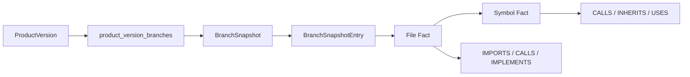

# 图存储结构简化设计

## 1. 目标

这份文档用于明确 MVP 的图存储简化方向，重点解决：

- 同一个仓库在多个分支下重复存整套图数据
- `copy_data` 语义不清，实际接近“复制整图结果”
- 多分支场景下节点刷新、语义检索、链路查询都要先区分“这是哪个分支那一份数据”
- 分支越多，图存储空间、清理成本和维护复杂度越高

本次简化不改变图节点类型和关系类型的业务语义，重点只改存储结构。

## 2. 结论

MVP 采用：

- `仓库级事实图`
- `分支快照引用`

不再采用：

- `一个仓库一个分支一套完整图`

一句话定义：

`图数据库存仓库级可复用代码事实；分支只维护“当前引用哪些代码事实”的快照，不再复制整套分支图。`

### 2.1 总体结构图



## 3. 目标结构

### 3.1 仓库事实图

图数据库中的代码节点和关系按“仓库级事实”存储，只保留一份可复用事实。

建议原则：

- 节点身份不再以 `branch` 作为主维度
- 节点身份以仓库、路径、符号签名、内容版本为主
- 同内容代码在不同分支中尽量复用同一份节点和关系

建议标识思路：

- 文件节点：`repo_id + file_path + content_hash`
- 符号节点：`repo_id + file_path + symbol_signature + content_hash`

关系也跟随事实节点存储一份，不按分支复制。

### 3.2 分支快照

每个分支只维护一个当前可见视图，不维护独立整图。

建议快照主信息：

- `snapshot_id`
- `repo_id`
- `branch`
- `head_commit`
- `last_parsed_commit`
- `base_snapshot_id`
- `created_from_action`
- `status`

这里的 `created_from_action` 对应：

- `copy_data`
- `incremental`
- `full`

### 3.3 分支快照条目

分支快照通过 entry 记录“这个分支当前引用了哪些代码事实”。

MVP 推荐先以文件为主，不先把所有符号都单独存一份 membership。

建议 entry 信息：

- `snapshot_id`
- `repo_id`
- `file_path`
- `file_node_id`
- `file_content_hash`
- `visible`

符号可见性默认通过 `File -> Symbol` 的包含关系推导，不单独复制一层分支级符号 membership。

这一步是简化的关键：

`分支快照先只精确到文件层；符号层沿文件包含关系解析。`

### 3.4 多分支复用对比图

```mermaid
flowchart TB
    subgraph Old[旧结构：按分支复制整图]
        OM1[main: a.py]
        OM2[main: b.py]
        OF1[feature-a: a.py]
        OF2[feature-a: c.py]
        OM1 --- OM2
        OF1 --- OF2
    end

    subgraph New[新结构：仓库事实图 + 分支快照]
        NS1[Snapshot: main]
        NS2[Snapshot: feature-a]
        NF1[a.py@h1]
        NF2[b.py@h2]
        NF3[c.py@h3]
        NS1 --> NF1
        NS1 --> NF2
        NS2 --> NF1
        NS2 --> NF3
    end
```

## 4. 为什么这样更简单

### 4.1 简化存储

旧模型：

- 每个分支存一套完整节点和关系

新模型：

- 代码事实只存一份
- 分支只存快照头和文件级引用

### 4.2 简化复用

旧模型下：

- `copy_data` 接近复制整套图
- 相同 HEAD 也会带来大量重复数据

新模型下：

- `copy_data` 只复制快照引用
- 相同 HEAD 可直接复用已有快照或从已有快照克隆
- 相同文件内容可复用同一个 file/symbol 子图

### 4.3 简化维护

旧模型下：

- 删除分支要处理整套图数据
- 查询链路时先判断分支内哪一份节点才是真正当前版本

新模型下：

- 删除分支只删快照和引用
- 图事实和分支视图边界清楚
- 链路、语义检索、节点刷新都先按快照限定范围，再查仓库级事实图

## 5. 核心流程

### 5.1 全量分析

`full` 不再意味着“为该分支重建一整套独立图”。

新的语义是：

1. 解析该分支当前文件集
2. 为变化文件生成新的事实节点
3. 复用未变化文件对应的已有事实节点
4. 生成新的分支快照和文件级引用

### 5.2 增量分析

`incremental` 的语义变成：

1. 基于已有分支快照找到当前文件引用集合
2. 只替换本次变更涉及的文件引用
3. 未变化文件继续沿用旧快照中的引用
4. 输出新的快照版本

### 5.3 快照复制

`copy_data` 的语义变成：

1. 发现目标分支与已分析分支 `HEAD` 相同
2. 不复制整图
3. 直接复用已有快照，或创建一个指向相同 entry 集合的新快照

也就是：

`copy_data = 复制分支视图，不复制图事实。`

### 5.4 三种动作如何改变快照



## 6. 对查询能力的影响

### 6.1 语义检索

产品版本语义检索的查询边界改为：

1. `ProductVersion`
2. `product_version_branches`
3. 对应分支的 `BranchSnapshot`
4. 快照中可见的文件节点
5. 文件节点下的符号节点

语义检索仍基于 `description + embedding`，但先经过快照裁剪范围。

### 6.2 链路查询

链路查询不再从“某个 branch 的整图副本”出发，而是：

1. 从快照限定当前分支可见节点
2. 在可见节点范围内做关系遍历
3. 返回结果时保留 `snapshot_id / branch / head_commit`

### 6.3 节点刷新

推送后节点刷新也按快照工作：

1. 识别受影响文件
2. 刷新对应文件子图
3. 让当前分支快照切换到新事实节点
4. 对受影响节点执行 AI 描述与 embedding 刷新

### 6.4 查询路径图



## 7. 存储边界

### 7.1 图数据库保留

- 仓库级代码事实节点
- 仓库级代码事实关系
- 节点 AI 描述和 embedding
- 文档节点和文档关系

### 7.2 轻量元数据库保留

- `BranchSnapshot`
- `BranchSnapshotEntry`
- `Product`
- `ProductVersion`
- `DocChange`
- `BranchAnalysisTask`
- `DangerousCommitRecord`

这样分工更清楚：

`图数据库负责知识事实；元数据库负责分支视图、业务状态和执行记录。`

## 8. MVP 不做的事

- 不做按 commit 的完整图快照
- 不做分支级整图副本
- 不做查询结果预聚合表
- 不做链路结果缓存作为主路径

MVP 优先使用：

- 仓库级事实复用
- 分支快照裁剪
- `content_hash` 复用

## 9. 对现有实现的改造含义

当前本地实现里，很多能力已经存在：

- `copy_data / incremental / full`
- `last_parsed_commit`
- `content_hash`
- AI 描述与 embedding 写回

这次改造不是推翻现有能力，而是重定义它们的存储语义：

- `copy_data` 从复制分析结果，改为复制快照引用
- `incremental` 从分支级子图改写，改为快照级局部替换
- `full` 从分支级重建整图，改为生成新的快照视图

## 10. 关键收益

- 多分支共享相同代码时不再重复存整套图
- 图数据和分支视图职责分离
- 更容易删除分支、回溯分支状态、排查复用问题
- 节点刷新、语义检索、链路查询都能围绕统一结构工作

## 11. 一句话结论

`简化的不是节点和关系语义，而是“同仓库多分支”的存储方式：代码事实仓库级唯一化，分支只保留快照引用。`
