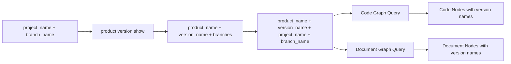

# Version Branch Graph Navigation Master PRD

## 1. 背景

NeoDev 已有产品版本、项目分支绑定、代码图刷新、文档导入和图查询能力。当前缺口是缺少一条稳定的 CLI 导航链路：用户给出项目分支名称时，需要找到绑定的产品版本；用户拿到产品名称、版本名称、项目名称、分支名称后，需要能直接查询该版本对应的代码图和文档图。

本需求的最终目标不是让 `product version show` 展示图内容，而是让它成为低噪声的名称参数发现入口。图的直接查询由后续 graph/doc 查询能力承接。外部查询参数统一使用名称，ID 不作为用户侧查询参数。

## 2. 目标与非目标

### 2.1 目标

| ID | 目标 | 来源 |
| --- | --- | --- |
| R-001 | 不新增主流程 CLI，优先增强既有 `product version show`。 | SRC-U-002 |
| R-002 | `product version show` 只返回产品名称、版本名称、项目名称、分支名称等基础定位信息。 | SRC-U-005 |
| R-003 | `product version show --project-name --branch-name` 支持从项目分支反查一个或多个产品版本。 | SRC-U-001, SRC-U-006 |
| R-004 | 后续图查询使用 `product_name/version_name/project_name/branch_name` 直接找到代码图和文档图。 | SRC-U-001, SRC-U-005, SRC-U-006 |
| R-005 | 代码图和文档图都必须直接绑定版本名称作用域。 | SRC-U-005 |
| R-006 | 代码图节点、文档图节点和关键图关系必须写入名称化版本作用域字段。 | SRC-U-003, SRC-U-005, SRC-U-006 |
| R-007 | 产品名称、项目名称、版本名称组合和分支名称组合必须有唯一性校验。 | SRC-U-006 |
| R-008 | 历史代码图和文档图通过重建方式补齐名称化版本作用域，不保留缺版本字段的历史图作为有效查询结果。 | SRC-U-007 |
| R-009 | 文档由 Git 管理并按版本隔离，一个文档不能被多个产品版本复用。 | SRC-U-007 |

### 2.2 非目标

- 不让 `product version show` 返回 `code_graphs[]`、`document_graph`、节点数量、边数量或图健康摘要。
- 不在本需求中新增独立 `resolve-branch`、`version graphs` 等主流程命令。
- 不把 ID 作为用户侧 CLI/API 查询参数；ID 可作为内部追踪字段或兼容字段，但不能是唯一外部入口。
- 不把产品级文档归属继续作为文档图唯一业务归属。

## 3. 名称唯一性规则

| ID | 名称 | 唯一性要求 | 冲突处理 |
| --- | --- | --- | --- |
| UQ-001 | `product_name` | 全局唯一。 | 创建或改名时拒绝重复名称。 |
| UQ-002 | `project_name` | 全局唯一。 | 创建或改名时拒绝重复名称。 |
| UQ-003 | `version_name` | 在同一 `product_name` 下唯一。 | 同产品内拒绝重复版本名。 |
| UQ-004 | `branch_name` | 在同一 `project_name` 下唯一。 | Git 分支天然按项目作用域唯一，CLI 校验必须按项目限定。 |
| UQ-005 | 版本分支绑定 | `product_name + version_name + project_name` 下最多绑定一个 `branch_name`。 | 重复绑定返回冲突错误。 |

名称查询无法唯一命中时必须返回 `ambiguous_name` 或 `name_conflict`，不能随机选择。

## 4. 核心流程



## 5. 业务对象

| ID | 对象 | 说明 | 用户侧定位字段 | 内部字段 |
| --- | --- | --- | --- | --- |
| BO-001 | Product | 产品主体 | `product_name` | `product_id` 可保留内部追踪 |
| BO-002 | ProductVersion | 产品版本 | `product_name/version_name` | `product_version_id` 可保留内部追踪 |
| BO-003 | Project | 代码或文档项目 | `project_name` | `project_id` 可保留内部追踪 |
| BO-004 | VersionBranchBinding | 版本分支绑定 | `product_name/version_name/project_name/branch_name` | 绑定 ID 可保留内部追踪 |
| BO-005 | CodeGraph | 版本代码图 | `product_name/version_name/project_name/branch_name` | `graph_id/head_commit` |
| BO-006 | DocumentGraph | 版本文档图 | `product_name/version_name` | `doc_binding_id/document_id` |
| BO-007 | GraphNode | 图节点 | `product_name/version_name/project_name/branch_name/type` | `node_id/fact_id/doc_id` |
| BO-008 | GraphRelationship | 图关系 | `product_name/version_name/source_name/target_name/type` | relation ID |

## 6. 功能拆分

| 功能 | 名称 | 范围 | PRD |
| --- | --- | --- | --- |
| F001 | `product version show` 名称参数发现 | 返回产品、版本、分支和后续查询所需名称参数；支持按项目名称和分支名称反查版本。 | `features/F001-version-show-graph-navigation.md` |
| F002 | 版本名称直绑图和节点属性 | 代码图、文档图、节点、关系写入名称化版本作用域，并支持按名称直接查询图。 | `features/F002-query-oriented-graph-node-fields.md` |

## 7. 跨功能规则

| ID | 规则 | 验收 |
| --- | --- | --- |
| BR-G-01 | `product version show` 是只读参数发现命令，不触发图刷新、文档导入或 Neo4j 查询。 | CLI 集成测试确认无图查询副作用。 |
| BR-G-02 | 版本定位模式返回 `product/version/branches/query_params`，不得返回图摘要字段。 | 输出中不存在 `code_graphs` 和 `document_graph`。 |
| BR-G-03 | 分支定位模式返回 `resolved_versions[]`，多版本命中时全部返回，不暗选。 | 构造多命中用例。 |
| BR-G-04 | CodeGraph 必须直接保存 `product_name/version_name/project_name/branch_name`。 | 图刷新后查询图元数据。 |
| BR-G-05 | DocumentGraph 必须直接保存 `product_name/version_name`。 | 文档导入后查询图元数据。 |
| BR-G-06 | CodeNode、DocumentNode 和关键关系必须写入名称化版本作用域字段。 | Neo4j 节点/关系属性断言。 |
| BR-G-07 | 分支反查无命中时返回空 `resolved_versions[]` 且保持 `ok=true`。 | 无命中 CLI 集成测试。 |
| BR-G-08 | 历史图缺少名称化版本作用域时必须重建；重建前不得作为有效版本图查询结果。 | 历史图重建测试或迁移验证。 |
| BR-G-09 | 文档绑定必须指向版本隔离的 Git 文档来源；同一文档不得绑定到多个版本。 | 文档绑定唯一性测试。 |

## 8. 输出契约摘要

`product version show` 版本定位模式：

```json
{
  "product": {"name": "NeoDev"},
  "version": {"name": "v1.0"},
  "branches": [
    {"project_name": "NeoDev", "branch_name": "main"}
  ],
  "query_params": [
    {
      "product_name": "NeoDev",
      "version_name": "v1.0",
      "project_name": "NeoDev",
      "branch_name": "main"
    }
  ]
}
```

分支反查模式：

```json
{
  "project": {"name": "NeoDev"},
  "branch_name": "main",
  "resolved_versions": [
    {
      "product": {"name": "NeoDev"},
      "version": {"name": "v1.0"},
      "query_params": {
        "product_name": "NeoDev",
        "version_name": "v1.0",
        "project_name": "NeoDev",
        "branch_name": "main"
      }
    }
  ]
}
```

## 9. 验收标准

| ID | 验收标准 |
| --- | --- |
| AC-G-01 | `product version show --product-name <name> --version-name <name> --json` 返回产品、版本、分支和名称化 `query_params`。 |
| AC-G-02 | 上述输出不包含 `code_graphs` 和 `document_graph`。 |
| AC-G-03 | `product version show --project-name <name> --branch-name <name> --json` 返回 `resolved_versions[]`。 |
| AC-G-04 | 使用名称化 `query_params` 可以调用后续 graph/doc 查询直接找到版本代码图和版本文档图。 |
| AC-G-05 | 代码图节点包含 `product_name/version_name/project_name/branch_name`。 |
| AC-G-06 | 文档图节点包含 `product_name/version_name`，且不以 `product_id` 作为唯一归属。 |
| AC-G-07 | 创建或改名导致名称冲突时返回明确冲突错误。 |
| AC-G-08 | 项目分支无版本命中时返回 `resolved_versions: []`，不返回 `not_found`。 |
| AC-G-09 | 历史图重建后，代码图和文档图节点均包含名称化版本作用域字段。 |
| AC-G-10 | 同一文档尝试绑定多个版本时返回冲突错误。 |

## 10. 测试要求

- `tests/test_product_cli.py` 增加名称定位、分支反查、多命中、无图摘要字段测试。
- `tests/test_product_cli.py` 或 repository 单测增加产品名、项目名、产品内版本名唯一性测试。
- `tests/test_graph_cli.py` 或 graph 查询单测增加名称参数查询入口测试。
- `tests/test_branch_graph_neo4j_service.py` 增加代码图节点名称化版本作用域断言。
- `tests/test_doc_graph_service.py` 增加文档图节点名称化版本作用域断言。

## 相关文档

- [[00-source-index|Version Branch Graph Navigation Source Index]]
- [[features/F001-version-show-graph-navigation|F001 Version Show Graph Navigation PRD]]
- [[features/F002-query-oriented-graph-node-fields|F002 Query Oriented Graph Node Fields PRD]]
- [[99-open-questions|Version Branch Graph Navigation Open Questions]]
