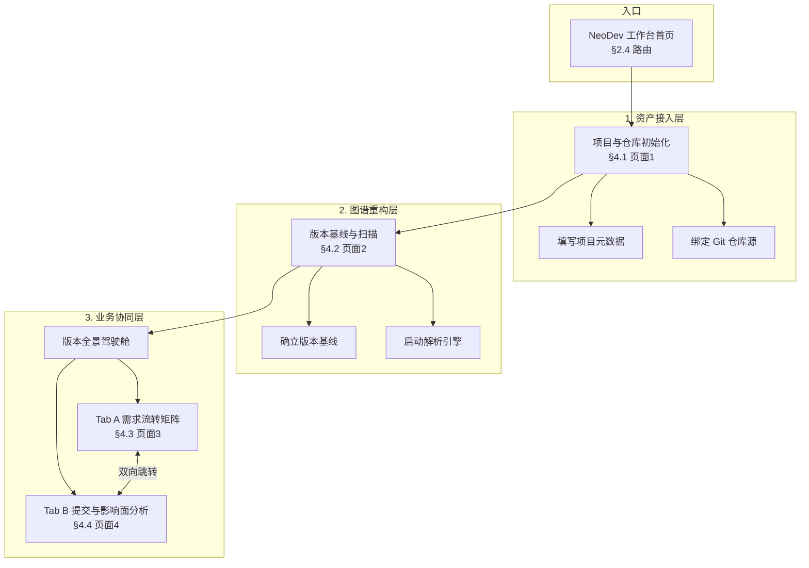

# NeoDev 平台页面原型设计文档（V1.0 详细版）

> 基于 V1.0 平台原型概要，补充可被前端与设计直接执行的细节：设计令牌、全局壳、每页区域/组件/状态/交互/文案/数据接口触点，以及与现有 PRD/数据模型的映射。  
> 相关文档：[影响面分析页面 PRD](.cursor/plans/影响面分析页面_prd_ef560444.plan.md)、[数据结构设计-影响面分析](数据结构设计-影响面分析.md)。

---

## 目录

1. [设计规范（Design Tokens）](#1-设计规范design-tokens)
2. [全局布局与壳（Shell）](#2-全局布局与壳shell)
3. [页面拓扑图](#3-页面拓扑图)
4. [逐页详细设计](#4-逐页详细设计)
5. [组件复用与优先级](#5-组件复用与优先级)
6. [与 PRD/数据模型映射](#6-与-prd数据模型映射)
7. [后续技术设计可选延伸](#7-后续技术设计可选延伸)

---

## 1. 设计规范（Design Tokens）

### 1.1 色彩

| 用途 | 色值 | 说明 |
|------|------|------|
| 背景（主） | `#0D0D12` | 沉浸式深空黑，全局主背景 |
| 主交互 | `#00F0FF` | 全息荧光蓝，按钮、链接、焦点、主 CTA |
| AI 洞察 | `#B026FF` | 赛博紫，Agent 气泡、智能建议高亮 |
| 告警/风险 | `#FF0055` | 霓虹红，告警标签、错误态、影响面中心节点 |
| 中性灰（边框/分割） | `#2A2A33` | 卡片边框、分割线 |
| 中性灰（次要文字） | `#8A8A9A` | 辅助说明、时间戳 |
| 正文 | `#E8E8F0` | 主内容文字 |
| 禁用态 | `#4A4A55` | 禁用按钮、不可用项 |
| 悬浮态（主交互） | `#33F5FF` | 主色悬浮变亮，可选发光 |

### 1.2 字体

- **字体族**：科技感无衬线优先（如 "JetBrains Mono", "SF Mono", "Consolas" 用于代码/数据；界面标题与正文可用 "Inter", "PingFang SC" 等）。
- **标题**：H1 约 24px/600，H2 约 18px/600，H3 约 16px/600。
- **正文**：14px/400，行高约 1.5。
- **辅助/标签**：12px/400，颜色用中性灰或主交互色。

### 1.3 圆角与阴影

- **卡片**：圆角 8px；阴影为淡色描边或轻微外发光（主交互色 10% 透明度）。
- **输入框**：圆角 6px；聚焦时 1px 主交互色描边 + 可选发光。
- **按钮**：圆角 6px；主按钮可带轻微内阴影或外发光。
- **胶囊标签**：圆角 999px（全圆角）。

### 1.4 间距系统

- 基准：4、8、16、24、32（单位 px）。
- 栅格与组件内边距：卡片内 16–24px；区块间距 24px；表单项之间 16px。

---

## 2. 全局布局与壳（Shell）

### 2.1 三栏比例

- **左侧系统导航**：15% 宽度（可设定最小宽度如 200px），固定或随内容滚动视实现而定。
- **中部核心工作流**：60% 宽度，主内容区。
- **右侧常驻 Agent 视窗**：25% 宽度（可设定最小宽度如 280px）。
- **折叠**：右侧 Agent 支持收起到图标栏（仅显示图标，点击展开），收起后中栏可占约 85%。

### 2.2 左侧系统导航

- **导航项与 V1.0 拓扑对应**：
  - 入口：NeoDev 工作台首页（默认落地页）
  - 资产接入层：项目与仓库初始化（填写元数据、绑定 Git）
  - 图谱重构层：版本基线与扫描（确立版本基线、启动解析引擎）
  - 业务协同层：版本全景驾驶舱
    - 子项 A：需求流转矩阵（业务驱动视角）
    - 子项 B：提交与影响面分析（代码演进视角）
- **呈现**：图标 + 文案；当前路由高亮（主交互色）；驾驶舱子项可折叠/展开。
- **高亮规则**：当前 path 匹配的导航项高亮；若在驾驶舱 Tab A/B 内，对应子项也高亮。

### 2.3 右侧 Agent 视窗

- **常驻**：全局路由下始终保留 25% 区域（或折叠态），不随路由卸载。
- **最小高度**：视窗至少占一屏高度，内容可滚动。
- **上下文同步**：随路由、选中需求、选中提交变化；Agent 根据当前上下文输出迎新、解析播报、智能建议或根因告警（见各页详细设计）。
- **典型状态**：迎新、解析播报（流式输出）、智能建议（需求/提交相关）、根因分析与风险阻断（告警样式）。

### 2.4 路由与导航映射表

| V1.0 页面/入口 | 建议 path | 说明 |
|----------------|-----------|------|
| NeoDev 工作台首页 | `/` | 入口，可选仪表盘或跳转至资产接入 |
| 项目初始化与资产接入 | `/onboard` 或 `/projects/new` | 对应现有「项目管理」的新增流程；也可与 `/projects` 列表整合 |
| 图谱重构（版本基线与扫描） | `/graph-build` 或 `/projects/:id/versions` 内操作 | 选择分支、启动图谱重构；可与现有解析管理 `/repos` 对应 |
| 版本驾驶舱 - 需求流转矩阵 | `/cockpit` 或 `/cockpit/requirements` | Tab A |
| 版本驾驶舱 - 提交与影响面分析 | `/cockpit/impact` 或 `/impact` | Tab B；与现有 `/impact` 可统一 |
| 项目管理（列表/详情） | `/projects`、`/projects/:id` | 与现有路由一致 |

- 若采用单一路由「版本驾驶舱」下双 Tab，则建议：`/cockpit?tab=requirements` 与 `/cockpit?tab=impact`，或 `/cockpit/requirements`、`/cockpit/impact`。
- 与现有前端路由实现的对应关系见 [§6.1](#61-路由)（[web/src/App.tsx](../web/src/App.tsx) 当前为顶栏导航，无三栏壳与 Agent 视窗）。

---

## 3. 页面拓扑图

以下流程图复现从入口到三层业务协同的完整路径；节点旁标注对应本文档小节，便于跳读。

- **右侧 Agent 视窗**在全局路由中始终保持常驻与上下文跟随，图中不重复画出。

---

## 4. 逐页详细设计

### 4.1 页面 1：项目初始化与资产接入（Project Onboarding）

- **页面目标**：建立物理代码库与 NeoDev 平台的连接。
- **用户故事**：作为研发/管理员，我填写项目名称与 Git 仓库地址并完成校验，以便平台接管仓库并为后续图谱与需求追溯做准备。

| 维度 | 说明 |
|------|------|
| **区域划分** | 中栏：极简配置表单（项目名称、业务线可选、Git 仓库 URL、Token 鉴权）。底部显眼主按钮「校验并接入资产」。右侧：Agent 迎新视窗。 |
| **组件树/清单** | 发光输入框（项目名称、仓库 URL、Token 可选）×N；下拉或输入「业务线」可选；流光按钮「校验并接入资产」；Agent 视窗（迎新态）。以上组件可在全站复用。 |
| **状态与反馈** | 默认态：空表单。加载态：校验中按钮 loading、禁用表单。成功态：按钮呈现流光反馈；Toast 或文案「接入成功」；Agent 输出成功话术。错误态：校验失败时输入框或全局提示错误信息。 |
| **交互说明** | 用户填写必填项后点击「校验并接入资产」；后端校验 Webhook/连通性；成功后可跳转至图谱构建或项目列表。Agent 在接入成功后自动激活并输出迎新话术。 |
| **文案与示例** | 按钮：「校验并接入资产」。Agent 迎新话术：「✅ 成功接管仓库。主语言为 TypeScript，准备好为你的代码建立数字主线了吗？」 |
| **数据/API 触点** | 实体：**projects**（创建/更新）；对接点：项目元数据写入、仓库 URL 与 Token 校验（可调现有 repos 或新接口）；参考 [数据结构设计 2.2.1](数据结构设计-影响面分析.md#221-projects项目)。 |

---

### 4.2 页面 2：版本基线与图谱构建（Graph Builder）

- **页面目标**：确定分析范围，触发底层工具链完成代码解析与图谱写入。
- **用户故事**：作为研发，我选择目标分支并启动图谱重构，以便平台生成该版本的代码图并供影响面与需求追溯使用。

| 维度 | 说明 |
|------|------|
| **区域划分** | 中栏：顶部选择分支（如 release/v1.0）、可选输入版本号/标签；主操作「启动图谱重构」。启动后切换为科技感进度雷达（中心 Neo4j 节点生成动画）。右侧：Agent 解析播报视窗（流式输出）。 |
| **组件树/清单** | 分支选择器（下拉或列表）；版本号/标签输入（可选）；流光按钮「启动图谱重构」；进度雷达/环形进度 + 中心动画；Agent 视窗（解析播报态）。进度组件本页专用，其余可复用。 |
| **状态与反馈** | 默认态：分支已选或默认分支。进行态：进度雷达展示、百分比或阶段文案；Agent 流式输出解析日志。完成态：进度 100%、成功提示；Agent 输出「图谱构建完毕」。失败态：错误提示与重试入口。 |
| **交互说明** | 用户选择分支后点击「启动图谱重构」；前端可调解析/管线接口；界面切换为进度视图；Agent 实时输出「> 提取核心接口 120 个...」「> 发现孤儿代码片段...」「图谱构建完毕。」 |
| **文案与示例** | 按钮：「启动图谱重构」。Agent 解析播报：「> 提取核心接口 120 个...」「> 发现孤儿代码片段...」「图谱构建完毕。」 |
| **数据/API 触点** | 实体：**versions**（列表、当前分支）、**projects**；对接点：拉取分支列表、触发解析管线（AST 提取 → 向量化 → Neo4j 图谱织网）；参考 [数据结构设计 2.2.2](数据结构设计-影响面分析.md#222-versions版本分支)、现有 parse 管线与 [Neo4j 多分支](数据结构设计-影响面分析.md#32-规划多分支模型prd-24--33)。 |

---

### 4.3 页面 3：版本全景驾驶舱 - Tab A 需求流转矩阵

- **页面目标**：产品与研发的对接点，实现需求向下追溯代码。
- **用户故事**：作为产品/研发，我查看需求树与需求详情并管理关联提交，以便在需求维度查看绑定的 Commit 与代码链路，并可跳转至影响面分析。

| 维度 | 说明 |
|------|------|
| **区域划分** | 中栏左：需求树状列表（Epic/Story/Task 层级）。中栏右：需求详情抽屉（基本信息与 PRD 文档 RAG 支撑）+ 代码追溯区（关联的 Commit 列表：Hash、提交人、Message）。右侧：Agent 上下文智能建议。 |
| **组件树/清单** | 树状列表（可拖拽排序、点击高亮）；详情抽屉（标题、描述、PRD 片段）；代码追溯区（Commit 列表、Hash 可点击）；按钮「+ 关联提交」；Agent 视窗（智能建议态）。树、抽屉、Commit 列表可复用。 |
| **状态与反馈** | 空态：无需求时占位文案。选中态：树项高亮、抽屉展示对应需求与关联 Commit。加载态：树或抽屉 loading。Agent 根据需求与绑定 Commit 输出建议（如状态流转建议）。 |
| **交互说明** | 点击树单行高亮并打开详情抽屉；支持拖拽排序需求；点击「+ 关联提交」可打开提交选择器并绑定；点击已绑定 Commit Hash 跳转至 Tab B 并展开该提交的影响面。Agent 感知需求状态并输出建议话术。 |
| **文案与示例** | Agent 智能建议：「该需求绑定的 Commit a1b2c3d 已合并，测试覆盖率符合要求，是否流转状态为【待验证】？」 |
| **数据/API 触点** | 实体：**requirements**、**requirement_commits**、**commits**、**versions**、**projects**；对接点：需求列表（树结构）、需求详情、关联提交列表、绑定/解绑提交；参考 [数据结构设计 2.2.3](数据结构设计-影响面分析.md#223-requirements需求)、[2.2.4](数据结构设计-影响面分析.md#224-commits提交)、[2.2.5](数据结构设计-影响面分析.md#225-requirement_commits需求提交-多对多)。 |

---

### 4.4 页面 4：版本全景驾驶舱 - Tab B 提交追踪与影响面分析

- **页面目标**：运维、测试与开发排查风险的主阵地，实现代码向上追溯业务。
- **用户故事**：作为研发/测试，我按时间轴选择提交并查看动态影响面拓扑图与业务归属，以便评估变更波及范围并反向跳转需求。

| 维度 | 说明 |
|------|------|
| **区域划分** | 中栏左：Commit 时间轴（分支下所有提交）。中栏右：动态影响面拓扑图（深灰底色，中心红色节点为变更代码，发光线条向外辐射）；拓扑图顶部悬浮「业务归属标签」蓝色胶囊（所属需求：Story ID）。右侧：Agent 根因分析与风险阻断。 |
| **组件树/清单** | 时间轴列表（提交 Hash、Message、作者、时间）；拓扑图容器（GraphRAG 展示区，节点与边）；业务归属标签（可点击）；Agent 视窗（根因/告警态）。时间轴与拓扑图容器可复用或专用。 |
| **状态与反馈** | 默认态：时间轴列表，右侧图为空或占位。选中态：点击单条 Commit 后拓扑图重绘，中心为变更节点，辐射受波及节点；顶部展示业务归属标签。加载态：图重绘时骨架或 loading。Agent 输出根因与风险话术。 |
| **交互说明** | 点击时间轴单条 Commit 触发右侧图谱重绘；点击业务归属标签反向跳转 Tab A 并定位对应需求。底层 GraphRAG/Neo4j 遍历关系树；标签可点击跳转。 |
| **文案与示例** | Agent 根因与风险：「⚠️ 警告：本次变更波及了订单结算组件，且该变更是为了实现 Story-12 需求。建议通知测试团队重点回归订单链路。」 |
| **数据/API 触点** | 实体：**commits**、**impact_analyses**、**requirement_commits**（业务归属）、**Neo4j**（影响面遍历）；对接点：按分支拉取提交列表、触发/查询影响面分析、按提交查 Neo4j 关系树与归属需求；参考 [数据结构设计 2.2.4、2.2.6](数据结构设计-影响面分析.md#224-commits提交)、[4.2 影响面分析](数据结构设计-影响面分析.md#42-影响面分析未实现prd-todo)。 |

---

## 5. 组件复用与优先级

| 组件 | 复用页面 | 优先级 | 说明 |
|------|----------|--------|------|
| 发光输入框 | 页面 1、全局表单 | P0 | 与主流程强相关，项目/仓库配置必用 |
| 流光按钮 | 全站主 CTA | P0 | 校验并接入、启动图谱重构等 |
| 抽屉 | 页面 3、可选页面 4 详情 | P0 | 需求详情与代码追溯区容器 |
| 树状列表 | 页面 3 | P0 | 需求树 Epic/Story/Task |
| Commit 列表/时间轴 | 页面 3、页面 4 | P0 | 代码追溯区与提交时间轴 |
| 拓扑图容器 | 页面 4 | P0 | 动态影响面 GraphRAG 展示 |
| 业务归属标签（胶囊） | 页面 4 | P0 | 所属需求 Story ID 展示与跳转 |
| Agent 视窗 | 全站 | P0 | 常驻右侧，多状态话术 |
| 分支/版本选择器 | 页面 2、驾驶舱 | P0 | 图谱构建与驾驶舱上下文 |
| 进度雷达/环形进度 | 页面 2 | P1 | 增强图谱构建过程体验 |
| 提交选择器（弹窗） | 页面 3「+ 关联提交」 | P1 | 需求绑定提交时的选择器 |

---

## 6. 与 PRD/数据模型映射

### 6.1 路由

| 原型页面 | 建议 path | 与现有路由关系 |
|----------|-----------|----------------|
| 工作台首页 | `/` | 与现有主流程入口一致 |
| 项目初始化与资产接入 | `/onboard` 或 `/projects/new` | 可并入现有 `/projects` 的新增流程 |
| 版本基线与图谱构建 | `/graph-build` 或 `/projects/:id/versions` | 可与 `/repos` 解析管理对应或整合 |
| 驾驶舱 Tab A 需求流转矩阵 | `/cockpit/requirements` 或 `/cockpit?tab=requirements` | 新增或与主流程「选择需求」对应 |
| 驾驶舱 Tab B 提交与影响面分析 | `/cockpit/impact` 或 `/impact` | 与现有 `/impact` 可统一 |
| 项目管理 | `/projects`、`/projects/:id` | 与现有一致 |

### 6.2 实体

| 页面 | 涉及实体（PG/Neo4j） |
|------|----------------------|
| 页面 1 | projects |
| 页面 2 | projects, versions；Neo4j 图写入 |
| 页面 3 | projects, versions, requirements, requirement_commits, commits |
| 页面 4 | commits, impact_analyses, requirement_commits（业务归属）；Neo4j 影响面查询 |

### 6.3 流程

- PRD 2.1 主流程：**选择项目 → 选择版本 → 选择需求 → 选择提交 → 触发影响面分析**。
- 原型对应：页面 1 完成「项目」建立；页面 2 完成「版本/分支」确立与图谱；页面 3 对应「需求」与需求–提交绑定；页面 4 对应「提交」选择与「影响面分析」展示；Tab A ↔ Tab B 双向跳转满足需求↔提交的联动。

---

## 7. 后续技术设计可选延伸

本原型文档不展开以下实现细节，仅作引用与拆分建议：

- **A. 核心图模型设计**：梳理后端 Neo4j 节点与关系（Nodes & Edges）定义表，明确代码、需求、Commit 之间的边类型（如 IMPLEMENTS, AFFECTS 等）。可单独产出《Neo4j 图模型与影响面关系定义》与 [数据结构设计 3.1](数据结构设计-影响面分析.md#31-现有图模型当前实现) 对齐。
- **B. 自动绑定算法流**：设计自研 Agent 如何通过向量计算（RAG）或规则，自动推断「某个 Commit 属于哪个业务需求」的业务流程图。可单独产出《Commit–需求自动绑定算法与流程》。
- **C. 前端图组件与 Agent 通信**：针对动态影响面拓扑图，提供 G6 或 ECharts 的选型建议，以及前端与右侧 Agent 进行 Context 同步的 JSON 结构方案。可单独产出《前端图组件选型与 Agent Context 协议》。

以上三份可在需要时从本原型文档延伸拆出，与 [影响面分析页面 PRD](.cursor/plans/影响面分析页面_prd_ef560444.plan.md)、[数据结构设计-影响面分析](数据结构设计-影响面分析.md)、[影响面分析多步骤技术实现](.cursor/plans/影响面分析多步骤技术实现_34fc1fdf.plan.md) 并列使用。
