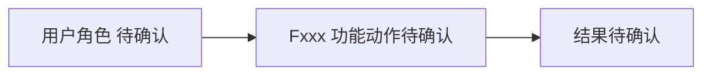
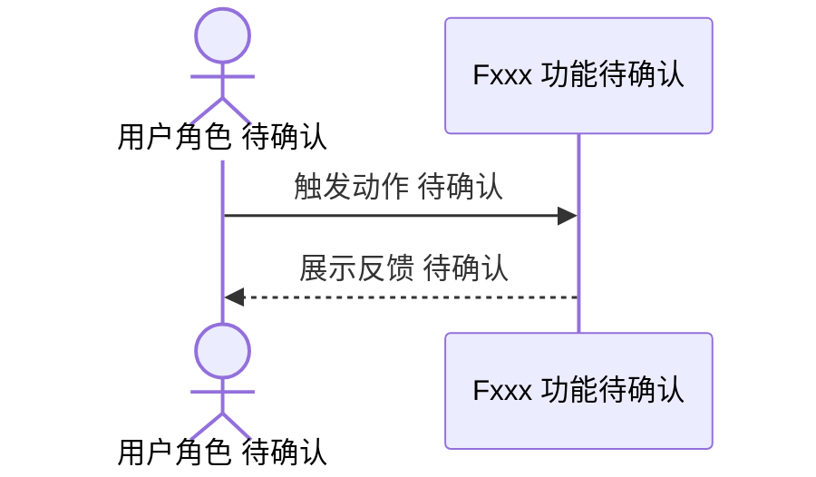

# Fxxx <功能名称> PRD

## 1. 功能信息

| 项 | 内容 |
| --- | --- |
| 功能编号 | Fxxx |
| 功能名称 | <功能名称> |
| 优先级 | P0/P1/P2 |
| 状态 | 草稿/待确认/已确认 |
| 所属总 PRD | `../01-master-prd.md` |
| 主要事实源 | SRC-?/Q-? |

## 2. 引用业务口径

| 类型 | 编号 | 名称 | 来源章节 | 来源编号/问题编号 |
| --- | --- | --- | --- | --- |
| 业务对象 | BO-xxx | 待确认 | 总 PRD 5.1 | SRC-?/Q-? |
| 属性 | BO-xxx-Axx | 待确认 | 总 PRD 5.2 | SRC-?/Q-? |
| 术语 | T-xxx | 待确认 | 总 PRD 5.3 | SRC-?/Q-? |
| 跨功能规则 | BR-G-xx | 待确认 | 总 PRD 7 | SRC-?/Q-? |

## 3. 功能目标

## 4. 用户故事与使用场景

| 场景编号 | 用户角色 | 场景描述 | 业务价值 | 来源编号/问题编号 |
| --- | --- | --- | --- | --- |
| US-Fxxx-01 | 待确认 | 待确认 | 待确认 | SRC-?/Q-? |

## 5. 前置条件

## 6. 页面入口与导航路径

| 入口编号 | 页面/模块/能力入口 | 入口位置 | 触发方式 | 到达结果 | 来源编号/问题编号 |
| --- | --- | --- | --- | --- | --- |
| EN-Fxxx-01 | 待确认 | 待确认 | 待确认 | 待确认 | SRC-?/Q-? |

## 7. 典型场景与细节

| 场景编号 | 场景 | 示例触发/用户说法 | 推荐操作顺序 | 输入数据 | 读取事实 | 写入/变更事实 | 输出示例关注点 | 失败反馈 | 下一步 | 验收关注点 | 来源编号/问题编号 |
| --- | --- | --- | --- | --- | --- | --- | --- | --- | --- | --- | --- |
| S-Fxxx-01 | 待确认 | 待确认 | 待确认 | 待确认 | 待确认 | 待确认 | 待确认 | 待确认 | 待确认 | 待确认 | SRC-?/Q-? |

## 8. 交互说明

| 交互编号 | 触发动作 | 系统反馈 | 状态变化 | 失败反馈 | 退出路径 | 来源编号/问题编号 |
| --- | --- | --- | --- | --- | --- | --- |
| IA-Fxxx-01 | 待确认 | 待确认 | 待确认 | 待确认 | 待确认 | SRC-?/Q-? |

## 9. 业务规则

| 规则编号 | 规则类型 | 规则内容 | 影响对象/属性 | 例外情况 | 关联 AC | 来源编号/问题编号 | 确认状态 |
| --- | --- | --- | --- | --- | --- | --- | --- |
| BR-Fxxx-01 | 创建/编辑/删除/状态流转/权限/一致性/异常 | 待确认 | 待确认 | 待确认 | AC-Fxxx-01 | SRC-?/Q-? | 待确认 |

## 10. 字段、状态、枚举与校验

| 字段编号 | 字段名 | 所属对象属性 | 输入/展示 | 校验规则 | 错误提示 | 来源编号/问题编号 | 确认状态 |
| --- | --- | --- | --- | --- | --- | --- | --- |
| FLD-Fxxx-01 | 待确认 | BO-xxx-Axx | 待确认 | 待确认 | 待确认 | SRC-?/Q-? | 待确认 |

## 11. 功能内数据流图

仅绘制事实可支撑的节点。不得用默认 UI/API/DB 链路补齐未知实现。

## 12. 功能内时序图

仅绘制事实可支撑的参与方。参与方或动作未确认时，在名称或消息中标注“待确认”。

## 13. 接口与数据口径

| 项 | 内容 | 来源编号/问题编号 | 确认状态 |
| --- | --- | --- | --- |
| 输入数据 | 待确认 | SRC-?/Q-? | 待确认 |
| 输出数据 | 待确认 | SRC-?/Q-? | 待确认 |
| 读数据边界 | 待确认 | SRC-?/Q-? | 待确认 |
| 写数据边界 | 待确认 | SRC-?/Q-? | 待确认 |
| 接口候选 | 待确认，不得写成已确认接口 | SRC-?/Q-? | 待确认 |

## 14. 异常与边界场景

| 场景编号 | 场景 | 处理规则 | 用户反馈 | 关联 AC | 来源编号/问题编号 |
| --- | --- | --- | --- | --- | --- |
| EX-Fxxx-01 | 待确认 | 待确认 | 待确认 | AC-Fxxx-01 | SRC-?/Q-? |

## 15. 验收标准

| AC 编号 | Given | When | Then | 覆盖规则 | 来源编号/问题编号 |
| --- | --- | --- | --- | --- | --- |
| AC-Fxxx-01 | 待确认 | 待确认 | 待确认 | BR-Fxxx-01 | SRC-?/Q-? |

## 16. 测试场景建议

| 测试编号 | 优先级 | 场景 | 前置条件 | 操作 | 预期结果 | 覆盖 AC | 来源编号/问题编号 |
| --- | --- | --- | --- | --- | --- | --- | --- |
| TC-Fxxx-01 | P0 | 待确认 | 待确认 | 待确认 | 待确认 | AC-Fxxx-01 | SRC-?/Q-? |

## 17. 关联需求与依赖

## 18. 待确认问题

| 问题编号 | 当前已知事实 | 问题 | 需要确认的选项/开放点 | 影响范围 | 阻塞级别 | 需要谁确认 |
| --- | --- | --- | --- | --- | --- | --- |
| Q-xxx | 待确认 | 待确认 | 待确认 | 待确认 | 阻塞/非阻塞 | 待确认 |

## 关联文档

- [[requirements/<feature-name>/01-master-prd|<需求名称> 总 PRD]]
- [[requirements/<feature-name>/00-source-index|事实源索引]]
- [[requirements/<feature-name>/99-open-questions|待确认问题]]
