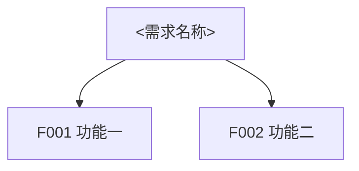
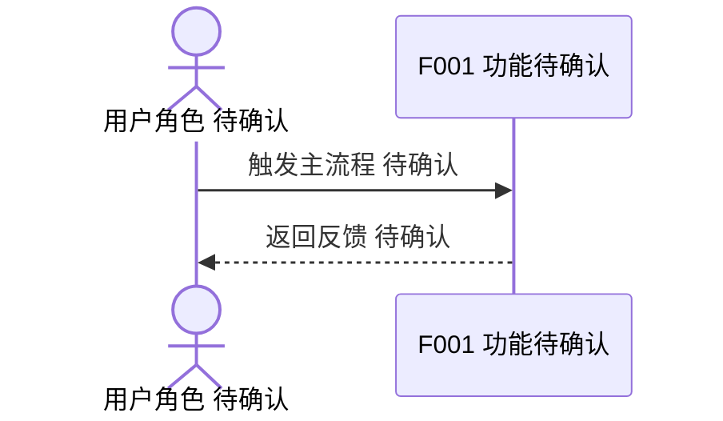

# <需求名称> 总 PRD

## 1. 文档信息

| 项 | 内容 |
| --- | --- |
| 文档编号 | R-<编号> |
| 版本 | v0.1 |
| 状态 | 草稿/待确认/已确认 |
| 负责人 | 待确认 |
| 最后更新 | YYYY-MM-DD |
| 事实源 | 见 `00-source-index.md` |
| 输出路径 | `<target-project>/docs/requirements/<feature-name>/` |

## 2. 背景与目标

### 2.1 背景

### 2.2 目标

### 2.3 非目标

## 3. 范围

### 3.1 纳入范围

### 3.2 不纳入范围

## 4. 用户角色

| 角色编号 | 角色名称 | 定义 | 主要诉求 | 权限边界 |
| --- | --- | --- | --- | --- |
| U-001 | 待确认 | 待确认 | 待确认 | 待确认 |

## 5. 业务对象、属性、术语统一

### 5.1 业务对象清单

| 对象编号 | 标准名称 | 别名 | 定义 | 所属域 | 主标识 | 生命周期 | 关联对象 | 来源编号/问题编号 | 确认状态 |
| --- | --- | --- | --- | --- | --- | --- | --- | --- | --- |
| BO-001 | 待确认 | 待确认 | 待确认 | 待确认 | 待确认 | 待确认 | 待确认 | SRC-?/Q-? | 待确认 |

### 5.2 业务对象属性字典

| 属性编号 | 所属对象 | 中文名 | 英文名 | 类型 | 必填 | 取值范围 | 来源编号/问题编号 | 可编辑 | 展示口径 | 校验规则 | 确认状态 |
| --- | --- | --- | --- | --- | --- | --- | --- | --- | --- | --- | --- |
| BO-001-A01 | BO-001 | 待确认 | 待确认 | 待确认 | 待确认 | 待确认 | SRC-?/Q-? | 待确认 | 待确认 | 待确认 | 待确认 |

### 5.3 术语与定义

| 术语编号 | 标准术语 | 别名/旧称 | 定义 | 禁用叫法 | 适用范围 | 来源编号/问题编号 | 确认状态 |
| --- | --- | --- | --- | --- | --- | --- | --- |
| T-001 | 待确认 | 待确认 | 待确认 | 待确认 | 待确认 | SRC-?/Q-? | 待确认 |

### 5.4 对象关系

事实不足时不要补默认关系图，改为列出缺口并关联 `Q-xxx`。

### 5.5 生命周期与状态

| 对象编号 | 状态 | 状态定义 | 进入条件 | 退出条件 | 可执行操作 | 来源编号/问题编号 | 确认状态 |
| --- | --- | --- | --- | --- | --- | --- | --- |
| BO-001 | 待确认 | 待确认 | 待确认 | 待确认 | 待确认 | SRC-?/Q-? | 待确认 |

## 6. 功能地图与拆分

### 6.1 功能地图

### 6.2 功能拆分清单

| 功能编号 | 功能名称 | 用户价值 | 优先级 | 子 PRD | 依赖 | 来源编号/问题编号 | 确认状态 |
| --- | --- | --- | --- | --- | --- | --- | --- |
| F001 | 待确认 | 待确认 | P0/P1/P2 | `features/F001-<name>.md` | 待确认 | SRC-?/Q-? | 待确认 |

## 7. 跨功能业务规则

| 规则编号 | 规则内容 | 影响对象 | 影响功能 | 例外情况 | 关联 AC | 来源编号/问题编号 | 确认状态 |
| --- | --- | --- | --- | --- | --- | --- | --- |
| BR-G-01 | 待确认 | 待确认 | 待确认 | 待确认 | AC-G-01 | SRC-?/Q-? | 待确认 |

## 8. 跨功能数据流图

仅绘制已确认或明确标记为待确认的节点。不得用默认 UI/API/DB 链路补齐未知实现。

## 9. 跨功能主时序图

仅绘制事实可支撑的参与方。参与方或动作未确认时，在名称或消息中标注“待确认”。

## 10. 非功能需求

| 编号 | 类型 | 要求 | 度量方式 | 确认状态 |
| --- | --- | --- | --- | --- |
| NFR-001 | 性能/安全/兼容/可用性 | 待确认 | 待确认 | 待确认 |

## 11. 权限、安全与兼容性

### 11.1 权限规则

### 11.2 安全约束

### 11.3 兼容性约束

## 12. 总体验收标准

| AC 编号 | 验收内容 | 覆盖功能 | 覆盖规则 | 来源编号/问题编号 | 验收方式 |
| --- | --- | --- | --- | --- | --- |
| AC-G-01 | 待确认 | F001 | BR-G-01 | SRC-?/Q-? | 待确认 |

## 13. 待确认问题索引

详见 `99-open-questions.md`。

## 关联文档

- [[requirements/<feature-name>/README|<需求名称> PRD 产物索引]]
- [[requirements/<feature-name>/00-source-index|事实源索引]]
- [[requirements/<feature-name>/99-open-questions|待确认问题]]
